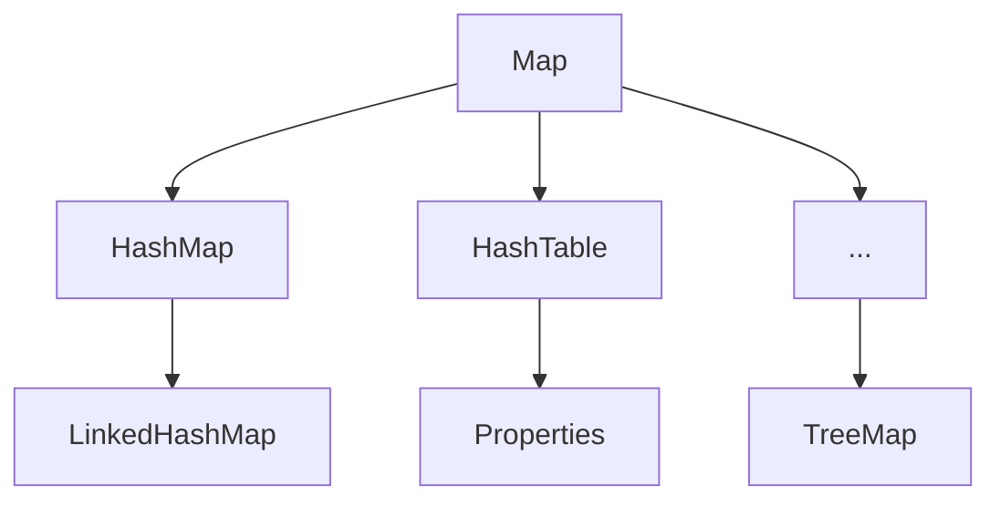
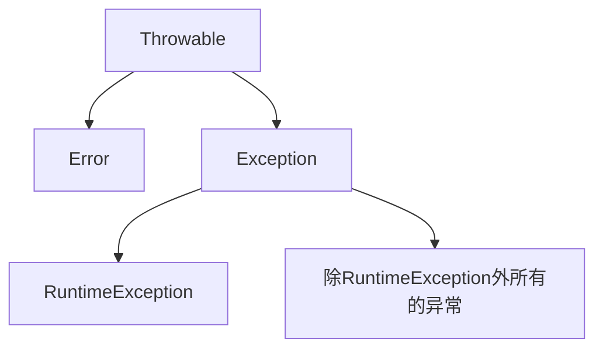
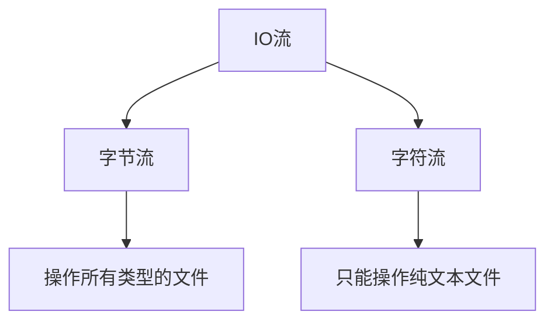
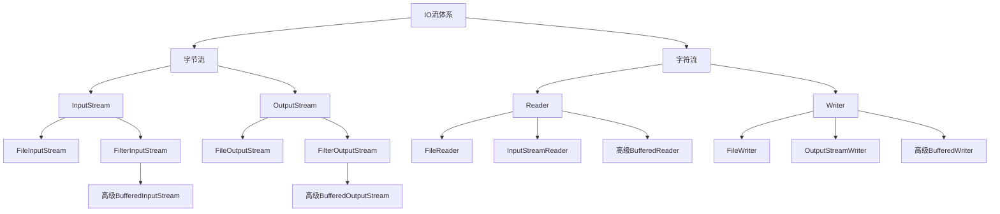
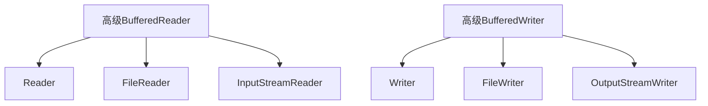
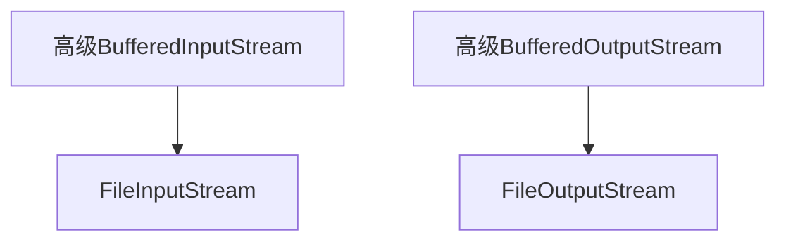
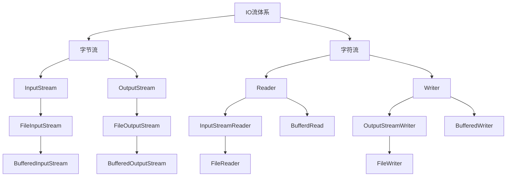
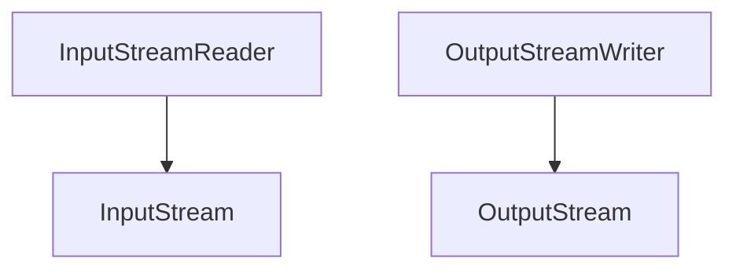
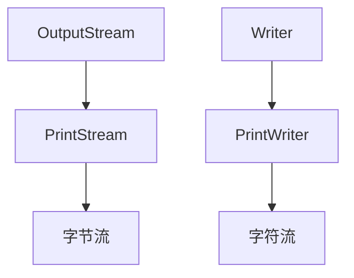
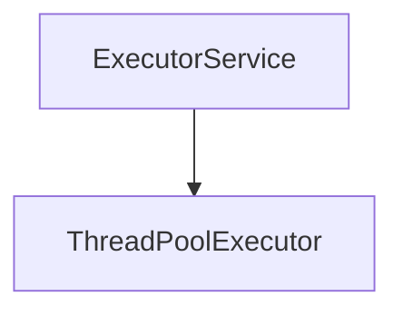

## 1. 面向对象


把事物看成一个个对象来解决问题（万物皆对象）


### 1.1 如何理解面向对象

人画圆，draw方法在圆里面。（我给你一拳，你死了。死是你的行为）


### 1.2 类与对象


#### 1.2.1 类是对象共同特征的描述


```
class Person{
//属性(成员变量)
//行为（方法）
}
```


#### 1.2.2 对象是类的具体实例


```
//得到类的对象
类名 对象名=new 类名();
Car c=new Car();
//使用对象
对象名.成员变量	//访问属性
对象名.方法名();	//访问行为
```

总结：Java中，必须先创建类，再创建对象并使用。


#### 1.2.3 定义类的注意事项

```
驼峰命名
一个文件定义一个class类（只能有一个类是public修饰且这个类名是代码文件名）
```


### 1.3 对象在内存中的运行机制

对象存放在堆内存

Car c=new Car() ; 	//c中存放对象在堆内存的地址

成员变量的数据存放在对象中，存在于堆内存。


### 1.4 封装思想

原则:

**对象代表什么就得封装对应的数据，并且提供数据对应的行为**

好处：有什么事，找对象，调方法就可以。


## 2. JavaBean 

也叫实体类，

比如学生类，汽车类，用户类这些，测试类不是。

其对象可以用于在程序中封装数据。


### 2.1 标准JavaBean的书写要求

```
成员变量要用private修饰。
提供成员变量对应的setXX()/getXX()方法
必须提供一个无参构造器;有参构造器是可写可不写的。
```


### 2.2 成员变量和局部变量的区别

| 区别         | 成员变量                                   | 局部变量                                       |
| ------------ | ------------------------------------------ | ---------------------------------------------- |
| 类中位置不同 | 类中，方法外                               | 方法中                                         |
| 初始化值不同 | 有默认值，无需初始化                       | 没有默认值，需要初始化                         |
| 内存位置不同 | 堆                                         | 栈                                             |
| 生命周期不同 | 随着对象的创建而存在，随着对象的消失而消失 | 随着方法的调用而存在，随着方法的运行结束而消失 |
| 作用域       |                                            | 大括号中                                       |


## 3. Java内存模型（JMM)

| 区域            | 存放的数据                                                   |
| --------------- | ------------------------------------------------------------ |
| 栈区            | 局部数据，函数的参数函数的返回值之类的变量（其中还有返回到调用函数下一条指令的地址） |
| 堆区            | 程序中动态申请内存的变量                                     |
| 全局变量/静态区 | 程序中的全局变量或者是静态变量（因为它们的大小是确定的，在编译期间就已经进行静态空间的分配，而且不会改变，这样会提高程序对这些数据的访问速度） |
| 代码区（code）  | 编译后的二进制代码                                           |
| 常量区          | 声明的常量（const类型）                                      |


## 4. JVM架构

Jvm是Java虚拟机。运行/解释/将字节码转换为机器码。

### 4.1 类加载器

Classloader 是 JVM 的一个子系统，用于加载类文件。

每当我们运行 java 程序时，它首先由类加载器加载。Java中有三个内置的类加载器。

1. Bootstrap ClassLoader：这是第一个类加载器，它是扩展类加载器的超类。它加载包含Java标准版所有类文件的rt.jar文件，如java.lang包类、java.net包类、java.util包类、java.io包类、java.sql包类等。
2. Extension ClassLoader：这是 Bootstrap 的子类加载器和 System 类加载器的父类加载器。它加载位于$JAVA_HOME/jre/lib/ext目录中的 jar 文件。
3. System/Application ClassLoader：这是扩展类加载器的子类加载器。它从类路径加载类文件。默认情况下，类路径设置为当前目录。您可以使用“-cp”或“-classpath”开关更改类路径。它也被称为应用程序类加载器。


### 4.2 类（方法）区

类（方法）区存储每个类的结构，存放类似于元数据信息方面的数据，比如类信息，常量，静态变量，编译后代码...等。	类加载器将.class文件搬过来就是先丢到这一块。

线程不安全。


### 4.3 堆和栈

堆： 主要放了一些存储的数据，比如对象实例，数组...等。它和方法区都同属于 线程共享区域，也就是说都是线程不安全的。


栈： 代码运行空间，我们编写的每一个方法都会放到栈里面运行。线程安全


### 4.4 程序计数器寄存器

PC（程序计数器）寄存器包含当前正在执行的 Java 虚拟机指令的地址。

主要就是完成一个加载工作，类似于一个指针一样的，指向下一行我们需要执行的代码，

和栈一样，都是线程独享的，就是说每一个线程都会有自己对应的一块区域而不会存在并发和多线程的问题。


### 4.5 原生方法栈

它包含应用程序中使用的所有本机方法。

### 4.6 执行引擎

1. **虚拟处理器**
2. **解释器：**读取字节码流然后执行指令。
3. **Just-In-Time(JIT) 编译器：**用于提高性能。JIT 同时编译具有相似功能的部分字节码，从而减少编译所需的时间。这里，术语“编译器”是指从Java虚拟机(JVM)的指令集到特定CPU的指令集的翻译器。


### 4.7 Java原生接口

Java Native Interface (JNI) 是一个框架，它提供了一个接口来与用另一种语言（如 C、C++、Assembly 等）编写的另一个应用程序进行通信。Java 使用 JNI 框架将输出发送到控制台或与 OS 库进行交互。


## 	5. String 类

### 5.1 String类概述

也叫不可变字符串类型，它的对象在创建后不能被更改。

本质： String变量每次的修改其实都产生并指向新的字符串对象，但原来的字符串对象没有被改变。


### 5.2 equals与==的区别 

== : 	

它的作用是判断两个对象的地址是不是相等。即，判断两个对象是不是同一个对象

注意：基本数据类型==比较的是值，引用数据类型==比较的是内存地址。 


equals： 

情况 1：类没有重写 equals() 方法。则通过 equals() 比较该类的两个对象时，等价 于通过“==”比较这两个对象。 

情况 2：类重写了 equals() 方法。一般，我们都重写 equals() 方法来比较**两个对象 的内容**是否相等；若它们的内容相等，则返回 true (即，认为这两个对象相等)。


总结：

1. 字符串的内容比较不要用“==”，
2. String类提供的“equals"只比较内容，返回true。


### 5.3 String类常用API


| 方法名                                                | 说明                                         |
| ----------------------------------------------------- | -------------------------------------------- |
| public int length()                                   | 返回此字符串长度                             |
| public char charAt(int index)                         | 获取某个索引位置处的字符                     |
| public char[] toCharArray();                          | 将当前字符串转换成字符数组返回               |
| public String substring(int beginIndex,int endIndex)  | 根据开始和结束索引进行截取，包前不包后       |
| public String substring(int beginIndex)               | 从传入的索引处截取，截取到末尾               |
| public String replace (char olderchar, char newchar ) | 使用新值替换字符串的旧值                     |
| public String[] split(String regex)                   | 根据传入的规则切割字符串，得到字符串数组返回 |

注：regex是正则表达式。


exp:

```
package com.StringDemo;

import java.util.Arrays;

public class StringApiTest {
   static  String s="aa:bb@cc/dd!ee"; //

    public static void main(String[] args) {
        //StringApiTest sp=new StringApiTest();

        System.out.println(s.length());
        System.out.println(s.charAt(3));
        System.out.println(s.toCharArray());

        //1.split可以按空格分开，可以按特定字符分开，
        //2.多个标记分开
        String aa[]=s.split("\\:|@|/|!");   //[aa, bb, cc, dd, ee]
        System.out.println(Arrays.toString(aa));
        //3.split中的limit
        String s3="广东 广州 万象城大街 科技大厦 天河";
        String rs[]=s3.split(" ",3);    //里面是空格，非空格的话是第一个就拆
        System.out.println(Arrays.toString(rs));

        System.out.println("======");

        System.out.println(s.substring(1,4));   //左闭右开
        System.out.println(s.replace('c','a'));

    }
}

```


### 5.4 String创建对象的两种方式


方式1：直接使用” “定义（推荐）

```
//这种方式创建的字符串对象，在字符串常量池中存储，而且相同内容只会在其中存储一份
String name="aaa";
```


方式2：通过String类的构造器


说明：	这种方式创建的，每new一次都会产生一个新对象，放在堆内存中，是分开存储的。

| 构造器                          | 说明                                   |
| ------------------------------- | -------------------------------------- |
| public String()                 | 创建一个空白字符串对象，不含有任何内容 |
| public String (String original) | 根据传入的字符串内容，来创建字符串对象 |
| public String (char[] chs)      | 根据字符串数组的内容，来创建字符串对象 |
| public String (byte[] chs)      | 根据字节数组的内容，来创建字符串对象   |


### 5.5 String常见面试题


```
package com.StringDemo;

/**
 * String常见面试的坑
 *
 *  //System.identityHashCode(s)打印对象地址
 */
public class StringDemo01 {
    public static void main(String[] args) {

        //这里是创建两个对象，对象"abc"存放在常量池中，每次new String()都会创建一个对象s在堆内存中
        String s=new String("abc");

        //这里只创建一个字符串对象"abc" ,存放在常量池中
        String s1="abc";
        System.out.println("s==s1:"+s==s1);     //false

        String s2="a";
        String s3=s2+"b"+"c";   //编译时候不能确定下来，不能引用常量池对象

        System.out.println(s1.equals(s3));    //true  编译器的优化
        System.out.println(s1 == s3);     //false  比较的是对象地址

        //下面这两个地址不一样
        System.out.println(System.identityHashCode(s1));
        System.out.println(System.identityHashCode(s3));

    }
}

```


### 5.6  编译器对String类的自动优化


```
package com.StringDemo;
/**
 * 编译器对String类的自动优化
 */
public class StringDemo2 {
    public static void main(String[] args) {
        String s1="abc";    //"abc"对象存放在常量池中
        String s2="ab";
        String s3=s2+"c";	//对象+常量

        /**
         * java中使用+号拼接字符串，编译器会自动将其优化成StringBuilder的appen方法。
         */
        String s4="a"+"b"+"c";		//自动优化成abc

        System.out.println("s1==s3: "+s1 == s3);        //System.identityHashCode(s1)
        System.out.println("s1==s4: "+s1 == s4);

    }
}
```


## 6.	Object

所有类的父类。

### 6.1  toString

作用：子类重写，输出子类对象。

```
  @Override
    public String toString(){
       return ("name:"+this.name+"age:"+this.age);
    }
```


### 6.2 equal（Objects o)

作用：子类重写来比较对象内容，类似于Java中重载==运算符。

```
 @Override
public test equals (Object o){
	...
}
```


### 6.3. 子类Objects

jdk1.7后出现，Objects也是Object的子类，提供静态方法操作对象。


```
//Objects.equlas(object a,object b);

 public static boolean equals(Object a,Object b){
     return (a==b) ||(a!=null && a.euqals(b));
 }

```


## 7. StringBuilder

可变字符串的操作类，操作字符串性能比String要高。可以看成是一个对象容器。


### 7.1 StringBuilder构造器

| public StringBuilder()           | 创建一个空白的可变的字符串对象，不包含任何内容 |
| -------------------------------- | ---------------------------------------------- |
| public StringBuilder(String str) | 创建一个指定字符串内容的可变字符串对象         |


### 7.2 StringBuilder的API: 


| 方法名称                              | 说明                                                |
| ------------------------------------- | --------------------------------------------------- |
| public StringBuilder append(任意类型) | 添加数据并返回StringBuilder对象本身                 |
| public StringBuilder reverse()        | 将对象的内容反转                                    |
| public int length()                   | 返回对象内容长度                                    |
| public String toString()              | 通过toString()就可以实现把StringBuilder转换为String |


### 7.3  String,StringBuilder,StringBuffer的区别


```
1. String: 	是不可变类，即一个String对象被创建之后，包含在这个对象内容不可变，拼接字符串性能差。定义字符串使用String

  
StringBuilder和StringBuffer继承自AbstractStringBuilder类。

2. StringBuilder：	内容可变，拼接字符串性能好。拼接，修改等操作字符串使用,线程不安全。执行速度快。

3. StringBuffer: 	为了解决大量拼接字符串时产生很多中间对象而提供的一个类，本质是线程安全可修改的字符序列。执行速度慢。
```


总结：

1. 操作少量的数据使用String。
2. 单线程操作大量数据使用StringBuilder。
3. 多线程操作大量数据使用StringBuffer，因为加了同步锁。


## 8. ArrayList 动态数组


### 8.1ArrayList对于泛型的支持


类比于C++的泛型编程中的template

泛型概述

```
ArrayList<E>: 其实就是一个泛型类，可以在编译阶段约束集合对象只能操作某种数据类型
举例：
ArrayList<String> : 只能操作字符串类型
ArrayList<Integer>：只能操作整数类型
```

注意：集合中只能存储引用类型，不支持基本数据类型。


### 8.2 ArrayList集合api


| 方法名称                           | 说明                                   |
| ---------------------------------- | -------------------------------------- |
| public E get(int index)            | 返回指定索引处的元素                   |
| public int size()                  | 返回集合中的元素的个数                 |
| public E remove(int index)         | 删除指定索引处的元素，返回被删除的元素 |
| public boolean remove(Object o)    | 删除指定的元素，返回删除是否成功       |
| public E set(int index,E element ) | 修改指定索引处的元素，返回被修改的元素 |

**注意： 集合中存储的元素是对象的地址**


### 8.3 ArrayList实现ATM


1.用户的账户信息，系统是如何表示的？

定义账户类Account，定义系统关心的属性信息

2.系统采用什么来存储全部用户的对象信息？

ArrayList<Account> accounts=new ArrayList<>();


开户功能实现：开户就是往集合中存入一个新的账户对象的信息

1.开户定义成一个方法，并传入账户集合

```
public static void register(ArrayList<Account> accounts,...)
```

2.创建一个Account账户类的对象用于封装账户信息（姓名，密码，卡号）


## 9. Staitc

可以修饰成员变量和成员方法。

修饰成员变量表示该变量在内存中只存储一份，可以被共享，修改。


```
public class User{
	public static int onlineNumber=161;
}
```


### 9.1成员变量的分类和访问

静态成员变量（有static修饰，属于类，加载一次，可以被共享访问）访问格式：


```
类名.静态成员变量（推荐）
对象.静态成员变量（不推荐）
```

实例成员变量（无static修饰，属于对象），访问格式：

```
对象.实例成员变量
```


### 9.2 成员方法的分类


静态成员方法：（有static修饰，归属于类），建议用类名访问，也可以用对象访问

实例成员方法：（无static修饰，归属于对象），只能用对象触发访问。

使用场景：

1. 表示对象自己的行为的，且方法中需要访问实例成员的，则该方法必须声明成实例方法
2. 如果该方法是以执行一个共用功能为目的，则可以申明成静态方法。


### 9.3 static访问注意事项

1. 静态方法只能访问静态的成员，不可以直接访问实例成员。（实例成员属于对象，main方法就是静态方法，不可以直接访问实例成员）
2. 实例方法可以访问静态的成员（静态成员是共享的），也可以访问实例成员。
3. 静态方法中是不可以出现this关键字的。


### 9.4 工具类

定义：

类中都是一些静态方法，每个仿佛都是以完成一个共用的功能为目的。大家都要用的一个类。

好处：

使用方便，提高代码复用。（一次编写，处处可用）

#### 9.4.1 为什么工具类的方法不用实例方法？

实例方法需要创建对象调用。

此时用对象只是为了调用方法，这样只会浪费内存。

#### 9.4.2 工具类定义的其他要求

由于工具类里面都是静态方法，直接用类名即可访问。因此，**工具类无需创建对象，建议将工具类的构造器进行私有。**


### 9.5 代码块：

定义：

代码块是类的五大成分之一（成员变量、构造器、方法、代码块、内部类），定义在类方法外。

在Java类下，使用{}括起来的代码被称为代码块

分类：


##### 9.5.1 静态代码块：

```
static{}
```

特点：随着类的加载而加载，自动触发、只执行一次。

作用：**类加载时候初始化静态数据。**


##### 9.5.2 构造代码块：

```
{}
```

特点：每次创建对象，调用构造器执行前都会被执行。

作用：初始化实例资源。


### 9.6 static应用：单例设计模式

设计模式：

开发中最优解法的模板。


#### 9.6.1 单例模式：

应用该模式的这个类永远只有一个实例，即一个类永远只能创建一个对象。


#### 9.6.2 饿汉单例模式

在用类获取对象的时候，对象已经提前创建好了。

设计步骤：

​	1. 定义一个类，把构造器私有。

​	2. 定义一个静态变量存储一个对象。

```
//定义一个单例类
public class SingleInstance{
	//对象只需要一个，所以定义静态成员变量
	//2.定义一个静态变量存储对象
	public static SingleInstance instance =new SingleInstance();	
	
	//1.必须私有构造器
	private SingleInstance(){		
		System.out.println("创建了一个对象");
	}
}


//Test1
public class Test1{
	public static void main(String [] args){
		SingleInstance s1=SingleInstance.instance();
	}
}
```


#### 9.6.3 懒汉单例模式

需要时再创建（延迟加载对象）

设计步骤：

​	1. 定义一个类，把构造器私有

​	2. 定义一个静态变量存储一个对象

​	3. 提供一个返回单例对象的方法

```
class SingleInstance{
	//2. 定义一个静态变量存储对象
	public static SingleInstance instance;	
	
	//1.必须私有构造器
	private SingleInstance(){}	

	//3.必须提供一个方法返回一个单例对象
	public static SingleInstance getInstance(){
		...
		return ...;		
	}
}


//DemoTest
class DemoTest{
    public static void main(String[] args) {
      SingleInstance ins=SingleInstance.getInstance();
    }
}

```


## 10. 继承

定义：子类直接使用父类公共的属性和方法。

关键字extends

```
public  class Girl extends Person{}
```

继承设计规范：

子类们相同特征（共性属性，共性方法）放在父类中定义，子类独有的属性和行为定义在子类自己里面。


### 10.1 继承的特点：

1. 子类可以继承父类的属性和行为，**<u>但是子类不能继承父类的构造器。</u>**
2. Java是单继承：一个类只能继承一个直接父类（C++支持多继承，即吕布继承）。
3. Java不支持类的多继承，支持多层继承（孙子的孙子）。
4. Java中所有的类都是Object类的子类。


### 10.2 继承的几个问题：


1.子类是否可以继承父类的构造器？

答：不能，子类有自己的构造器，父类构造器用于初始化父类对象。

2.子类是否可以继承父类的私有成员？

答：可以，只是不能直接访问。	//可以走反射

3.子类能否继承父类的静态成员？

答：子类可以共享父类的静态成员（非继承）


### 10.3 子类中访问成员

成员是指成员变量和成员方法。


#### 10.3.1 满足就近原则

先子类局部范围，然后子类成员范围，再父类成员范围，最后还找不到就报错。


#### 10.3.2 子父类成员重名问题


在子类中会优先使用子类的。如果一定要在子类中使用父类的成员？


答：在非静态方法中使用super进行指定（因为成员属于是属于对象的，但是实例方法可以直接访问继承来自父类的成员）

```
super.父类成员变量/父类成员方法
```

exp:  

说明：子类可以在自己的非静态方法使用super关键字来调用属性，但是不能修改父类的属性值。

```
package com.d1;

public class TestExtends extends Man {
    String name = "son";
    int age;

    public  void eat(){
        super.name="aaa";       //
        super.money=200;

    }

    //测试字符类成员重名调用
    public static void main(String[] args) {
        Man m=new Man();
        TestExtends t=new TestExtends();
        t.eat();
        System.out.println(m.money);     //
    }
}

```


### 10.4 方法重写：

子类和父类一样的方法声明，旧手机和新手机。

@Override重写注解：建议都加上。


方法重写注意事项和要求：

```
1.方法名，形参列表必须和被重写的方法一样

2.私有方法不能被重写

3.子类重写父类方法，访问权限必须>=父类

4.子类不能重写父类的静态方法。
```


### 10.5 子类构造器：


子类中所有构造器默认都会先访问父类中无参的构造器，再执行自己。

（子类初始化之前，要调用父类的构造器先完成父类数据的初始化，没你爸咋有你？）


#### 10.5.1 如何调用父类构造器：


1. 子类构造器第一行语句默认是：super(), 不写也存在。

2. 子类构造器访问父类有参构造器使用super关键字。

3. super关键字用于初始化继承自父类的数据。


#### 10.5.2 父类没有无参构造器


当父类没有无参构造方法的时候( 提供了有参构造方法，并且不显示提供无参构造方法)，子类就会抛出异常，因为它**尝试**去调用父类的无参构造方法。
这个时候，子类必须在构造方法中通过super去调用父类声明的、存在的、有参的构造方法。


```
//这是子类的无参构造函数
ADhero(){
        super("aaa");  //调用父类的有参构造方法 ,"aaa"是传进去的参数
        System.out.println("ADhero的构造方法");
        }
        
        
//如果不用无参构造函数的话
//public TestExtends(String name) {
        super(name);      //调用父类的有参构造方法
    }
```


## 11. 包

定义：   管理不同类的，类似于文件夹，建包有利于程序的管理和维护。

```
package com.itheima.javabean;	//包名建议全部英文小写
```


导包：   相同包下的类可以直接访问，不同包下的类才必须导包。

```
import 包名.类名；
```


如果一个类要用到不同包的相同类，只需要导一个，另一个用全名访问

​	访问格式：

```
//it1中的使用导包
//it2中的用全名访问类
com.itheima.d1_package.it2.Student s2=new com.itherima.d1_package.it2.Student();
```


## 12. final 


#### 12.1 final的作用：

final可以修饰类、方法、变量。


```
修饰类：表明该类是最终类，不能被继承
修饰方法：表明该方法是最终方法，不能被重写。
修饰变量：表示该变量第一次赋值后，不能被再次赋值（有且只能被赋值一次）
```


#### 12.2 final修饰变量的注意：

final修饰基本类型：那么变量存储的数据值不能发生改变

final修饰变量是引用类型：那么变量存储的地址值不能发生改变，但是地址指向的对象内容是可以发生变化的。


## 13. 常量

定义：    是使用了public static final修饰的成员变量，必须有初始值，而且执行过程中其值不能被改变。

作用和好处：   用于做系统的配置信息，方便维护，提高可读性


```
public static Constant{
	public static String SCHOOL_NAME="传智教育";		//常量命名规范：英文单词全部大写
	public static String LOGIN_NAME="admin";		  //多个单词下划线连接
	public static final PASS_WORD="123456";
}
```


常量的执行原理：     类比于C++的#define

```
在编译阶段进行“宏替换”，会替换成真实的字面量
```


## 14. 枚举


和switch一起用。

概述：   枚举是Java中的一种特殊类型

作用：     做信息的标志和分类。


定义枚举类的格式：

```
修饰符 enum 枚举名称{
   第一行都是枚举类实例的名称；
}
exp：
enum Season{
	SPRING,SUMMER,AUTUMN,WINTER;
}
```


## 15. 抽象类


具体定义：     抽象类可以理解成不完整的设计图。即父类把子类一定要完成某些行为，但每个子类该行为的实现又不同，所以

该父类把该行为定义成抽象的，具体实现由子类完成。这里的父类是抽象类。


语法格式：

```
public abstract class Animal{
	public abstract void run();
}
```


### 15.1 抽象类，抽象方法都是啥样的？


**注意：一个类中定义了抽象方法，这个类必须声明成抽象类。**

```
都是用abstract修饰的，
抽象方法只有方法签名，不能写方法体
```


### 15.2 抽象类基本作用？

作为父类，用来被继承的。


### 15.3 继承抽象类有哪些要注意？


一个类如果继承了抽象类，那么这个类必须重写完抽象类的所有抽象方法，否则这个类也必须定义成抽象类。


### 15.4 抽象类的注意事项


1. 抽象类中不一定有抽象方法，有抽象方法的一定是抽象类。

2. 不能用abstract修饰变量，代码块，构造器

3. 抽象类不能创建对象。


### 15.5 final和abstract 


```
互斥
abstract定义的抽象类作为模板让子类继承，final定义的类不能被继承。
抽象方法定义通用功能让子类重写，final定义的方法不能重写。
```


### 15.6 抽象类的应用：模板方法模式


实现步骤：

```
1.定义一个抽象类
2.抽象类里定义两个方法，一个是模板方法（建议用final修饰），通用能确定的代码放模板里。
不同的（不能确定的）代码定义成抽象方法让具体子类去实现。
3.子类继承抽象类，重写抽象方法，完成具体的需求。
```

举例：写作文，要求前后第一段要一样，中间的要求不同。


## 16.  接口interface

定义

```
public interface 接口名{
	//jkd8之前接口中只能是抽象方法和常量
	//常量（接口中只有常量不能有变量）
	//抽象方法
	abstract void run();  //等价于void run();
	public abstract void physicAttack();
}
```


### 16.1 接口特点

1. 接口不能实例化

2. 接口中的所有成员都是public修饰，写不写都是，为了公开


### 16.2 接口的实现


implements,实现类可以理解成子类

```
修饰符 class 实现类 implements 接口1，接口2{ }		//多实现
```

接口实现的注意事项：   一个类实现接口，必须重写完全部接口的全部抽象方法，否则这个类需要定义成抽象类。


### 16.3 接口与接口的多继承

notice:  类是单继承。接口是多实现，多继承。

一个接口可以同时继承多个接口，关键字extends。

多继承的作用： 一个接口多继承 多个接口，然后这个接口被实现，规范编程。类似C++的模板编程逆向。


### 16.4 接口注意事项


1. 接口不能创建对象
2. 一个类实现一个接口，多个接口中有同样的静态方法不冲突
3. 一个类继承了父类，同时又实现了接口，默认用父类的
4. 一个类实现了多个接口，多个接口中存在同名的默认方法，不冲突，这个类重写该方法即可。
5. 一个接口继承多个接口，是没有问题的，如果多个接口中存在规范冲突则


### 16.5 JDK8开始新增的接口方法(少用)

#### 16.5.1 第一种，默认方法

必须用default修饰，
默认public权限修饰，需要用接口的实现类的对象来调用。

```
default void run(){
}
```


#### 16.5.2 第二种 ，静态方法

默认public权限修饰，必须static修饰
注意:接口的静态方法必须用本身的接口名来调用。

```
static void add(){}
```


#### 16.5.3 第三种,私有方法

必须使用private修饰，从jdk1.9开始
只能在本类中被其他的默认方法或者私有方法访问

```
private void go(){}
```


### 16.6 接口与抽象类的区别


#### 16.6.1 相同点：

（1）都不能被实例化 

（2）接口的实现类或抽象类的子类都只有实现了接口或抽象类中的方法后才能实例化。

（3）Jdk1.8之后，两个都有方法的定义和实现。


#### 16.6.2 不同点:

1）抽象类是类，只能单继承，接口可以多继承。

2）关键字不同

3）接口的权限全公开，抽象类不能有private权限的。

4）用法不同：接口强调功能实现，被用于便于增删改查等常用的功能，是对行为的抽象。而抽象类是对类的抽象，是对事物的整体即属性和行为抽象，是一种模板式设计。


举例1：飞机和鸟，都会飞。但是飞这个特性只能是接口，而不能是抽象类。

举例2：门，都可以开关，但有的们可以报警。报警是接口，门是抽象，关门开门是抽象方法。


## 17. 多态

语法：

```
 //父类类型 对象名称=new 子类构造器
  Animal a=new Dog(); 
```


用法：把一个类当成参数来使用，里面接受参数类型，进行实现不同的方法。

```
 public void useItem(Item i){	//很多类继承了Item
        i.effect();
 	}
```


### 17.1多态中成员访问特点


#### 17.1.1方法调用：

编译看左边，运行看右边。

#### 17.1.2变量调用：

编译看左边，运行看左边。

exp:

```
package com.DuoTai;
public class TestDuoTai {
    public static void main(String[] args) {
        //1.方法调用，运行看右边
        Animal c=new Cat();
        c.run();
        Animal d=new Dog();
        d.run();

        //2.变量调用，运行看左边
        System.out.println(c.age);      //100
        System.out.println(d.age);      //100      
    }
}
```


### 17.2 多态的前提


1. 有继承实现关系
2. 有父类引用指向子类对象
3. 有方法重写（多态侧重行为）


### 17.3 多态的优势

1. 多态形式下，*右边对象可以随意变动*。灵活性大
2. 有方法调用时，定义方法可以设置参数为父类对象，接收一切子类对象


### 17.4 多态的问题

不能使用子类的独有功能。


### 17.5 多态下自动类型转换问题


#### 17.5.1 自动类型转换（子->父）

```
Animal a=new Cat();
```


#### 17.5.2 强制类型转换（父->子）

作用：实现调用子类独有的功能。

注意：如果转型后的不是同一种类型，运行报ClassCastException。有继承/实现关系的两个类型可以进行强转，只是编译没问题，运行不一定。

```
Animal c=new Cat();
Dog d=(Dog) c; 	//出现异常ClassCastException
```


#### 17.5.3 Java建议Instance of判断再强转


不确定变量的真实类型时，先用instance of判断（返回true) 再转换。

```
if(a instanceof (Hero)){
  Hero h=(Hero) a;
}
```


## 18. 内部类


定义：  类里面的类。里面的类（内部类）类似于病毒，外面的类（外部类）叫宿主。

```
public class People{
	//内部类
	public class Heart{
	}
}
```


使用场景：

一个事物的内部，还有一个部分需要一个完整的结构进行描述时。


基本作用：

1. 内部类通常可以方便访问外部类的成员，包括私有的成员。

2. 内部类提供了更好的封装性，**内部类也有权限修饰符**，可以有更多控制。


### 18.1 静态内部类（少用）

static修饰，属性算在外部类。

特点:   和普通类一样，只是位置在别的类里面。（汽车类中有发动机类）


```
public class Outer{
	//静态成员内部类
	public static class Inner{}
}
```


#### 18.1.1 创建对象的格式：

```
//外部类名.内部类名 对象名=new 外部类名.内部类构造器();
Outer.Inner in=new Outer.Inner();
```


#### 18.1.2  访问拓展：

1. 静态内部类可以直接访问外部类的静态成员，因为外部类的静态成员(属于外部类）只有一份被共享访问。

2. 静态内部类中不可以直接访问外部类的实例成员，因为外部类的实例成员必须用外部类对象访问。

   

   exp:

   ```
   package com.InnerClass;
   
   /**
    * 静态内部类：汽车有发动机类
    */
   public class StaticInnerClass {
       static int age;
       String name;
   
   
       //静态内部类
        static class Inner{
   
           public void run(){
               //静态成员属于类，通过类名访问，同类中可以不写类名。
               //如果不在方法里面写，那就相当于this.age=20这样是不可以的。
               age=20;     //等价于StaticInnerClass.age=20;
               StaticInnerClass s=new StaticInnerClass();
               s.name="aaa";
               System.out.println("静态内部类");
           }
       }
   }
   
   ```

   

   

   


### 18.2 成员内部类（非静态）

无static修饰，属于外部类的对象。

jdk16之后开始可以定义静态成员(改编译版本Source那)

```
public class Outer{
	//成员内部类
	public class Inner{
		public static String name="123";
	}
}
```


#### 18.2.1 创建对象的格式：

```
外部类名.内部类名 对象名 =new 外部类构造器.new 内部类构造器();
Outer.Inner in=new Outer().new I;
```


#### 18.2.2 访问拓展：

1.成员内部类可以直接访问外部类的静态成员

2.成员内部类的实例方法可以直接访问外部类的实例成员，因为必须先有外部类对象，才能有内部类对象。


exp:

```
package com.InnerClass;

public class MembInnerClass {
	//static修饰的成员在类加载的时候直接运行
    static String name;
    int money;
    //1.成员内部类
    public class Inner{
       //public static int age=20;
       public void run(){
           name="aaa";   //可以直接访问外部类的静态成员
           money=200;   //可以直接访问外部类的实例成员，必须先有外部类对象才能有内部类对象。
       }
    }

}

```


### 18.3 局部内部类

没啥用。


### 18.4 匿名内部类（重点）

本质上是一个没名字的局部内部类。

作用：   方便创建子类对象，  最终目的是为了简化代码。

（就是不需要再去实现接口或者继承抽象类，再多态写法创建对象来调用，直接匿名内部类写法可以简化）

​	格式：

```
new 类或抽象类名或接口名（）{
	重写方法
}
exp:
package com.test01;

public class anonymous {
    public static void main(String[] args) {
    	//重写run方法
        Animal a=  new Animal() {		//这里就是匿名内部类。
            @Override
            public void run() {

            }
        };
        a.run();
        
    }   
}


//继承抽象类
/**
 *
 * class Tiger extends Animal{
 *     @Override
 *     public void run() {
 *
 *     }
 * }
 */

abstract class Animal{
    public abstract void  run();
}
```


特点总结：

1. 匿名内部类是一个没有名字的内部类，同时也代表一个对象。

2. 匿名内部类产生的对象类型，相当于是当前new的那个类型的子类类型。


## 19. 日期与时间


### 19.1 Date类


Date构造器

| public Date() | 创建一个Date对象，代表的是系统当前此刻日期时间。 |
| ------------- | ------------------------------------------------ |

Date的常用方法：

| public long getTime() | 返回从1970年1月1日   00:00:00走到此刻的总的毫秒数 |
| --------------------- | ------------------------------------------------- |


时间毫秒值->日期对象

| 构造器                 | 说明                             |
| ---------------------- | -------------------------------- |
| public Date(long time) | 把时间毫秒值转换成Date日期对象。 |


| Date方法                       | 说明                                         |
| ------------------------------ | -------------------------------------------- |
| public void setTime(long time) | 设置日期对象的时间为当前时间毫秒值对应的时间 |


### 19.2 SimpleDateFormat

日期简单格式化，可以把时间换成我们想要的格式。

构造器：

| public SimpleDateFormat(String pattern) | 创建简单日期格式化对象，并封装格式化的形式信息 |
| --------------------------------------- | ---------------------------------------------- |

exp:

```
package com.TestDate;

import java.text.SimpleDateFormat;
import java.util.Date;

/**
 * 日期的简单格式化
 */

public class SimpleDateFormatTest01 {

    public static void main(String[] args) {
        Date d=new Date();
        System.out.println(d);
        System.out.println("---------------");
        SimpleDateFormat sdf=new SimpleDateFormat("yyyy-MM-dd HH:mm:ss EEE a");
        //1. format(Date d)
        String s=sdf.format(d);
        System.out.println(s);


        System.out.println("-----------------");
        long time1=System.currentTimeMillis()+121*1000;
        //2. format(Object time)
        String s2=sdf.format(time1);
        System.out.println(s2);
    }

}

```


#### 19.2.1 格式化方法：

| 格式化方法                                  | 说明                              |
| ------------------------------------------- | --------------------------------- |
| public final String **format(Date date)**   | 将日期格式化成日期/时间字符串     |
| public final String **format(Object time)** | 将时间毫秒值式化成日期/时间字符串 |

exp:

```
package com.TestDate;

import java.text.SimpleDateFormat;
import java.util.Date;

/**
 * 日期的简单格式化
 */

public class SimpleDateFormatTest01 {

    public static void main(String[] args) {
        Date d=new Date();
        System.out.println(d);
        System.out.println("---------------");
        SimpleDateFormat sdf=new SimpleDateFormat("yyyy-MM-dd HH:mm:ss EEE a");
        //1. format(Date d)
        String s=sdf.format(d);
        System.out.println(s);

       
        long time1=System.currentTimeMillis()+121*1000;
        //2. format(Object time)	
        String s2=sdf.format(time1);
        System.out.println(s2);
    }
}

run:
Sun May 15 17:08:55 CST 2022
---------------
2022-05-15 17:08:55 星期日 下午
2022-05-15 17:10:56 星期日 下午
```


#### 19.2.2 解析字符串称为日期对象


| 解析方法                             | 说明                                 |
| ------------------------------------ | ------------------------------------ |
| public Date parse   (String source ) | 从给定字符串的开始解析文本以生成日期 |


exp:

```
package com.TestDate;

import java.text.ParseException;
import java.text.SimpleDateFormat;
import java.util.Date;

/**
 * 时间解析以及比较
 */

public class DateDemo {
    public static void main(String[] args) throws ParseException {
        //1.开始时间和结束时间
        String startTime="2020年11月11日 0:0:0";
        String endTime="2020年11月11日 0:10:0";

        //2.小明和小佳
        String xiaoming="2021年11月11日 00:03:47";
        String xiaojia="2021年11月11日 00:10:11";

        //3.解析他们的时间
        SimpleDateFormat sdf=new SimpleDateFormat("yyyy-MM-dd HH:mm:ss");
        Date d1=sdf.parse(startTime);
        Date d2=sdf.parse(endTime);
        Date d3=sdf.parse(xiaoming);
        Date d4=sdf.parse(xiaojia);

        if(d3.after(d1)&&d3.before(d2)){
            System.out.println("小明秒杀成功");
        }else{
            System.out.println("小明秒杀失败");
        }
    }
}

```


### 19.3 Calendar

日历对象，是个抽象类，不能直接创建对象。


#### 19.3.1 拿到Calendar对象的方法：

| public  static Calendar getInstance() | 获取当前日历对象 |
| ------------------------------------- | ---------------- |

exp:

```
public class CalendarDemo {
    public static void main(String[] args) {
        //拿到日历对象
        Calendar ca= Calendar.getInstance();
        System.out.println(ca);
    }
}
```


#### 19.3.2 Calendar常用方法：

| 方法名                                | 说明                        |
| ------------------------------------- | --------------------------- |
| public int get(int field)             | 取日期中的某个字段信息。    |
| public void set(int field,int value)  | 修改日历的某个字段信息。    |
| public void add(int field,int amount) | 为某个字段增加/减少指定的值 |
| public final Date getTime()           | 拿到此刻日期对象。          |
| public long getTimeInMillis()         | 拿到此刻时间毫秒值          |


exp:

```
package com.TestDate;

import java.util.Calendar;
import java.util.Date;

/**
 * 简单的获取日历对象
 */

public class CalendarDemo {
    public static void main(String[] args) {
        //1.拿到日历对象
        Calendar ca= Calendar.getInstance();
        System.out.println(ca);

        //2.获取日历的信息 public int ger(int field)
        System.out.println(ca.get(Calendar.YEAR));

        //3.public void set(int field,int value)
        // ca.set(Calendar.HOUR,12);

        //4.public void add(int field,int amount)
        //ca.add(Calendar.DAY_OF_YEAR,64);

        //5.public final Date getTime();    //拿到此刻日期对象
        Date d=ca.getTime();

        //6.public long getTimeInMills();   //拿到此刻时间毫秒值
        //long time =ca.getTimeInMillis();


    }
}

```


## 20. 包装类


Java为了实现一切皆对象，为8种基本类型提供了对应的引用类型。

后面的集合和泛型其实也只能支持包装类型，不支持基本数据类型


**自动装箱**：基本类型的数据和变量可以直接赋值给包装类型的变量。

**自动拆箱：**包装类型的变量可以直接赋值给基本数据类型的变量


可以把字符串类型的数值转换成真实的数据类型（真的很有用）

```
①Integer.parseInt(“字符串类型的整数”)

②Double.parseDouble(“字符串类型的小数”)。
```


exp:

```
public class Test {
    public static void main(String[] args) {

        int a=10;
        Integer a1=a;       //自动装箱
        System.out.println(a1);

        Integer a2=12;
        int a3=a2;		//自动拆箱
        System.out.println(a3);

        System.out.println("==================");

        int b=Integer.parseInt("200");
        System.out.println(b);
        double b1=Double.parseDouble("20.3");
        System.out.println(b1);
    }
}

```


## 21. 正则表达式


字符类，默认匹配一个字符

```
[abc]	只能是a,b,或c
[^abc]	除了a,b,c之外的任何字符
[a-zA-Z]	a到z A到Z，包括(范围)
[a-d[m-p]]	a 到 d, 或 m 到 p:[a-dm-p] (联合)
[a-z&&[def]]	d, e, or f (交集)
[a-z&&[^bc]]	a 到 z, 除了  b 和 c: [ad-z] (减法)
[a-z&&[^m-p]]	a 到 z, 除了 m 到 p: [a-lq-z](减法)

```


预定义的字符串，默认匹配一个字符。

```
.	任何字符
\d	一个数字： [0-9]
\D	非数字： [^0-9]
\s	一个空白字符： [ \t\n\x0B\f\r]
\S	非空白字符： [^\s]
\w	[a-zA-Z_0-9] 英文、数字、下划线
\W	 [^\w] 一个非单词字符
```


量词（默认匹配多个字符）

```
X?	X , 一次或根本不
X*	X，零次或多次
X+	X , 一次或多次
X {n}	X，正好n次
X {n, }	X，至少n次
X {n,m}	X，至少n但不超过m次
```


## 22. Arrays类


API：

| public static String   toString(类型[] a)                    | 返回数组的内容（字符串形式）                     |
| ------------------------------------------------------------ | ------------------------------------------------ |
| public  static void sort(类型[] a)                           | 对数组进行默认升序排序                           |
| public  static <T> void sort(类型[] a, Comparator<?  super T> c) | 使用比较器对象自定义排序                         |
| public  static int  binarySearch(int[] a,  int key)          | 二分搜索数组中的数据，存在返回索引，不存在返回-1 |

注意：sort(arr,new Comparator(){})可以对自定义的引用类型进行排序。


exp:

```
//自定义排序规则Comparetor
package Arrays;

import java.util.Arrays;
import java.util.Comparator;

public class testCompDemo {
    public static void main(String[] args) {
        Integer [] arr={20,10,2,100,34};
        /**
        Arrays.sort(arr);
        System.out.println(Arrays.toString(arr));
        */
        //自定义排序规则
        Arrays.sort(arr, new Comparator<Integer>() {
            @Override
            public int compare(Integer o1, Integer o2) {
                return -(o1 - o2);
            }
        });

        System.out.println(Arrays.toString(arr));

    }

}

```


## 23. 二维数组 


```
//定义二维数组
int arr[][]=new int[4][6];
int m=arr.length;   //行数
int n=arr[0].length;	//列数
```


## 24. Lambda表达式


作用：   简化匿名内部类的代码写法。

注意：   Lambda表达式只能简化函数式接口的匿名内部类的写法形式。


函数式接口：首先是接口，其次接口中有且仅有一个抽象方法的形式。

```
(匿名内部类被重写方法的形参列表)->{
	被重写方法的方法体代码
}
注：->是语法形式，无实际含义。
```


省略规则：

```
参数类型可以省略不写。

如果只有一个参数，参数类型可以省略，同时()也可以省略。

如果Lambda表达式的方法体代码只有一行代码。可以省略大括号不写,同时要省略分号！

如果Lambda表达式的方法体代码只有一行代码。可以省略大括号不写。此时，如果这行代码是return语句，必须省略return不写，同时也必须省略
```


## 25. 集合


集合动态变化，不确定元素大小。

分为Collection和Map。Collection单列集合，每个元素只包含一个值。Map双列集合，每个元素包含两个值（键值对）。


### 25.1 Collection


  ```mermaid
  graph TD;
  Collection-->List;
  Collection-->Set;
  List-->ArrayList;
  List-->LinkedList;
  Set-->HashSet;
  Set-->TreeSet;
  HashSet-->LinkedHashSet;
  ```


### 25.2 List系列集合

特点：	添加的元素是有序、可重复、有索引。分为ArrayList、LinkerLis。

两者区别：

1. ArrayList底层是基于数组实现的，查询元素快，增删相对慢。

2. LinkedList底层基于双链表实现的，查询元素慢，增删首尾元素是非常快的。


```
有序：存储和取出的元素顺序一致。
有索引：可以通过索引操作元素。
可重复：存储的元素可以重复。
```


#### 25.2.1 List的api:


| void add(int  index,E element) | 在此集合中的指定位置插入指定的元素     |
| ------------------------------ | -------------------------------------- |
| E remove(int  index)           | 删除指定索引处的元素，返回被删除的元素 |
| E set(int index,E  element)    | 修改指定索引处的元素，返回修改前的元素 |
| E get(int  index)              | 返回指定索引处的元素                   |


#### 25.2.2 List的四种遍历方式

1. 迭代器

2. 增强for循环

3. Lambda表达式

4. for循环（存在索引才可以用）

```
lists.size().fori
```

exp:

```
package com.Collectiion_List;

import java.util.ArrayList;
import java.util.Iterator;

/**
 * List的四种遍历方式
 */

public class ListDemo02 {
    public static void main(String[] args) {
        ArrayList<String> lists=new ArrayList<>();
        lists.add("java");
        lists.add("is ");
        lists.add("Rubbish ");


        //1.for循环
        System.out.println("------------");
        for (int i = 0; i < lists.size(); i++) {
            String e=lists.get(i);
            System.out.println(e);
        }


        //2.迭代器
        System.out.println("-----------");
        Iterator <String> it=lists.iterator();
        while(it.hasNext()){
            String e=it.next();
            System.out.println(e);
        }

        //3.foreach
        System.out.println("----------");
        for (String e : lists) {
            System.out.println(e);
        }


        //4.JDK1.8之后的遍历方式
        /**
        lists.forEach(new Consumer<String>() {
            @Override
            public void accept(String s) {
                System.out.println(s);;
            }
        });
         */
        lists.forEach( s -> System.out.println(s));
    }

}

```


#### 25.2.3 ArrayList的底层原理：

底层使用Object数组。

增删慢，查询快，线程不安全，元素必须连续存储。

扩容机制：初始化的是一个空数组，当添加第一个元素时，数组扩容为10，当插入元素个数大于当前容量时，每次扩容为原来的1.5倍。


#### 25.2.4 LinkedList的底层原理

底层使用的是双向链表。

增删快，线程不安全。

API:

| public  void addFirst(E e) | 在该列表开头插入指定的元素       |
| -------------------------- | -------------------------------- |
| public  void addLast(E e)  | 将指定的元素追加到此列表的末尾   |
| public  E getFirst()       | 返回此列表中的第一个元素         |
| public  E getLast()        | 返回此列表中的最后一个元素       |
| public  E removeFirst()    | 从此列表中删除并返回第一个元素   |
| public  E removeLast()     | 从此列表中删除并返回最后一个元素 |

​	注意：可以用链表实现队列，栈。


exp:

```
package Arrays;

import java.util.LinkedList;

public class LinkedListDemo {
    public static void main(String[] args) {
        //栈
        LinkedList<String> stack=new LinkedList<>();
        //入栈
        stack.addFirst("子弹1");  //加入到表头,可以用push
        stack.addFirst("子弹2");
        stack.addFirst("子弹3");
        stack.addFirst("子弹4");
        System.out.println(stack);  //[子弹4, 子弹3, 子弹2, 子弹1]
        //出栈
        stack.removeFirst();
        System.out.println(stack);

        //队列
        LinkedList <String> queue=new LinkedList<>();
        //入队
        queue.addLast("第1个人");      //尾插法
        queue.addLast("第2个人");
        queue.addLast("第3个人");
        queue.addLast("第4个人");
        System.out.println(queue);
        //出队
        queue.removeFirst();
        System.out.println(queue);

    }
}

```


#### 25.2.5 List当中的删除异常


问题：直接使用lists集合进行删除会有遗漏，1. 可以使用迭代器it.remove()进行删除。


exp:

```
  //解决方案1
        for(int i=list.size()-1;i>=0;i--){
            String e=list.get(i);
            if("java".equals(e)){
                list.remove("java");
            }
        }
        System.out.println(list);
```


2. 使用for循环删除需要从后开始删，不然会有遗漏

```
   //解决方案1
        for(int i=list.size()-1;i>=0;i--){
            String e=list.get(i);
            if("java".equals(e)){
                list.remove("java");
            }
        }
        System.out.println(list);
```


### 25.3 Set系列集合

添加的元素是无序、不重复、无索引。

HastSet :

无序，不重复，无索引


LinkedHashSet:

有序，不重复，无索引。


TreeSet:

按照大小默认升序排序，不重复，无索引。


### 25.4 集合对于泛型的支持

只支持引用数据类型。

```
Colletion<String> lists=new ArrayList<>();	//JDK1.7之后后面的泛型类型可以省略不写
```


### 25.5 Collection常用API

全部单列集合都可以继承使用。

| 方法名称                             | 说明                             |
| ------------------------------------ | -------------------------------- |
| public  boolean add(E e)             | 把给定的对象添加到当前集合中     |
| public  void clear()                 | 清空集合中所有的元素             |
| public  boolean remove(E e)          | 把给定的对象在当前集合中删除     |
| public  boolean contains(Object obj) | 判断当前集合中是否包含给定的对象 |
| public  boolean isEmpty()            | 判断当前集合是否为空             |
| public  int size()                   | 返回集合中元素的个数。           |
| public  Object[] toArray()           | 把集合中的元素，存储到数组中     |


### 25.6 Collection集合的遍历方式

方式一：迭代器

Collection集合获取迭代器

```
Iterator<E> iterator()  返回集合中的迭代器对象，该迭代器对象默认指向当前集合的0索引
```

```
Iterator <String> it=lists.iterator();
```

Iterator中的常用方法

| boolean hasNext() | 询问当前位置是否有元素存在，存在返回true,不存在返回false     |
| ----------------- | ------------------------------------------------------------ |
| E next()          | 获取当前位置的元素，并同时将迭代器对象移向下一个位置，注意防止取出越界。 |

```
String ele=it.next();
```

两者结合使用：

```
while(it.hasNext()){
	String ele=it.next();
	Sytem.out.println(ele);
}
```


方式二：foreach/增强for循环

```
for(元素数据类型 变量名：数组或Collection集合){
	//在此处使用变量即可，该变量就是元素
}
```

exp:

```
Collection <String> list=new ArrayList<>();
...
for(String) list{
	Systrm.out.println(ele);
}
```

方式三：lambda表达式

```
default void forEach(Consumer <?super T> action):  
//结合lambda表达式遍历
```

exp:

```
package Arrays;

import java.util.ArrayList;
import java.util.function.Consumer;

public class IteratorLambda {
    public static void main(String[] args) {
        ArrayList<String> lists=new ArrayList<>();
        lists.add("java");
        lists.add("is ");
        lists.add("Rubbish ");

        /**
        lists.forEach(new Consumer<String>() {
            @Override
            public void accept(String s) {
                System.out.println(s);;
            }
        });
         */
        lists.forEach( s -> System.out.println(s));
    }

}

```


## 26. 泛型：


### 26.1 自定义泛型类

作用：编译阶段可以指定数据类型，类似于集合的作用

```
public class MyArrayList<T> {}
```


### 26.2 自定义泛型方法

作用：方法中可以使用泛型接收一切实际类型的参数，方法更具备通用性。

```
public <T> void show(T t){}
```


### 26.3 自定义泛型接口

作用：可以让实现类选择当前功能需要操作的数据类型。

```
public interface Data<E> {}
```


### 26.4 通配符：？

泛型上下限：

​    ？extends Car:?必须是Car或者其子类        泛型上限

​    ？super Car:  ?必须是Car或者其父类         泛型下限

exp:

```
package Arrays;

import java.util.ArrayList;

public class TemplDemo {
    public static void main(String[] args) {
        ArrayList<BMW> bmw=new ArrayList<>();
        bmw.add(new BMW());
        bmw.add(new BMW());
        bmw.add(new BMW());
        go(bmw);


        ArrayList<BENZ> benz=new ArrayList<>();
        benz.add(new BENZ());
        benz.add(new BENZ());
        benz.add(new BENZ());
        go(benz);

        ArrayList<Dog> dog=new ArrayList<>();
        dog.add(new Dog());
        //go(dog);


    }
    //ArrayList<Cars>和ArrayList<BENZ>，ArrayList<BWM>是三个不同的集合类

    public static void go(ArrayList<? extends Car> car){

    }

}


class Dog{ }
class Car{}

class BENZ extends Car{ }
class BMW extends Car{}

```


## 27. Set集合

特点：

1. 无序（存取顺序不一致），

2. 不重复（可以去除重复），

3. 无索引（没有带索引的方法，所以不能用普通for循环遍历，也不能通过索引来获取元素）。

```
Set<String> sets=new HashSet<>();	
```


### 27.1 实现类


HashSet:   无序，不重复，无索引。

LinkedHashSet:    有序，不重复，无索引。

TreeSet:     排序，不重复，无索引。


注意：Set集合的功能基本与Collection的API一致。


### 27.2 HashSet底层原理：

底层表采用哈希表存储的数据。哈希表是一种对于增删改查


#### 27.2.1 哈希表组成:

JDK8之前用数组+链表，

DK8之后用数组+链表+红黑树。


#### 27.2.2 哈希值：

根据某种规则算出来的int类型的数值。

```
public  int hashCode();		//返回对象的哈希值
```


#### 27.2.3 对象的哈希值特点：

同一个对象多次调用hashCode（）方法返回的哈希值是相同的

不同对象的哈希值是不同的。

```
public class SetDemo {
    public static void main(String[] args) {
        String name1="aaa";
        System.out.println(name1.hashCode());
        String name2="bbb";
        System.out.println(name2.hashCode());
    }
}
```


#### 27.2.4 HashSet去重的底层原理


1.  JDK1.7版本原理解析：数组+链表：

   

```
1.创建一个默认长度为16的数组，默认加载因子为0.75
2.根据元素的哈希值和数组的长度求余计算应存入的位置
3.判断是否为null,如果是null直接存入。如果位置不为null,表示有元素，调用equals方法，如果一样，则不存，如果不一样，则存入数组。
说明：JDK7新元素占老元素位置，指向老元素。
     JDK8中新元素挂在老元素下面。
4.当数组存满到16*0.75时，就自动扩容，每次扩容原先的两倍。
```


2. JDK1.8版本开始  HashSet原理解析：

   

底层结构：哈希表（数组，链表，红黑树的结合体）

当挂在元素下面的数据过多时，查询性能降低，从JDK8开始后，当链表长度超过8之后，自动转换为红黑树。


结论：   如果希望Set集合认为两个内容一样的对象是重复的，必须重写对象的hashCode()和queals方法。


案例：Student.java

```
package Set;

import java.util.Objects;

public class Student {
    private String name;
    private int age;

    public Student(){

    }

    public String getName() {
        return name;
    }

    public Student(String name, int age) {
        this.name = name;
        this.age = age;
    }

    public void setName(String name) {
        this.name = name;
    }

    public int getAge() {
        return age;
    }

    public void setAge(int age) {
        this.age = age;
    }

    @Override
    public String toString() {
        return "Student{" +
                "name='" + name + '\'' +
                ", age=" + age +
                '}';
    }


    //学生类要重写hashCode()和equals方法

    @Override
    public boolean equals(Object o) {
        if (this == o) return true;
        if (o == null || getClass() != o.getClass()) return false;
        Student student = (Student) o;
        return age == student.age && Objects.equals(name, student.name);
    }

    @Override
    public int hashCode() {
        return Objects.hash(name, age);
    }
}

```


StdHashExp.java

```
package com.Set;

import java.util.HashSet;
import java.util.Set;

/**
 * 创建一个存储学生对象的集合，存储多个学生对象，使用程序实现在控制台遍历该集合，
 * 要求：学生对象的成员变量值相同，我们就认为是同一个对象。
 *
 */
public class StdHashExp {
    public static void main(String[] args) {
        Set<Student> stuset=new HashSet<>();
        Student s1=new Student("张三",21);
        Student s2=new Student("张三",21);
        Student s3=new Student("王五",20);
        stuset.add(s1);
        stuset.add(s2);
        stuset.add(s3);
        System.out.println(stuset);

       //因为重写了哈希值的计算方法，所以算出来一样。默认的方法是不一样的。
        System.out.println(s1.hashCode());
        System.out.println(s2.hashCode());

    }

}

```


### 27.3 LinkedHashSet


有序，不重复，无索引。

这里的有序指的是保证存储和取出的元素顺序一致。

底层基于哈希表，使用双链表记录添加顺序。


### 27.4 TreeSet


#### 27.4.1 特点：

```
可排序，不重复，无索引。

底层基于红黑树实现排序，增删改查性能较好。
```


对于数值类型：Integer，Double,官方默认按照大小进行升序排序。

对于字符串类型：默认按照首字符的编号进行排序。

对于自定义类型如Student对象，TreeSet无法直接排序。


结论：想要使用TreeSet存储自定义类型，需要制定排序规则。


#### 27.4.2 自定义排序规则：

方式一：

让自定义的类（如学生类）实现Comparable接口重写里面的compareTo方法来定制比较规则。

exp:

```
package com.Set;


//方式一，实现Comparable接口

public class Apple implements Comparable<Apple> {

    public Apple() {
    }

    public Apple(String name, int price) {
        this.name = name;
        this.price = price;
    }

    public String getName() {
        return name;
    }


    public void setName(String name) {
        this.name = name;
    }

    public int getPrice() {
        return price;
    }

    public void setPrice(int price) {
        this.price = price;
    }

    private String name;
    private  int price;

    @Override
    public String toString() {
        return "Apple{" +
                "name='" + name + '\'' +
                ", price=" + price +
                '}';
    }


    /**
     * 方式一：让自定义的类实现Comparable接口重写里面的compareTo方法来定制比较规则。
     *
     * 重写比较方法
     * @param
     * @return
     */
    @Override
    public int compareTo(Apple o) {

        //如果认为第一个大于第一个，返回正整数即是升序

          return this.price-o.price;        //按价格升序

        //不要去重，定义相等时哪个大
        //return this.price-o.price >=0?1:-1;
    }
}

```

方式二：


TreeSet集合有参数构造器，可以设置Comparator接口对应的比较器对象，来定制比较规则。

exp:

```
package com.Set;

import java.util.Set;
import java.util.TreeSet;

/**
 * TreeSet集合有参构造器，可以设置Comparator接口对应的比较器对象，来定制比较规则。
 */
public class AppleCompare {
    public static void main(String[] args) {

        //方式二，用自带的比较器进行自定义
        /**
         * com.Set<Apple> sa=new TreeSet<>(new Comparator<Apple>() {
         *             @Override
         *             public int compare(Apple o1, Apple o2) {
         *                 return o2.getPrice()-o1.getPrice();    //按价格降序，方式一和方式二都有会默认用这个
         *             }
         *         });
         */
        //TreeSet
        Set<Apple> sa=new TreeSet<>(( o1,  o2) -> o2.getPrice()-o1.getPrice());

        sa.add(new Apple("红富士",25));
        sa.add(new Apple("黄将军",20));
        sa.add(new Apple("普通苹果",8));
        sa.add(new Apple("烂苹果",8));

       // System.out.println(sa);     //如果不自定义排序规则会报错

        //自定义排序规则后才能正常输出
        System.out.println(sa);
    }
}

```


**注意：如果TreeSet集合存储的对象有实现比较规则，集合也自带比较器，默认使用集合自带的比较器排序。**


总结：

1. 如果希望元素可以重复，又有索引，索引查询要快？

​		用ArrayList集合，基于数组的。（用的最多）

2. 如果希望元素可以重复，又有索引，增删首尾操作快？

​		用LinkedList集合，基于链表。

3. 如果希望增删改查都快，但是元素不重复，无序，无索引？

​		用HashSet集合，基于哈希表的。

4. 如果希望增删改查都快，但是元素不重复，有序，无索引？

​		用LinkedHashSet集合，基于哈希表和双链表。

5. 如果要对对象进行排序

​		用TreeSet集合，基于红黑树，后续也可以用List集合。


## 28. Collections集合工具类


### 28.1 定义

Collections并不属于集合。是操作集合的工具类。

| public static <T> boolean  addAll(Collection<? super T> c, T... elements) | 给集合对象批量添加元素 |
| ------------------------------------------------------------ | ---------------------- |
| public static void shuffle(List<?> list)                     | 打乱List集合元素的顺序 |

exp:

```
package com.Collection_object;

import java.util.ArrayList;
import java.util.Collections;
import java.util.List;

/**
 *
 */
public class TestCollections {
    public static void main(String[] args) {
        List<String> names=new ArrayList<>();
        Collections.addAll(names,"aaa","ccc","bbb");
        System.out.println(names);
        System.out.println("-------");
        Collections.shuffle(names);
        System.out.println(names);
    }
}

```


### 28.2 Collections排序相关API

使用范围：只能对于List集合的排序。


#### 28.2.1 排序方式一：


```
public static <T> void sort(List<T> list)	//将集合中元素按照默认规则排序
```

注意：本方式不可以直接对自定义类型的List集合排序，除非自定义类型实现类比较规则Comparable接口。


#### 28.2.2 排序方式二：


自定义比较器Comparator。

```
public static <T> void sort(List<T> list, Comparator<?  super T> c)
//将集合中元素按照指定规则排序
 List<Integer> list=new ArrayList<>();
        Collections.addAll(list,12,23,2,34,4);
        //Collections.sort(list);
        Collections.sort(list, new Comparator<Integer>() {
            @Override
            public int compare(Integer o1, Integer o2) {
                return o2-o1;
            }
        });
        System.out.println(list);
```


## 29. Map

Map集合是一种双列集合，也叫"键值对集合"。每个元素包含两个数据。

Map集合的每个元素的格式，key=value（键对值元素）


Map集合整体格式

Collection集合的格式：{元素1，元素2，元素3}

Map集合的完整格式：{key=value1,key2=value2,key3=value3,...}


### 29.1 Map集合体系





说明：	使用最多的Map集合是HashMap。  重点掌握HashMap,LinkedHashMap,TreeMap。


### 29.2 Map集合体系特点：

Map集合的特点都是由键决定的。

**Map集合的键是无序，不重复，无索引的，值不做要求（可以重复）。**

**Map集合后面重复的键对应的值会覆盖前面重复键的值。**

Map集合的键值对都可以为null。


### 29.3 Map集合实现类特点：


HashMap ：	元素按照键是无序，不重复，无索引，值不做要求。

LinkedHashMap ：	元素按照键是有序，不重复，无索引，值不做要求。

TreeMap:		元素按照键是排序，不重复，值不做要求。

**注意：Map集合如果键重复了，后面的键对应的值会覆盖前面的值。**	


### 29.4 Map API


Map是双列集合的祖宗接口，它的功能是全部双列集合都可以继承使用的。

| V  put(K key,V value)               | 添加元素                             |
| ----------------------------------- | ------------------------------------ |
| V  remove(Object key)               | 根据键删除键值对元素                 |
| void  clear()                       | 移除所有的键值对元素                 |
| boolean containsKey(Object key)     | 判断集合是否包含指定的键             |
| boolean containsValue(Object value) | 判断集合是否包含指定的值             |
| boolean isEmpty()                   | 判断集合是否为空                     |
| int  size()                         | 集合的长度，也就是集合中键值对的个数 |


#### 29.4.1 获取全部键的集合


```
  //一行经典代码
        Map<String,Integer> maps=new HashMap<>();
 
        //键集合
        Set<String> keys=maps.keySet();
        System.out.println(keys);
```


#### 29.4.2 获取全部值的集合

```
 //值集合
        Collection<Integer> values=maps.values();
        System.out.println( maps.values());
```


#### 29.4.3 获取键值对集合

```
//maps.entrySet();
        Set<Map.Entry<String, Integer>> entries = maps.entrySet();
        for (Map.Entry<String, Integer> entry : entries) {
            String key = entry.getKey();
            int value = entry.getValue();
            System.out.println(key + "==>" + value);
        }
```


#### 29.4.4 集合合并

```
//maps.putAll(maps2);

Map <String,Integer> map1=new HashMap();
map1.put("java1",1);
Map <String,Integer> map2=new HashMap();
map2.put("java2",2);
maps1.putAll(maps2);
```


### 29.5 Map集合的遍历


#### 29.5.1 方式一：键找值

先拿到键集合，再取值。

API:

| Set<K> keySet()        | 获取所有键的集合                        |
| ---------------------- | --------------------------------------- |
| V   get   (Object key) | 里面的key是键，根据键获取值,   结果是值 |

exp:

```
 //键找值
        Set<String> keys = maps.keySet();   //拿到全部键集合
        for (String key : keys) {
            int value = maps.get(key);    //不能写keys，会空指针异常
            System.out.println(key + "==" + value);
        }
```


#### 29.5.2 方式二：键值对

把里面的元素当成一个整体，依次遍历时再通过键找值。


| Set<Map.Entry<K,V>> entrySet() | 获取所有键值对对象的集合 |
| ------------------------------ | ------------------------ |
| K getKey()                     | 获得键                   |
| V getValue()                   | 获得值                   |


exp:

```
 //ctrl +alt+v 自动补全
        Set<Map.Entry<String, Integer>> entries = maps.entrySet();
        for (Map.Entry<String, Integer> entry : entries) {
        	//然后拿到键，再取值
            String key=entry.getKey();
            int value=entry.getValue();
            System.out.println(key+"==>"+value);
        }
```


#### 29.5.3 方式三：Lambda表达式

```
//结合lambda遍历Map集合
default void forEach(BiConsumer<?super K,?super V> action)
```


案例：

```
package Map;

import java.util.HashMap;
import java.util.Map;
import java.util.Random;
import java.util.function.BiConsumer;


/**
 * 某个班级80名学生，现在需要组成秋游活动，班长提供了四个景点依次是（A、B、C、D）,
 * 每个学生只能选择一个景点，请统计出最终哪个景点想去的人数最多。
 */
public class MapExp {
    public static void main(String[] args) {
        String str[]={"A","B","C","D"};
        StringBuilder sb=new StringBuilder();
        Random r=new Random();

        for(int i=0;i<80;i++){
            sb.append(str[r.nextInt(str.length)]);      //拼接成一个字符串
        }
        //  System.out.println(sb);


        //定义一个集合接受投票结果
        Map<Character,Integer> infos=new HashMap<>();
        for (int i = 0; i <sb.length() ; i++) {
            //提取当前选择景点字符
            char ch=sb.charAt(i); //A,B
            //判断
            if(infos.containsKey(ch)){
                infos.put(ch,infos.get(ch)+1);
            }else{
                infos.put(ch,1);
            }
        }


        //遍历键值对获取Value
        //infos.forEach(( key,  value)-> System.out.println(key+"==="+value));
        System.out.println(infos);

    }
}

```


### 29.6 HashMap

无序，不重复，无索引。 方法和Map里的一样。

HashMap跟HashSet底层原理都是一样的，都是哈希表结构。只是HashMap的每个元素包含两个值而已。


实际上：	Set系列集合底层就是Map实现的，只是Set集合中的元素只要键数据，不要值数据。

```
public HashSet(){
     map=new HashMap<>();
}
```


#### 29.6.1 HashMap的特点

1. 由键决定：无序、不重复、无索引。HashMap底层是哈希表结构的。
2. 依赖hashCode方法和equals方法保证**键**的唯一。
3. 如果**键**要存储的是自定义对象，需要重写hashCode和equals方法。
4. 基于哈希表。增删改查的性能都较好。


#### 29.6.2 HashMap的底层原理

JDK1.7之前是基于数组和链表实现的，采用头插法。

jdk1.8之后在解决哈希冲突时，当链表长度大于阈值（默认为8） （将链表转换成红黑树前会判断，如果当前数组长度小于64，那么会选择先进行数组扩容，而不是转换成红黑树） 时，将链表转换成红黑树，


HashMap默认的初始化大小为16（1<<4) ，当HashMap中的元素之和大于负载因子*当前容量的时候就要进行补充，容量就会变为原来的2倍。（这里注意不是数组中的个数，而且数组中和链/树中的所有元素个数之和）


29.6.3 HashMap线程不安全，主要体现为：

1.jdk1.7中，多线程下，扩容时会造成环形链或数据丢失

2.jdk1.8中，多线程环境，会产生数据覆盖的情况。


### 29.7 LinkedHashMap


由键决定：有序（存储和取出的顺序一致），不重复，无索引。

原理：底层采用数据结构是哈希表，只是每个键值对元素又多了双链表的机制记录存储的顺序。


### 29.8 TreeMap


#### 29.8.1 特点：

由键决定特性，不重复，无索引，可排序。     可排序：按照键数据的大小默认升序，只能对键进行排序。


TreeSet集合底层是基于红黑树的数据结构实现排序的，增删改查性能都较好。


注意：TreeMap集合是一定要排序的，可以默认排序，也可以将键按照指定的规则进行排序。

TreeMap和TreeSet底层原理是一样的。


排序规则：

1.对于数值类型：Integer,Double，官方默认大小进行升序降序。

2.对于字符串类型：默认按照首字符的编号进行升序排序。

3.对于自定义类型如Student对象，TreeSet无法直接排序。


#### 29.8.2 TreeMap集合自定义排序规则有两种

对比TreeSet。


##### 29.8.2.1规则一:

类实现Comparable接口，重写比较规则。

Apple.java

```
package Map;

import Set.Apple;

import java.util.Comparator;
import java.util.HashMap;
import java.util.Map;
import java.util.TreeMap;

public class TreeMapDemo {
    public static void main(String[] args) {
    
        System.out.println("TreeMap自己的排序");
        Map<Integer,String > maptest1=new TreeMap<>();
        maptest1.put(12,"张三");
        maptest1.put(10,"李四");
        maptest1.put(20,"王五");
        System.out.println(maptest1);

        System.out.println("--------------------");


        //自定义排序规则，按价格降序
        Map<Apple,String> mapdemo=new TreeMap<>(new Comparator<Apple>() {
            @Override
            public int compare(Apple o1, Apple o2) {
                return o2.getPrice()-o1.getPrice();     //按价格降序
            }
        });
        
        mapdemo.put(new Apple("红苹果",20),"江西");
        mapdemo.put(new Apple("黄苹果",25),"河北");
        mapdemo.put(new Apple("青苹果",10),"广西");

        //按价格升序
        System.out.println(mapdemo);
    }
}

```


##### 29.8.2.2 规则二：

集合自定义Comparator比较器对象，重写比较规则。

```
package Map;

import Set.Apple;

import java.util.Comparator;
import java.util.HashMap;
import java.util.Map;
import java.util.TreeMap;

public class TreeMapDemo {
    public static void main(String[] args) {
        System.out.println("TreeMap自己的排序");
        Map<Integer,String > maptest1=new TreeMap<>();
        maptest1.put(12,"张三");
        maptest1.put(10,"李四");
        maptest1.put(20,"王五");
        System.out.println(maptest1);

        System.out.println("--------------------");


        //自定义排序规则，按价格降序
        Map<Apple,String> mapdemo=new TreeMap<>(new Comparator<Apple>() {
            @Override
            public int compare(Apple o1, Apple o2) {
                return o2.getPrice()-o1.getPrice();     //按价格降序
            }
        });
        mapdemo.put(new Apple("红苹果",20),"江西");
        mapdemo.put(new Apple("黄苹果",25),"河北");
        mapdemo.put(new Apple("青苹果",10),"广西");

        //按价格升序
        System.out.println(mapdemo);


    }
}

```


## 30. 集合的嵌套案例


```
package Map;

/**
 * 某个班级多名学生，现在需要组成秋游活动，班长提供了四个景点（A,B,C,D)
 * 每个学生可以选择多个景点，请统计出最终哪个景点想去的人数最多
 */

import java.util.*;

/**
 * {张三=A，B,C},{李四=A,C}
 */
public class TravelMap {
    public static void main(String[] args) {
        //学生选择的数据List集合
        Map<String, List<String>>  data=new HashMap<>();
        

        List<String> selects=new ArrayList<>();
        //某一个学生的操作
        Collections.addAll(selects,"A","B","C");
        data.put("张三",selects);

        List<String> select1=new ArrayList<>();
        //某一个学生的操作
        Collections.addAll(select1,"B","C");
        data.put("李四",select1);


        List<String> select2=new ArrayList<>();
        //某一个学生的操作
        Collections.addAll(select2,"B","C");
        data.put("王五",select2);


        //遍历List集合获取数量
        Collection<List<String>> values = data.values();

        //使用Map集合来统计List集合中A，B，C的个数
        Map<String,Integer> infos=new HashMap<>();

        for (List<String> value : values) {
            //{A,B,C}
            for (String s : value) {
                //用Map键值对来存储
                if(infos.containsKey(s)){
                    infos.put(s,infos.get(s)+1);
                }else{
                    infos.put(s,1);
                }

            }

        }


        //输出
        System.out.println(infos);

    }

}

```


## 31. 不可变集合


### 31.1 定义：

不可被修改的集合。这个集合不能添加，不能删除，不能修改。

集合的数据项在创建的时候提供，并且在整个生命周期都不可改变，否则报错。


### 31.2 如何创建

在List，Set,Map接口中，都存在of方法，可以创建一个不可变的集合。

| 方法名称                                    | 说明                               |
| ------------------------------------------- | ---------------------------------- |
| static  <E>  List<E>  of(E…elements)        | 创建一个具有指定元素的List集合对象 |
| static  <E>  Set<E>  of(E…elements)         | 创建一个具有指定元素的Set集合对象  |
| static <K  , V>   Map<K，V>  of(E…elements) | 创建一个具有指定元素的Map集合对象  |

exp:

```
List<Double> lists=List.of(200,100.0,200.1);
Set<String> name=Set.of("aaa","bbb","ccc");
Map<String,Integer> maps=Map.of("华为",2,"kaifa",1);
```


## 32. Stream流

目的：用于简化集合和数组操作的API


### 32.1 stream流思想的核心：

1. 先得到集合或者数组的Stream流（就是一根传送带）

2. 把元素放上去

3. 然后就用这个Stream流简化的API来方便的操作元素。


### 32.2 Stream流的获取


#### 32.2.1 集合获取Stream流的方式

可以使用Collection接口中的默认方法stream()生成流

| default Stream<E > Stream() | 获取当前集合对象的Stream流 |
| --------------------------- | -------------------------- |


#### 32.2.2 数组获取Stream流的方式

| public  static <T>  Stream<T>  stream(T[]  array) | 获取当前数组的Stream流          |
| ------------------------------------------------- | ------------------------------- |
| public  static<T>  Stream<T>  of(T...  values)    | 获取当前数组/可变数据的Stream流 |

exp:

```
package com.Stream;

import java.util.*;
import java.util.stream.Stream;

public class StreamDemo2 {
    public static void main(String[] args) {
        //Collection集合
        Collection<String> lists=new ArrayList<>();
        Stream<String> stream = lists.stream();

        //
        Map<String,Integer> maps=new HashMap<>();
        //键流
        Stream<String> keyStream = maps.keySet().stream();
        //值流
        Stream<Integer> valuesStream = maps.values().stream();

        //键值对流
         maps.entrySet().stream();


         //数组获取流
        String names[]={"张三","李四","王五"};
        Stream<String> namesStream1 = Arrays.stream(names);
        Stream<String> naemsStream2 = Stream.of(names);
        //String <String> s1=Stream.of("Java1","Java2");
        

    }
}

```


#### 32.2.3 Stream流的三类方法：

获取Stream流

创建一条流水线，并把数据放到流水线上准备进行操作。

中间方法：
流水线上的操作，一次操作完毕之后，还可以继续进行其他操作。支持链式编程

终结方法：

一个Stream流只能有一个终结方法，是流水线上的最后一个操作。


### 32.3 Stream流的常用方法：

#### 32.3.1 Stream流的常用API(中间操作方法)  


| Stream<T>  filter(Predicate<?  super  T>  predicate) | 用于对流中的数据进行**过滤。**                 |
| ---------------------------------------------------- | ---------------------------------------------- |
| Stream<T>  limit(long maxSize)                       | 获取前几个元素                                 |
| Stream<T>  skip(long n)                              | 跳过前几个元素                                 |
| Stream<T>  distinct()                                | 去除流中重复的元素。依赖(hashCode和equals方法) |
| static  <T> Stream<T> concat(Stream  a, Stream b)    | **合并**a和b两个流为一个流                     |

exp:

```
package com.Stream;

import java.util.ArrayList;
import java.util.List;
import java.util.function.Function;
import java.util.stream.Stream;


public class StreamDemo3 {
    public static void main(String[] args) {
        List<String> lists=new ArrayList<>();
        lists.add("张三");
        lists.add("周芷若");
        lists.add("张三丰");
        lists.add("赵敏");
        lists.add("张真人");

        //Stream<T> filter
        /**
         *   lists.stream().filter(new Predicate<String>() {
         *             @Override
         *             public boolean test(String s) {
         *                 return s.startsWith("张");
         *             }
         *         });
         */

        //lists.stream().filter(s->s.startsWith("张") ).forEach(s-> System.out.println(s));

        //获取结果前两个
        //lists.stream().filter(s->s.startsWith("张")).limit(2).forEach(s-> System.out.println(s));
        //lists.stream().filter(s->s.startsWith("张")).limit(2).forEach(System.out::println);


        //lists.stream().filter(s->s.startsWith("张")).skip(2).forEach(System.out::println);


        //用map进行加工: 第一个参数是原材料，第二个参数是加工后的结果
        //给集合元素加上一个前缀：黑马的
        /**
         *    lists.stream().map(new Function<String, String>() {
         *             @Override
         *             public String apply(String s) {
         *                 return "黑马的"+s;
         *             }
         *         });
         */
        //lists.stream().map( s->  "黑马的"+s).forEach(System.out::println);
        //lists.stream().map( s->  "黑马的"+s).forEach(s-> System.out.println(s));

        System.out.println("---------");
        //需求：把所有名称加工成一个学生对象
        lists.stream().map(s->new Student(s)).forEach(s-> System.out.println(s));
        //lists.stream().map(Student::new).forEach(System.out::println);    //构造器引用，方法引用

        System.out.println("-------");
        //合并流
        Stream<String> s1 = lists.stream().filter(s -> s.startsWith("张"));
        Stream <Integer>  s2=Stream.of(22,23);
        Stream<Object> s3 = Stream.concat(s1, s2);

        //forEach是终结方法,之后不可以有语句，不然会报异常
        s3.forEach(System.out::println);

    }
}

```


注意：中间方法也称为非终结方法，调用完成后返回新的Stream流可以继续使用，支持链式编程。

在Stream流无法直接修改集合，数组中的数据。


#### 32.3.2 Stream流常见终结操作方法


| void  forEach(Consumer action) | 对此流的每个元素执行遍历操作 |
| ------------------------------ | ---------------------------- |
| long count()                   | 返回此流中的元素数           |

注意：终结操作方法，调用完成后流就无法继续使用了，原因是不会返回Stream了。


### 32.4 收集Stream流

含义：把Stream流操作后的结果数据转回到集合或者数组中。

Stream流：方便操作集合/数组的手段。

集合/数组：才是开发的目的。


#### 32.4.1 Stream流的收集方法：

| R collector(Collector collector) | 开始收集Stream流，指定收集器 |
| -------------------------------- | ---------------------------- |


#### 32.4.2 Collectors工具类提供了具体的收集方式

| public static <T> Collector toList()                         | 把元素收集到List集合中 |
| ------------------------------------------------------------ | ---------------------- |
| public static <T> Collector toSet()                          | 把元素收集到Set集合中  |
| public static Collector toMap(Function keyMapper  , Function valueMapper) | 把元素收集到Map集合中  |

exp:

```
package com.Stream;

import java.util.ArrayList;
import java.util.List;
import java.util.Set;
import java.util.stream.Collectors;
import java.util.stream.Stream;

//目标：收集Stream流到集合中去
public class StreamDemo4 {
    public static void main(String[] args) {
        List<String> list1 = new ArrayList<>();
        list1.add("张三丰");
        list1.add("张无忌");
        list1.add("赵敏");
        list1.add("周芷若");
        list1.add("张强");

        //Stream流转成list集合
        Stream<String> stream = list1.stream().filter(s -> s.startsWith("张"));
        List<String> l1 = stream.collect(Collectors.toList());
        System.out.println(l1);


        //注意：流只能使用一次

        //Stream流转成Set集合
        Stream<String> stream2 = list1.stream().filter(s -> s.startsWith("张"));
        Set<String> s1 = stream2.collect(Collectors.toSet());
        System.out.println(s1);

        Stream<String> stream3 = list1.stream().filter(s -> s.startsWith("张"));

        //Object[] arr = stream3.toArray();
        // String arrs[]= stream3.toArray(String[]::new);
        //stream3.toList();

    }
}

```


## 33. 异常


### 33.1 异常概述，体系

可能出现的问题，比如数组越界，空指针异常，日期格式化异常等。




Error: 	系统级别问题，JVM退出，代码无法控制。

Exception:    java.lang包下，称为异常类，它表示程序本身可以处理的问题。

1. RuntimeException及其子类：	运行时异常，编译阶段不会报错（空指针异常，数组索引越界异常）

2. 除RuntimeException之外所有的异常：	编译时异常，编译器必须处理的，否则程序不能通过编译。（日期格式化异常）


### 33.2 常见运行时异常


直接继承自RuntimeException或者其子类，编译阶段不会报错，运行时可能出现的错误。

运行时异常示例：

​	数组索引越界异常：ArrayIndexOutOfBoundsException

​	空指针异常：NullPointException，直接输出没有问题，但是调用空指针的变量的功能就会报错。

​	数字操作异常：ArithmeticException

​	类型转换异常：ClassCastException

​	数字转换异常：NumberFormatException


运行时异常一般是程序员自己的问题。


### 33.3 常见编译时异常


不是RuntimeException或其子类的异常，变异截断就报错，必须处理。否则代码不通过。


### 33.4 异常的默认处理流程


①默认会在出现异常的代码那里自动的创建一个异常对象：ArithmeticException。

②异常会从方法中出现的点这里抛出给调用者，调用者最终抛出给JVM虚拟机。

③虚拟机接收到异常对象后，先在控制台直接输出异常栈信息数据。

④直接从当前执行的异常点干掉当前程序。

⑤后续代码没有机会执行了，因为程序已经死亡。


### 33.5 编译时异常的处理机制

编译时异常是编译阶段就出错的，所以必须处理，否则代码根本无法通过


出现异常直接抛出去给调用者，调用者也继续抛出去。

 出现异常自己捕获处理，不麻烦别人。

 前两者结合，出现异常直接抛出去给调用者，调用者捕获处理。


#### 33.5.1 异常处理方式1

throws

```
方法 throws异常1，异常2，异常3..{
}
```

规范做法：

```
方法 throws Exception{
}
```

代表可以抛出一切异常。


#### 33.5.2异常处理方式2  

try...catch...

这种方式还可以，发生异常的方法自己独立完成异常的处理，程序可以继续往下执行。

格式：

```
try{
  //监视可能出现异常的代码
}catch(异常类型1 变量1){
	//处理异常
}catch(异常类型2 变量){
	//处理异常
}
```


建议格式：

```
try{
	//可能出现异常的代码
}catch(Exception e){
	e.printStackTrace();//直接打印异常栈信息
}
Exception可以捕获处理一切异常类型！
```


#### 33.5.3 异常处理方式3  前两者结合

方法可以直接将异常通过throws抛出去给调用者。

调用者收到异常后直接捕获处理。


### 33.6 运行时异常的处理机制

运行时异常编译阶段不会出错，是运行时才可能出错的，所以编译阶段不处理也可以

按照规范建议还是处理：建议在最外层调用处集中捕获处理即可。


### 33.7 异常处理使代码更稳健的案例

需求：键盘录入一个合理的价格为止（必须是数值）。


### 33.8 自定义异常

可以使用异常的机制管理业务问题，同时一旦出现bug,可以用异常的形式清晰的指出错的地方。

**1**、自定义编译时异常 

```
定义一个异常类继承Exception
重写构造器。
在出现异常的地方用throw new 自定义对象抛出
```

作用：编译时异常是编译阶段就报错，提醒更加强烈，一定需要处理！！


exp:

```
package Exception;

//自定义异常

import java.util.Scanner;

public class ExceptionDemo2 {
    public static void main(String[] args) {
        try {
            checkAge(-34);
        } catch (AgeIllegalException e) {
            e.printStackTrace();
        }

    }


    public static void checkAge(int age) throws AgeIllegalException {
        if(age<0||age>200){
            throw new AgeIllegalException(age+" is illegal");
        }else{
            System.out.println("年龄合法");
        }

    }

}

```


**2**、自定义运行时异常

```
定义一个异常类继承RuntimeException.
重写构造器。
在出现异常的地方用throw new 自定义对象抛出!
```

作用：提醒不强烈，编译阶段不报错！！运行时才可能出现！！


## 34. 日志技术


用以记录程序运行过程中的信息，并可以进行永久存储。好比生活中的日记。


### 34.1 Logback日志框架


logback-core ：该模块为其他模块提供基础代码。（必须有）
logback-classic: 完整实现了slf4j API的模块（必须有）

logback-access 模块与Tomcat和Jetty等Servlet容器集成，以提供HTTP访问日志功能（可选模块）


想使用Logback日志框架，至少需要在项目中整合如下三个模块

```
slf4j-api:日志接口
logback-core：基础模块
logback-classic:基础模块，它完整实现了slf4j API
```


### 34.2 Logback快速入门


实现步骤：

1. 导入Logback框架到项目中去，在项目下新建文件夹lib,导入Logback的jar包到该文件夹下
2. 将存放jar文件的lib文件夹添加到项目依赖库中去。
3. 将Logback的核心配置文件log back.xml直接拷贝到src目录下（必须是src目录下）
4. 创建Logback框架提供的Logger日志对象，后续使用其方法记录系统的日志信息。

```
public static final Logger LOGGER=LoggerFactory.getLogger("类名");
```


lib下文件：（ctrl+v)


```
logback-class-1.2.3.jar
logback-core-1.2.3.jar
slf4j.api-1.7.26.jar
```

src下导入Logback.xml（ctrl+v)

logback.xml代码：


```
<?xml version="1.0" encoding="UTF-8"?>
<configuration>
    <!--
        CONSOLE ：表示当前的日志信息是可以输出到控制台的。
    -->
    <appender name="CONSOLE" class="ch.qos.logback.core.ConsoleAppender">
        <!--输出流对象 默认 System.out 改为 System.err-->
        <target>System.out</target>
        <encoder>
            <!--格式化输出：%d表示日期，%thread表示线程名，%-5level：级别从左显示5个字符宽度
                %msg：日志消息，%n是换行符-->
            <pattern>%d{yyyy-MM-dd HH:mm:ss.SSS} [%-5level]  %c [%thread] : %msg%n</pattern>
        </encoder>
    </appender>

    <!-- File是输出的方向通向文件的 -->
    <appender name="FILE" class="ch.qos.logback.core.rolling.RollingFileAppender">
        <encoder>
            <pattern>%d{yyyy-MM-dd HH:mm:ss.SSS} [%thread] %-5level %logger{36} - %msg%n</pattern>
            <charset>utf-8</charset>
        </encoder>
        <!--日志输出路径-->
        <file>C:\Users\23056\Desktop\Java/data.log</file>
        <!--指定日志文件拆分和压缩规则-->
        <rollingPolicy
                class="ch.qos.logback.core.rolling.SizeAndTimeBasedRollingPolicy">
            <!--通过指定压缩文件名称，来确定分割文件方式-->
            <!--data2那里就算去掉2也是可以成功的，？-->
            <!--data2-2022-0521.log52.gz-->
            <fileNamePattern>C:\Users\23056\Desktop\Java-data2-%d{yyyy-MMdd}.log%i.gz</fileNamePattern>
            <!--文件拆分大小-->
            <maxFileSize>1MB</maxFileSize>
        </rollingPolicy>
    </appender>

    <!--

    level:用来设置打印级别，大小写无关：TRACE, DEBUG, INFO, WARN, ERROR, ALL 和 OFF
   ， 默认debug
    <root>可以包含零个或多个<appender-ref>元素，标识这个输出位置将会被本日志级别控制。
    -->
    <root level="ALL">
        <appender-ref ref="CONSOLE"/>
        <appender-ref ref="FILE" />
    </root>
</configuration>
```


run:

```
2022-05-21 21:55:55.203 [main] DEBUG Logback.Test - main方法开始执行
2022-05-21 21:55:55.205 [main] INFO  Logback.Test - 第二行
2022-05-21 21:55:55.205 [main] TRACE Logback.Test - a:10
2022-05-21 21:55:55.206 [main] ERROR Logback.Test - ERROR:java.lang.ArithmeticException: / by zero

```


### 34.3 Logback配置详解-输出位置，格式设置


通过logback.xml中的<append> 标签可以设置输出位置

通常可以设置两个日志输出位置，一个是控制台，一个是系统文件中。


输出到控制台的配置标志：

```
<!--
        CONSOLE ：表示当前的日志信息是可以输出到控制台的。
    -->
    <appender name="CONSOLE" class="ch.qos.logback.core.ConsoleAppender">
```


输出到系统文件中的配置标志

```
 <!-- File是输出的方向通向文件的 -->
    <appender name="FILE" class="ch.qos.logback.core.rolling.RollingFileAppender">
```


### 34.4 Logback配置详解-日志级别设置


1.如果系统上线后想关闭日志，或者只想记录一些错误的日志信息，怎么办？

可以通过设置日志的输出级别来控制哪些日志信息输出或者不输出。


### 34.5 日志级别

ALL和OFF分别是打开，及关闭全部日志信息。日志级别还有    TRACE<DEBUG<INFO<WARN<ERROR;  	默认级别是DEBUG,对应其方法。

作用：当在logback.xml文件中设置了某种日志级别后，系统将输出当前级别，以及高于当前级别的日志。

具体在<root level="info" >标签的level属性中设置指定系统的日志级别。

```
  <root level="ALL">
        <appender-ref ref="CONSOLE"/>
        <appender-ref ref="FILE" />
    </root>
```


## 35. 阶段项目


### 35.1 前期准备：

1.集成日志框架，用于后期记录日志信息。

2.定义一个电影类Movie类，Movie类包含：片名，主演，评分，时长，票价，余票。

3.系统包含两个用户角色:客户，商家。存在大量相同属性信息。

4.定义User类作为父类，属性：登录名称，密码，真实名称，性别，电话，账户金额。

5.定义Bussiness类代表商家角色，属性：店铺名称，地址。

6.定义Customer类代表客户角色。属性：

7.定义集合List<User> 用户存放系统注册的用户对象信息。

8.定义集合Map<Bussiness,List<Movie> 存放商家和其他排片信息。


### 35.2 首页，登录，用户界面设计：

1.首页需要包含登录，商家入驻，客户注册功能。

2.商家和用户可以共用一个登录功能。

3.判断登录成功的用户的真实登录类型，根据用户类型完成对应的操作界面设计。


### 35.3 商家功能

1.展示本商家的信息和其排片情况

2.提供影片上架功能：就是创建一个影片对象，存入到商家的集合中去。

3.退出，需要回到登录的首页。


### 35.4 影片上架，影片修改

1.提供影片下架功能：其实就是从商家的集合中删除影片对象。

2.影片修改功能：拿到需要修改的影片对象，修改里面的数据。


### 35.5 用户购票功能：

1.用户可以选择需要购买票的商家和其电影信息。

2.可以选择购买的数量。

3.购买成功后需要支付金额，并更新商家金额和客户金额。


## 36. File类

在java.io.file包下。

file类不能读写文件，IO流是读写文件的。

### 36.1 创建File对象


| 方法名称                                      | 说明                                               |
| --------------------------------------------- | -------------------------------------------------- |
| **public**  File(String pathname)             | 根据文件路径创建文件对象(常用）                    |
| **public** File(String  parent, String child) | 根据父路径名字符串和子路径名字符串创建文件对象     |
| **public** File(File parent, String child)    | 根据父路径对应文件对象和子路径名字符串创建文件对象 |

注意:

file对象可以定位文件和文件夹

File封装的对象仅仅是一个路径名，这个路径可以是存在或者是不存在的。


#### 36.1.1 File类的判断文件类型，获取文件信息功能


| public  boolean isDirectory()    | 判断此路径名表示的File是否为文件夹   |
| -------------------------------- | ------------------------------------ |
| public  boolean isFile()         | 判断此路径名表示的File是否为文件     |
| public  boolean  exists()        | 判断此路径名表示的File是否存在       |
| public long  length()            | 返回文件的大小（字节数量）           |
| public  String getAbsolutePath() | 返回文件的绝对路径                   |
| public  String getPath()         | 返回定义文件时使用的路径             |
| public  String getName()         | 返回文件的名称，带后缀               |
| public  long lastModified()      | 返回文件的最后修改时间（时间毫秒值） |


#### 36.1.2 绝对路径和相对路径

绝对路径：从盘符开始。

```
File file1 = new File(“D:\\itheima\\a.txt”); 

```

相对路径：不带盘符，默认直接到当前工程下的目录找文件。

```
File file3 = new File(“模块名\\a.txt”); 
```


exp:

```
package com.FileDemo;

import java.io.File;

/**
 * 创建File对象定位操作系统的文件
 */
public class FileDemo01 {
    public static void main(String[] args) {
        //1.创建File对象(制定了文件路径）

        //File f =new File("C:\\Users\\23056\\Desktop\\2022\\123.jpg");
       // File f =new File("C:/Users/23056/Desktop/2022/123.jpg");
        //File.Separator
        File f =new File("C:"+File.separator+"Users/23056/Desktop/2022/123.jpg");

        //文件的字节大小
        long size=f.length();
        System.out.println(size);

        //2.FIle创建对象，支持绝对路径和相对路径
        //绝对路径
        File f1=new File("D:\\IDEAProject\\day01\\FileDemo\\src\\data.txt");
        long size1=f1.length();
        System.out.println(size1);
        //定位模块中的文件
        //相对路径
        File f2=new File("FileDemo/src/data.txt");
        long size2=f2.length();
        System.out.println(size2);

        //文件夹是拿不到size()


    }
}

```


### 36.2 判断文件类型，获取文件信息


| public  boolean isDirectory()    | 判断此路径名表示的File是否为文件夹   |
| -------------------------------- | ------------------------------------ |
| public  boolean isFile()         | 判断此路径名表示的File是否为文件     |
| public  boolean  exists()        | 判断此路径名表示的File是否存在       |
| public long  length()            | 返回文件的大小（字节数量）           |
| public  String getAbsolutePath() | 返回文件的绝对路径                   |
| public  String getPath()         | 返回定义文件时使用的路径             |
| public  String getName()         | 返回文件的名称，带后缀               |
| public  long lastModified()      | 返回文件的最后修改时间（时间毫秒值） |


exp:

```
package com.FileDemo;

import java.io.File;
import java.text.SimpleDateFormat;
import java.util.logging.SimpleFormatter;

/**
 *
 */
public class FileDemo02 {
    public static void main(String[] args) {
        File f =new File("C:/Users/23056/Desktop/2022/123.jpg");
        //获取绝对路径
        System.out.println(f.getAbsolutePath());
        //获取文件定义时候使用的路径
        System.out.println(f.getPath());
        //获取文件的名称，带后缀
        System.out.println(f.getName());
        //获取文件的大小，字节个数

        System.out.println(f.length());
        //获取文件的最后修改时间（时间毫秒值）
        long time= f.lastModified();

		//format(Object time) 格式化时间毫秒值
        System.out.println(new SimpleDateFormat("yyyy/MM/dd HH:mm:ss").format(time));

        System.out.println(f.isFile());


        System.out.println("-----------------------------------");

         File f2=new File("FileDemo/src/data.txt");

        System.out.println(f2.getAbsolutePath());
        //获取文件定义时候使用的路径
        System.out.println(f2.getPath());
        //获取文件的名称，带后缀
        System.out.println(f2.getName());
        //获取文件的大小，字节个数

        System.out.println(f2.length());
        //获取文件的最后修改时间
        long time2= f2.lastModified();

        System.out.println(new SimpleDateFormat("yyyy/MM/dd HH:mm:ss").format(time2));

        System.out.println(f2.isFile());

    }
}

```


### 36.3 创建文件，删除文件功能

#### 36.3.1 File类创建文件的功能

| public boolean createNewFile() | 创建一个新的空的文件 |
| ------------------------------ | -------------------- |
| public boolean mkdir()         | 只能创建一级文件夹   |
| public boolean mkdirs()        | 可以创建多级文件夹   |


#### 36.3.2 File类删除文件的功能

| public boolean delete() | 删除由此抽象路径名表示的文件或空文件夹 |
| ----------------------- | -------------------------------------- |

注意：delete方法默认只能删除文件和空文件夹，delete方法直接删除不走回收站。

exp:

```
package com.FileDemo;

import java.io.File;
import java.io.IOException;

public class FileDemo03 {
    public static void main(String[] args) throws IOException {
        File f=new File("FileDemo/src/data.txt");
        //创建新文件，创建成功则返回true,反之不需要这个
        System.out.println(f.createNewFile());
        File f2=new File("FileDemo/src/data02.txt");
        System.out.println(f2.createNewFile());     //几乎不用，以后创建文件是自动的

        File f3=new File("D:/FileDemo03Test/aaa");
        //如果有FileDemo03Test才会创建aaa文件夹
        
        //mkdir创建一级文件夹（一级是不算已经存在的那个文件夹）
        System.out.println(f3.mkdir());

        //创建多级文件夹
        File f4=new File("D:/FileDemo03Test/aaa/bbb/ccc");
        System.out.println(f4.mkdirs());


        System.out.println("-------------");

        //删除文件或空文件夹
        File f5=new File("D:/FileDemo03Test/aaa/bbb/data01.txt");
        System.out.println(f5.delete());  //占用一样可以删除
        System.out.println(f4.delete());    //删最后一级文件夹

        //只能删除非空文件夹
        File f6=new File("D:/FileDemo03Test/aaa/bbb");
        System.out.println(f6.delete());


    }
}

```


### 36.4 遍历文件夹


#### 36.4.1 FIle类的遍历功能

| 方法名称                        | 说明                                                         |
| ------------------------------- | ------------------------------------------------------------ |
| public String[] list()          | 获取当前目录下所有的"一级文件名称"到一个字符串数组中去返回。 |
| public File[] listFiles()(常用) | 获取当前目录下所有的"一级文件对象"到一个文件对象数组中去返回（重点） |


#### 36.4.2 listsFiles方法注意事项

1. 当文件不存在时或者代表文件时，返回null
2. 当文件对象代表一个空文件夹时，返回一个长度为0的数组
3. 当文件对象是一个有内容的文件夹时，将里面所有文件和文件夹的路径放在File数组中返回。
4. 当文件对象是一个有隐藏文件的文件夹时，将里面所有文件和文件夹的路径放在File数组中返回，包含隐藏文件
5. 当没有权限访问该文件夹时，返回null.


exp:

```
package com.FileDemo;

import java.io.File;

/**
 * 遍历文件夹
 */
public class FileDemo04 {
    public static void main(String[] args) {
        //1.定位一个目录
        File f1=new File("D:/FileDemo03Test");
        String  names[] =f1.list();
        for (String name : names) {
            System.out.println(name);
        }


        //2.一级文件对象
        //获取当前目录下所有的"一级文件对象"到一个文件对象数组中去返回（重点）
        File  files[]=f1.listFiles();
        for (File f : files) { ;
            System.out.println(f.getAbsolutePath());
        }

        System.out.println("--------");
        //空文件时返回0
        File f2=new File("D:/FileDemo04Test");
        File  files2[]=f2.listFiles();
        System.out.println(files2.length);
    }

}

```


## 37. 补充知识：方法递归

方法调用自身的形式称为方法递归。

### 37.1 递归的形式：

直接递归：方法自己调用自己。

间接递归：方法调用其他方法，其他方法调用自己。

### 37.2 存在的问题：

递归如果没有控制好终止，会出现递归死循环，导致栈内存溢出。


### 37.3 递归的三要素：

1. 递归的公式
2. 递归的终结点
3. 递归的方向必须走向终结点


### 37.4 递归的应用：


#### 37.4.1 文件搜索：

从C:盘中搜索出某个文件名称并输出绝对路径。


```
package Recursion;

import java.io.File;
import java.io.IOException;

/**
 * 搜索文件
 */
public class RecursionDemo02 {
    public static void main(String[] args) {
        //1.
        SearchFile(new File("D:/"),"one.txt");

    }

    /**
     * 1.搜索某个目录下指定的文件名
     * @param dir
     * @param fileName
     */
    public static void SearchFile(File dir,String fileName){
        if (dir!=null&&dir.isDirectory()) {
            //提取当前目录下的一级文件对象
            File files[]=dir.listFiles();
            //判断是否存在一级对象
            if (files!=null&&files.length>0) {
                for (File file : files) {
                    //判断是文件还是目录
                    if (file.isFile()) {
                        //是否是需要找的，是就输出
                        if ((file.getName().contains(fileName))) {
                            System.out.println("find it : " + file.getAbsolutePath());
                            //启动它
                            Runtime r=Runtime.getRuntime();
                            try {
                                r.exec(file.getAbsolutePath());
                            } catch (IOException e) {
                                e.printStackTrace();
                            }
                        }
                    }else{
                        //文件夹递归查找
                        SearchFile(file,fileName);
                    }
                }
            }

        }else{
            return ;
        }

    }
}

```


#### 37.4.2 啤酒问题：


啤酒2元1瓶，4个盖子可以换一瓶，2个空瓶可以换一瓶，

请问10元钱可以喝多少瓶酒，剩余多少空瓶和盖子。

exp:

```
package Recursion;

/**
 * 啤酒2元1瓶，4个盖子可以换一瓶，2个空瓶可以换一瓶，
 * 请问10元钱可以喝多少瓶酒，剩余多少空瓶和盖子。
 */
public class RecursionDemo03 {
    //定义静态的成员变量存储可以买的酒数量，需要累加
    public static   int totalNumber;
    public static int lastBottleNumber;  //每次剩余的瓶子数
    public static  int lastCoverNumber; //记录每次剩余的盖子数

    public static void main(String[] args) {
        BuyBeer(10);
        System.out.println("剩余盖子数：" + lastCoverNumber);
        System.out.println("剩余瓶子数：" + lastBottleNumber);

    }

    public static void BuyBeer(int money){
        int buynumber=money/2;   //5
        totalNumber+=buynumber;
        //盖子和瓶子换算成钱
        //统计盖子数+瓶子数
        int coverNumber=lastCoverNumber+buynumber;
        int bottleNumber=lastBottleNumber+buynumber;

        //统计可以换算的金额
        int allMoney=0;
        if(coverNumber>=4){
            allMoney+=(coverNumber/4)*2;

        }
        lastCoverNumber+=coverNumber%4;

        if(bottleNumber>=4){
            allMoney+=(bottleNumber/2)*2;

        }
        lastBottleNumber+=bottleNumber%2;

        if(allMoney>=2){
            BuyBeer(allMoney);
        }

    }
}

```


## 38. 补充知识：字符集


### 38.1 字符集基础知识：

是多个字符的集合，常见的字符集有ASCII字符集，GBK字符集，UTF-8字符集


#### 38.1.1 ASCII字符集

使用一个字节存储一个字符，总共可以表示128个字符，对于英文和数字是够用的。


#### 38.1.2 GBK

是中国的码表，兼容ASCII编码。一个中文字符一般以两个字节的形式存储。


#### 38.1.3 Unicode字符集

常见的有UTF-8。

注意：

​		1. UTF-8编码后一个中文一般以**三个字节**的形式存储，同时也要兼容ASCII编码表。

​		2. 技术人员都应该使用UTF-8的字符集编码。


总结：

1. 常见字符集底层字符的编码是什么样的？

```
  英文和数字等在任何国家的字符集中都占1个字节
  GBK字符中一个中文字符占2个字节
  UTF-8编码中一个中文1般占3个字节
```


2. 编码前的字符集和解码时的字符集有什么要求？

```
必须一致，否则会出现字符乱码
英文和数字不会乱码
```


### 38.2 字符集的编码，解码操作


#### 38.2.1 String编码

转换成字节数组getBytes()

| 方法名称                            | 说明                                                         |
| ----------------------------------- | ------------------------------------------------------------ |
| byte[] getBytes()                   | 使用平台的默认字符集将该  String编码为一系列字节，将结果存储到新的字节数组中 |
| byte[] getBytes(String charsetName) | 使用指定的字符集将该 String编码为一系列字节，将结果存储到新的字节数组中 |


#### 38.2.2 String解码

| 构造器                                   | 说明                                                         |
| ---------------------------------------- | ------------------------------------------------------------ |
| String(byte[] bytes)                     | 通过使用平台的默认字符集解码指定的字节数组来构造新的  String |
| String(byte[] bytes, String charsetName) | 通过指定的字符集解码指定的字节数组来构造新的 String          |

exp:

```
package com.iocharset;

import java.io.UnsupportedEncodingException;
import java.nio.charset.StandardCharsets;
import java.util.Arrays;

/**
 * 文字的编码解码
 */
public class Test {
    public static void main(String[] args) throws Exception {

        //1.编码，把文字转换成字节（使用指定的编码)
        String names="abc我爱你中国";
        System.out.println(names);
        byte bytes[]=names.getBytes();      //电脑默认是UFT-8
        System.out.println(bytes.length);
        System.out.println(Arrays.toString(bytes));


        //2.解码：把字节专场对应的中文形式(编码前和编码后的字符集必须一致，否则乱码)
        String rs=new String(bytes,"UTF-8");
        //String rs=new String(bytes,"GBK");        //乱码
        System.out.println(rs);


    }
}
```


## 39. IO流体系

IO流的输入输出流都是以内存为基准。按流中的数据最小单位分为





注意：所有类型的文件包括音视频图片。纯文本文件包括Java文件，txt文件。


具体关系如下： 





注：1.





2.




## 40. 字节流


### 40.1 文件字节输入流：FileInputStream


#### 40.1.1 每次读取一个字节

作用：以内存为基准，把磁盘文件中的数据以字节的形式读取到内存中去

| 构造器                                   | 说明                               |
| ---------------------------------------- | ---------------------------------- |
| public  FileInputStream(File file)       | 创建字节输入流管道与源文件对象接通 |
| public  FileInputStream(String pathname) | 创建字节输入流管道与源文件路径接通 |


exp:

```
package com.IO;

import java.io.File;
import java.io.FileInputStream;
import java.io.InputStream;

//文件字节输入流：每次读取一个字节
public class FileInputStreamDemo01 {
    public static void main(String[] args) throws Exception {
        //1.创建一个文件字节输入流管道与源文件接通
        InputStream is = new FileInputStream(new File("FileDemo\\src\\data.txt"));

        //2.读取一个字节返回(每次读取水滴）
        /**  int b1=is.read();
         System.out.println((char)b1);       //97,a
         */

        //3.使用循环
        //定义一个变量，记录每次读取的字节
        int b;
        while ((b = is.read()) != -1) {
            {
                System.out.print((char) b);
            }

        }

    }
}

```


| 方法名称                        | 说明                                                   |
| ------------------------------- | ------------------------------------------------------ |
| public int  read()              | 每次读取一个字节返回，如果字节已经没有可读的返回-1     |
| public int  read(byte[] buffer) | 每次读取一个字节数组返回，如果字节已经没有可读的返回-1 |


#### 40.1.2 每次读取一个字节数组

api:

| public  int read(byte[] buffer ) | 每次读取一个字节数组返回，如果字节已经没有可读的返回-1 |
| -------------------------------- | ------------------------------------------------------ |

问题：

相对读取一个字节的方式性能得到提升，读取中文字符输出无法避免乱码。


exp:

```
package com.IO;

import java.io.FileInputStream;

import java.io.InputStream;

//文件字节输入流；每次读取一个字节数组
public class FileInputStreamDemo02 {
    public static void main(String[] args) throws Exception {
        //1.创建一个文件字节输入流管道与源文件接通
        InputStream is = new FileInputStream("FileDemo\\src\\data02.txt");


        //2.定义一个字节数组用于接收数据
        byte buffer[] = new byte[3];
        int len = is.read(buffer);
        System.out.println("读取了：" + len + "个字节");
        //解码
        String rs = new String(buffer);
        System.out.println(rs);


        int len1 = is.read(buffer);
        System.out.println("读取了：" + len1 + "个字节");
        String rs1 = new String(buffer);
        System.out.println(rs1);


        int len2 = is.read(buffer);
        System.out.println("读取了：" + len2 + "个字节");
        String rs2 = new String(buffer);
        System.out.println(rs2);        //cdc  cd替换ab，第三滴水还在


//        int len2=is.read(buffer);
//        System.out.println("读取了：" + len2 + "个字节");
//        //读取多少，倒出多少
//        String rs2=new String(buffer,0,len2);
//        System.out.println(rs2);


        //3.循环进行读取，每次读取一个字节数组
//        byte buffer[]=new byte[3];
//        int len;        //记录每次读取的字节数
//        while((len=is.read(buffer))>0){
//            System.out.print(new String(buffer, 0, len));
//        }


    }
}

```


#### 40.1.3 一次读完全部字节

读取中文不乱码。

定义一个与文件一样大的字节数组，一次性读完。

问题： 文件过大，内存溢出。


##### 40.1.3.1 方式一：

​    自己定义一个字节数组与文件的大小一样大，然后使用读取字节数组的方法，一次性读取完成。

| 方法名称                        | 说明                                                   |
| ------------------------------- | ------------------------------------------------------ |
| public int  read(byte[] buffer) | 每次读取一个字节数组返回，如果字节已经没有可读的返回-1 |


exp:

```
package com.IO;

import java.io.File;
import java.io.FileInputStream;
import java.io.InputStream;

//文件字节输入流：读取文件的全部字节


/**
 * 一次读取全部字节，可以解决中文乱码问题
 */
public class FileInputStreamDemo03 {
    public static void main(String[] args) throws Exception {
        //1.创建一个文件字节输入流管道与源文件接通
        InputStream is = new FileInputStream("FileDemo\\src\\data02.txt");

        //2.定义一个字节数组和文件一样大
        File f=new File("FileDemo\\src\\data02.txt");
        byte buffer[]=new byte[(char)f.length()] ;
        int len= is.read(buffer);
        System.out.println("读取了多少个字节：" + len);
        System.out.println("文件大小: " + f.length());
        System.out.println(new String(buffer, 0, len));

        //is.readAllBytes();


    }
}

```


##### 40.1.3.2 方式二：

官方为字节输入流InputStream提供了如下API可以直接把文件的全部数据读取到一个字节数组中。

| 方法名称                                        | 说明                                                         |
| ----------------------------------------------- | ------------------------------------------------------------ |
| public byte[] readAllBytes() throws IOException | 直接将当前字节输入流对应的文件对象的字节数据装到一个字节数组返回 |


exp:

```
//is.readAllBytes();
```


### 40.2 文件字节输出流：FileOutputStream


作用：以内存为基准，把内存中的数据以字节的形式写出到磁盘文件中去的流。


| 构造器                                                   | 说明                                           |
| -------------------------------------------------------- | ---------------------------------------------- |
| public FileOutputStream(File file)                       | 创建字节输出流管道与源文件对象接通             |
| public FileOutputStream(File file，boolean append)       | 创建字节输出流管道与源文件对象接通，可追加数据 |
| public FileOutputStream(String filepath)                 | 创建字节输出流管道与源文件路径接通             |
| public FileOutputStream(String filepath，boolean append) | 创建字节输出流管道与源文件路径接通，可追加数据 |


#### 40.3.1 （FileOutputStream)写数据出去的API


| 方法名称                                             | 说明                         |
| ---------------------------------------------------- | ---------------------------- |
| public void write(int a)                             | 写一个字节出去               |
| public void write(byte[] buffer)                     | 写一个字节数组出去           |
| public void write(byte[] buffer , int pos , int len) | 写一个字节数组的一部分出去。 |


#### 40.3.2 流的关闭与刷新


| 方法    | 说明                                                         |
| ------- | ------------------------------------------------------------ |
| flush() | 刷新流，还可以继续写数据                                     |
| close() | 关闭流，释放资源，但是在关闭之前会先刷新流。一旦关闭，就不能再写数据 |


exp:

```
package com.IO;


import java.io.FileOutputStream;
import java.io.OutputStream;


/**
 *文件字节输出流
 */
public class FileOutputStreamDemo01 {
    public static void main(String[] args) throws Exception {
        //1.创建文件字节输出流管道
        //会清空原有的数据，再写新数据，覆盖
        //OutputStream os=new FileOutputStream("FileDemo\\src\\com\\IO\\out.txt");

        //追加
        OutputStream os=new FileOutputStream("FileDemo\\src\\com\\IO\\out.txt",true);


        //2.写数据(写一个字节）
        os.write('a');
        os.write(98);
        os.write('李');

        //写数据必须刷新数据
        os.flush();     //刷新之后可以继续使用

        //换行
        os.write("\r\n".getBytes());


        //3.写数据（一个字节数组）
        byte buffer[]= {'a',97,98,99};
        os.write(buffer);
        os.write("\r\n".getBytes());

        byte buffer2[]="我是中国人".getBytes();      //转成字节数组
        os.write(buffer2);
        os.write("\r\n".getBytes());


        //4.写字节数组的一部分
        byte buffer3[]={'1','2','3','4'};
        os.write(buffer3,0,2);
        os.write("\r\n".getBytes());


        os.close();     //包含刷新，关闭之后不可以使用
    }
}

```


#### 40.3.3  文件字节流的总结

1. 字节输出流如何实现数据追加

| public FileOutputStream(String filePath,boolean append) | 创建字节输出流管道与源文件路径接通，可追加数据。 |
| ------------------------------------------------------- | ------------------------------------------------ |

exp:

```
 //会清空原有的数据，再写新数据，覆盖
 //OutputStream os=new FileOutputStream("FileDemo\\src\\com\\IO\\out.txt");
 //追加
 OutputStream os=new FileOutputStream("FileDemo\\src\\com\\IO\\out.txt",true);
```


2. 字节输出流如何实现写出去的数据能换行

```
os.write("\r\n",getBytes())
```


3. 如何让写出去的数据能成功生效

```
fulush刷新数据

close()方法是关闭流，关闭包含刷新，关闭后流不可以继续使用了。
```


### 40.3 字节流案例：文件拷贝

把某个视频复制到其他目录下的“b.avi"

思路：

1. 根据数据源创建字节输入流对象
2. 根据目的地创建字节输出对象
3. 读写数据，复制视频。
4. 释放资源。


exp:

```
package com.IO;

import java.io.*;

/**
 * 字节流案例：文件拷贝
 * 学会使用字节流完成文件的复制（支持一切文件类型的复制）
 */
public class CopyDemo05 {
    public static void main(String[] args) {
        //1.创建一个字节输入流与原视频接通
        try {
            InputStream is=new FileInputStream("C:\\Users\\23056\\Desktop\\Java\\123.mp4");

            //2.创建一个字节输出流与目标文件接通
            OutputStream os=new FileOutputStream("C:\\Users\\23056\\Videos\\Captures\\new.mp4");

            //3.转换成字节数组
            byte buffer[]=new byte[1024];
            int len;    //记录每次读取的字节数
            while((len=is.read(buffer))!=-1){
                os.write(buffer,0,len);
            }
            System.out.println("复制完成!");

            //4.关闭流
            is.close();
            os.close();

        } catch (Exception e) {
            e.printStackTrace();
        }

    }
}

```


总结：字节流适合做一切文件数据的拷贝嘛？

​			任何文件的底层都是字节，拷贝是一字不漏的转移字节，只要前后文件格式，编码一致就没有问题。


### 40.4 资源释放的方式


#### 40.4.1 try-catch-finally


finally：放在try-catch后面的，无论是正常执行还是异常执行代码，最后一定要执行，除非JVM退出。

作用：一般用于进行最后的资源释放操作（专业级做法）


exp:

```
package com.IO;

import java.io.*;

/**
 * try-catch-finally释放资源
 */
public class TryCatchFinallyDemo01 {
    public static void main(String[] args) {

        InputStream is=null;
        OutputStream os=null;
        //1.创建一个字节输入流与原视频接通
        try {
             is = new FileInputStream("C:\\Users\\23056\\Desktop\\Java\\123.mp4");

            //2.创建一个字节输出流与目标文件接通
             os = new FileOutputStream("C:\\Users\\23056\\Videos\\Captures\\new.mp4");

            //3.转换成字节数组
            byte buffer[] = new byte[1024];
            int len;    //记录每次读取的字节数
            while ((len = is.read(buffer)) != -1) {
                os.write(buffer, 0, len);
            }
            System.out.println("复制完成!");
            System.out.println(10/0);


        } catch (Exception e) {
            e.printStackTrace();
        }finally{
            //无论代码是否正常结束，还是出现异常都要最后执行这里。
            //System.out.println("finally执行");
            //4.关闭流
            try {
                if (is != null) is.close();
            } catch (IOException e) {
                e.printStackTrace();
            }
            try {
                if (os != null) os.close();
            } catch (IOException e) {
                e.printStackTrace();
            }
        }
    }
}

```


#### 40.4.2 try-with-resource

jdk7

```
try(定义流对象){
	...
}catch{
	...
}

```


## 41. 字符流





### 41.1 文件字符输入流：FileReader

作用：以内存为基准，把磁盘文件中的数据以字符的形式读取到内存中去。utf-8中一个中文字符占3个字节。

字节读取中文输出存在的问题：会乱码或者内存溢出。但是**字符读取中文不会乱码**。

**读取中文输出，字符流更适合**。最小单位是按照单个字符读取的。


文件字符输入流：FileReader

| 构造器                              | 说明                               |
| ----------------------------------- | ---------------------------------- |
| public FileReader(File file)        | 创建字符输入流管道与源文件对象接通 |
| public FileReader(String  pathname) | 创建字符输入流管道与源文件路径接通 |

API:

| 方法名称                        | 说明                                                         |
| ------------------------------- | ------------------------------------------------------------ |
| public int read()               | 每次读取一个字符返回，如果字符已经没有可读的返回-1           |
| public int  read(char[] buffer) | 每次读取一个字符数组，返回读取的字符个数，如果字符已经没有可读的返回-1 |


#### 41.1.1 一次读取一个字符

exp:

```
package com.IO;

import java.io.FileReader;
import java.io.Reader;

/**
 * 文件字符输入流：每次读取一个字符
 */
public class FileReaderDemo01 {
    public static void main(String[] args) throws  Exception{
        //1.创建一个字符输入流管道与源文件接通
        Reader fr=new FileReader("FileDemo\\src\\com\\IO\\test01.txt");


        //2.读取一个字符的编号。没有可读的字符返回-1
        //一个中文字符也可也读取
//        int code=fr.read();     //中文也不乱码
//        System.out.print((char) code);


        //3.使用循环继续读取
        int code;
        while((code= fr.read())!=-1){
            System.out.print((char) code);
        }

    }
}

```


#### 41.1.2 一次读取一个字符数组

性能得到提升。

exp:

```
package com.IO;

import java.io.FileReader;
import java.io.Reader;

//文件字符输入流：一次读取一个字符数组

public class FileReaderDemo02 {
    public static void main(String[] args) throws Exception {
        //1.创建一个字符输入流管道与源文件接通
        Reader fr=new FileReader("FileDemo\\src\\com\\IO\\test02.txt");
        
        //2.使用一个字符数组
        //循环每次读取一个字符数组的数据
        char buffer[]=new char[1024];   //1k
        int len;
        while ((len = fr.read(buffer)) != -1) {     //记得要加buffer
            String rs=new String(buffer,0,len);
            System.out.println(rs);
        }

    }
}

```


### 41.2 文件字符输出流：FileWriter

作用：以内存为基准，把内存中的数据**以字符的形式写出到磁盘文件**中去的流。


| 构造器                                             | 说明                                           |
| -------------------------------------------------- | ---------------------------------------------- |
| public FileWriter(File file)                       | 创建字符输出流管道与源文件对象接通             |
| public FileWriter(File file，boolean append)       | 创建字符输出流管道与源文件对象接通，可追加数据 |
| public FileWriter(String filepath)                 | 创建字符输出流管道与源文件路径接通             |
| public FileWriter(String filepath，boolean append) | 创建字符输出流管道与源文件路径接通，可追加数据 |


#### 41.2.1 字符写出去的API:


| 方法名称                                   | 说明                 |
| ------------------------------------------ | -------------------- |
| void  write(int c)                         | 写一个字符           |
| void  write(char[] cbuf)                   | 写入一个字符数组     |
| void  write(char[] cbuf, int off, int len) | 写入字符数组的一部分 |
| void  write(String str)                    | 写一个字符串         |
| void  write(String str, int off, int len)  | 写一个字符串的一部分 |


#### 41.2.2 流的关闭与刷新


| 方法    | 说明                                                         |
| ------- | ------------------------------------------------------------ |
| flush() | 刷新流，还可以继续写数据                                     |
| close() | 关闭流，释放资源，但是在关闭之前会先刷新流。一旦关闭，就不能再写数据 |


exp:

```
package com.IO;

import java.io.FileWriter;
import java.io.Writer;

//文件字符输出流：按字符的形式写数据出去

public class FileWriterDemo01 {
    public static void main(String[] args) throws Exception {
        //1.创建一个字符输出流数组与源文件接通
        //覆盖管道
        //Writer fw=new FileWriter("FileDemo\\src\\com\\IO\\test02.txt");
        //追加管道
        Writer fw = new FileWriter("FileDemo\\src\\com\\IO\\test02.txt", true);


        //2.写一个字符出去
        fw.write('a');
        fw.write('李');  //不会乱码
        fw.write("\r\n");

        //3.写一个字符串出去
        fw.write("我是中国人");
        fw.write("\r\n");


        //4.写一个字符数组出去
        char char1[] = "我是江西人".toCharArray();
        fw.write(char1);
        fw.write("\r\n");


        //5.写字符串的一部分出去
        fw.write("abc我是赣州人", 0, 3);
        fw.write("\r\n");


        //4.写字符数组的一部分出去
        char char2[] = "abc我是赣县区的人".toCharArray();
        fw.write(char2, 5, 5);
        fw.write("\r\n");

        fw.flush();
        fw.close();     //关闭包含刷新


    }
}

```


#### 41.2.3 文件字符流的总结：


1. 字符输出流如何实现数据追加

| public FileWriter(String filePath,boolean append) | 创建字符输出流管道与源文件路径接通，可追加数据 |
| ------------------------------------------------- | ---------------------------------------------- |

exp：

```
 //覆盖管道
 //Writer fw=new FileWriter("FileDemo\\src\\com\\IO\\test02.txt");
  //追加管道
 Writer fw = new FileWriter("FileDemo\\src\\com\\IO\\test02.txt", true);
```


2. 字符输出流如何实现写出去的数据能换行?

```
fw.write(“\r\n”)
```


3. 字符输出流如何实现写出去的数据能换行？

```
flush()刷新数据

close()方法是关闭流，关闭包含刷新，关闭后流不可以继续使用了。
```


字节流和字符类对比总结：

1. 字节流适合做一切文件数据的拷贝（音视频，文本）
2. 字节流不适合读取中文内容输出
3. 字符流适合做文本文件的操作(读写)


## 42. 缓冲流

缓冲流也称为高效流、或者高级流。之前学习的字节流可以称为原始流。

作用：缓冲流自带缓冲区、可以提高原始字节流、字符流读写数据的性能

概述：缓冲流自带缓冲区。


缓冲流：读写数据性能更好。

转换流：解决读取的文件编码和代码编码不一致。

序列化：Java对象进行长久保存。

打印流：性能高效的写数据流。极为方便。使用的很多。

IO框架：


缓冲流分类

1. 字节缓冲流:

```
字节缓冲输入流： BufferedInputStream
字节缓冲输出流：BufferedOutputStream
```

2. 字符缓冲流:

```
字符缓冲输入流：BufferedReader
字符缓冲输出流：BufferedWriter
```


字节缓冲流性能优化原理： 	

1. 字节缓冲输入流自带了8KB 缓冲池，以后直接从缓冲池读取数据，所以性能较好。

2. 字节缓冲输出流自带了8KB缓冲池，数据直接写入到缓冲池去，写数据性能极高。


### 42.1 字节缓冲流

#### 42.1.1 字节缓冲输入流：BufferedInputStream

提高字节输入流读取数据的性能。


#### 42.1.2 字节缓冲输出流：BufferedOutputStream

提高字节输出流读取数据的性能。


| 构造器                                       | 说明                                                         |
| -------------------------------------------- | ------------------------------------------------------------ |
| public BufferedInputStream(InputStream is)   | 可以把低级的字节输入流包装成一个高级的缓冲字节输入流管道，从而提高字节输入流读数据的性能 |
| public BufferedOutputStream(OutputStream os) | 可以把低级的字节输出流包装成一个高级的缓冲字节输出流，从而提高写数据的性能 |


exp:

```
package com.Buffer;

import java.io.*;

//字节缓冲输入流和字节缓冲输出流的使用

public class ByteBufferDemo01 {
    public static void main(String[] args) {
        //jdk7写法
        try (
                //1.创建一个字节输入流管道与源文件接通
                InputStream is = new FileInputStream("FileDemo\\src\\com\\Buffer\\test01.txt");
                //a.把原始的字节输入流包装成高级的缓冲字节输入流
                InputStream bis = new BufferedInputStream(is);


                //2.创建一个字节输出流与目标文件接通
                OutputStream os = new FileOutputStream("FileDemo\\src\\com\\Buffer\\test02.txt");
                //b.把字节输出流管道包装成高级的缓冲字节输出流管道
                OutputStream bos = new BufferedOutputStream(os);

        ) {
            //3.定义一个字节数组转移数据
            byte buffer[] = new byte[1024];
            int len;
            while ((len = bis.read(buffer)) != -1) {
                bos.write(buffer, 0, len);
            }
            System.out.println("复制完成！");

        } catch (Exception e) {
            e.printStackTrace();
        }

    }
}

```


#### 42.1.3 字节缓冲流的性能分析：

推荐使用哪种方式提高字节流读写数据的性能？

建议使用字节缓冲输入流、字节缓冲输出流，结合字节数组的方式，目前来看是性能最优的组合。


exp:

```
package com.Buffer;

import jdk.internal.util.xml.impl.Input;

import java.io.*;

/**
 * 字节缓冲流的性能分析：
 * 使用低级的字节流按照一个一个字节的形式复制文件。
 * 使用低级的字节流按照一个一个字节数组的形式复制文件。
 * 使用高级的缓冲字节流按照一个一个字节的形式复制文件。
 * 使用高级的缓冲字节流按照一个一个字节数组的形式复制文件
 */
public class ByteBufferTimeDemo {

    private static final String SRC_FILE="C:\\Users\\23056\\Desktop\\Java\\123.mp4";
    private static final String DEST_FILE="C:\\Users\\23056\\Videos\\Captures\\";
    public static void main(String[] args) {
       // copy1();
        copy2();
        copy3();
        copy4();
    }

    //1. 字节流使用一个字节
    private static void copy1(){
        long startTime=System.currentTimeMillis();

        try {
            //1.创建低级的字节输入流与源文件接通。
            InputStream is=new FileInputStream(SRC_FILE);
            //2.创建低级的字节输出流与目标文件接通
            OutputStream os=new FileOutputStream(DEST_FILE+"new.mp4");

            //3.定义一个字节每次读取一个字节
            int b;
            while ((b = is.read()) != -1) {
                os.write(b);
            }

        } catch (Exception e) {
            e.printStackTrace();
        }
        long endTime=System.currentTimeMillis();
        System.out.println("字节流每次读取一个字节复制文件耗时：" + (endTime - startTime) / 1000.0 + "s");
    }

    //2. 字节流使用字节数组
    private static void copy2(){
        long startTime=System.currentTimeMillis();

        try {
            //1.创建低级的字节输入流与源文件接通。
            InputStream is=new FileInputStream(SRC_FILE);
            //2.创建低级的字节输出流与目标文件接通
            OutputStream os=new FileOutputStream(DEST_FILE+"new2.mp4");

            //3.定义一个字节每次读取一个字节
            int len;
           byte  buffer[]=new byte[1024*8];
            while (( len=is.read(buffer)) != -1) {
                os.write(buffer,0,len);
            }

        } catch (Exception e) {
            e.printStackTrace();
        }
        long endTime=System.currentTimeMillis();
        System.out.println("字节流每次读取一个字节数组复制文件耗时：" + (endTime - startTime) / 1000.0 + "s");
    }


    //3.字节缓冲流使用一个字节
    private static void copy3(){
        long startTime=System.currentTimeMillis();

        try {
            //1.创建低级的字节输入流与源文件接通。
            InputStream is=new FileInputStream(SRC_FILE);
            //
            InputStream bis=new BufferedInputStream(is);
            //2.创建低级的字节输出流与目标文件接通
            OutputStream os=new FileOutputStream(DEST_FILE+"new3.mp4");
            //
            OutputStream bos=new BufferedOutputStream(os);

            //3.定义一个字节每次读取一个字节
            int b;
            while ((b = bis.read()) != -1) {
                bos.write(b);
            }

        } catch (Exception e) {
            e.printStackTrace();
        }
        long endTime=System.currentTimeMillis();
        System.out.println("缓冲字节流每次读取一个字节复制文件耗时：" + (endTime - startTime) / 1000.0 + "s");
    }


    //4.字节缓冲流使用字节数组
    private static void copy4(){
        long startTime=System.currentTimeMillis();

        try {
            //1.创建低级的字节输入流与源文件接通。
            InputStream is=new FileInputStream(SRC_FILE);
            //
            InputStream bis=new BufferedInputStream(is);
            //2.创建低级的字节输出流与目标文件接通
            OutputStream os=new FileOutputStream(DEST_FILE+"new4.mp4");
            //
            OutputStream bos=new BufferedOutputStream(os);
            //3.定义一个字节每次读取一个字节
            int len;
            byte  buffer[]=new byte[1024*8];
            while (( len=bis.read(buffer)) != -1) {
                bos.write(buffer,0,len);
            }

        } catch (Exception e) {
            e.printStackTrace();
        }
        long endTime=System.currentTimeMillis();
        System.out.println("缓冲字节流每次读取一个字节数组复制文件耗时：" + (endTime - startTime) / 1000.0 + "s");
    }
}

```

run:

```
字节流每次读取一个字节复制文件耗时：91.097s
字节流每次读取一个字节数组复制文件耗时：0.101s
缓冲字节流每次读取一个字节复制文件耗时：0.059s
缓冲字节流每次读取一个字节数组复制文件耗时：0.019s
```


### 42.2 字符缓冲流


#### 42.2.1 字符缓冲输入流：BufferedReader

作用：提高字符输入流读取数据的性能，**除此之外多了按照行读取数据的功能**


| 构造器                           | 说明                                                         |
| -------------------------------- | ------------------------------------------------------------ |
| public  BufferedReader(Reader r) | 可以把低级的字符输入流包装成一个高级的缓冲字符输入流管道，从而提高字符输入流读数据的性能 |


**字符缓冲输入流新增功能**

| 方法                      | 说明                                                 |
| ------------------------- | ---------------------------------------------------- |
| public  String readLine() | 读取一行数据返回，如果读取没有完毕，无行可读返回null |


exp:

```
package com.Buffer;

import java.io.*;

/**
 * 学会使用缓冲字符输入流，
 * 新增按照行读取的方法（经典代码）
 */
public class BufferReadDemo01 {
    public static void main(String[] args) {

        //1.创建一个字符输入流管道与源文件接通

        try (
                Reader fr = new FileReader("FileDemo\\src\\com\\IO\\test03.txt");
                //a.把低级的字符输入流包装成缓冲输入流
                BufferedReader br = new BufferedReader(fr);
        ) {

//            //2.用循环
//            char buffer[] = new char[1024];
//            int len;
//            while ((len = br.read(buffer)) != -1) {
//                String rs = new String(buffer, 0, len);
//            }
            String line;
            while ((line = br.readLine()) != null) {
                System.out.println(br.readLine());
            }

        } catch (Exception e) {
            e.printStackTrace();
        }
    }

}

```


#### 42.2.2 字符缓冲输出流：BufferedWriter

作用：提高字符输出流写取数据的性能，**除此之外多了换行功能。**

| 构造器                           | 说明                                                         |
| -------------------------------- | ------------------------------------------------------------ |
| public BufferedWriter(Writer  w) | 可以把低级的字符输出流包装成一个高级的缓冲字符输出流管道，从而提高字符输出流写数据的性能 |


**字符缓冲输出流新增功能**

| 方法                   | 说明     |
| ---------------------- | -------- |
| public  void newLine() | 换行操作 |

exp:

```
package com.Buffer;

import java.io.*;


/**
 * 缓冲字符输出流的使用，
 * 新增换行功能：newLine();
 */
public class BufferWriterDemo01 {
    public static void main(String[] args) throws Exception {

        //1.创建一个字符输出流数组与源文件接通
        //追加管道
        Writer wr = new FileWriter("FileDemo\\src\\com\\Buffer\\test03.txt", true);
        //a.把低级的字符输入流包装成缓冲输入流
        BufferedWriter bw = new BufferedWriter(wr);


        //2.写一个字符出去
        bw.write('a');
        bw.write('李');  //不会乱码
        bw.newLine();   //br.write("\r\n");

        //3.写一个字符串出去
        bw.write("我是中国人");
        bw.newLine();

        //4.写一个字符数组出去
        char char1[] = "我是江西人".toCharArray();
        bw.write(char1);
        bw.newLine();


        //5.写字符串的一部分出去
        bw.write("abc我是赣州人", 0, 3);
        bw.newLine();


        //写字符数组的一部分出去
        char char2[] = "abc我是赣县区的人".toCharArray();
        bw.write(char2, 5, 5);
        bw.newLine();

        System.out.println("写文件完成！");

        bw.flush();
        bw.close();     //关闭包含刷新

    }
}

```


案例:	拷贝出师表到另一个文件，恢复顺序。

code:

```
package com.Buffer;

import java.util.ArrayList;
import java.util.Collections;
import java.util.List;

//对汉字的数字进行排序

public class exp {
    public static void main(String[] args) {
        List<String> data=new ArrayList<>();
        Collections.addAll(data,"一", "七", "三", "二", "五", "八", "六", "四");
        Collections.sort(data);
        System.out.println(data);   //不能排序


        List<String> data1=new ArrayList<>();
        Collections.addAll(data1,"一","二","三","四","五","六","七","八");

        //自定义排序规则
        /*
        Collections.sort(data, new Comparator<String>() {
            @Override
            public int compare(String o1, String o2) {
                //索引位置就是它的大小
                //data1.indeOf("二)=1
                return (data1.indexOf(o1.substring(0))-data1.indexOf(o2.substring(0)));
            }
        });
        */

        Collections.sort(data,
               ( o1,  o2) -> data1.indexOf(o1.substring(0))-data1.indexOf(o2.substring(0)));
        System.out.println(data1);
    }
}

```


## 43. 转换流


目的： 解决读取的文件编码和代码编码不一致。


注1：


注2：





### 43.1 字符输入转换流：InputStreamReader


可以把原始的字节流**按照指定编码**转换成字节输入流。


看下面的构造器，InputStreamReader包的是InputStream 。然后字符输入流Reader下面有FileReader，InputStreamReader，BufferedReader包Reader（Reader的多态写法右边就是FileReader ) 和InputStreamReader。


| 构造器                                                    | 说明                                                         |
| --------------------------------------------------------- | ------------------------------------------------------------ |
| public InputStreamReader(InputStream is)                  | 可以把原始的字节流按照代码默认编码转换成字符输入流。几乎不用，与默认的FileReader一样。 |
| public InputStreamReader(InputStream is ，String charset) | 可以把原始的字节流按照指定编码转换成字符输入流，这样字符流中的字符就不乱码了(重点) |


exp:

```
package com.TransferStream;

import java.io.*;

//字节转换输入流：可以把原始的字节流按照指定编码转换成字节输入流

public class InputStreamReadDemo01 {

    public static void main(String[] args) throws Exception {
        //1.提取GBK文件的原始字节流
        InputStream is=new FileInputStream("C:\\Users\\23056\\Desktop\\data.txt");  //GBk文件

        //2.把原始字节流转换成字符输入流

        //默认以utf-8的方式转换成字符流,还是乱码和FileReader一样，如果不指定的话。
        // Reader r=new InputStreamReader(is);

        //完美,多态写法
        //InputStreamReader包InputStream，Reader包InputStreamReader
        Reader r=new InputStreamReader(is,"GBK");

        //3.把低级的字节输入流包装成高级的缓冲输入流
        //BufferedReader包Reader
        BufferedReader brs=new BufferedReader(r);

        //再按行读取
        String line;
        while((line=brs.readLine())!=null){
            System.out.println(line);
        }
    }


}

```


### 43.2 字符输出转换流：OutputStreamWriter


可以把字节输出流**按照指定编码**转换成字符输出流。


看下面的构造器，OutputStreamWriter可以包OutputStream,然后Writer下面有FileWriter,OutputStreamWriter，BufferedWriter，然后BufferedWriter可以包Writer（Writer的多态写法右边就是FileWriter ),OutputStreamWriter。


| 构造器                                                      | 说明                                                         |
| ----------------------------------------------------------- | ------------------------------------------------------------ |
| public OutputStreamWriter(OutputStream os)                  | 可以把原始的字节输出流按照代码默认编码转换成字符输出流。几乎不用。 |
| public OutputStreamWriter(OutputStream os，String  charset) | 可以把原始的字节输出流按照指定编码转换成字符输出流(重点)     |


exp:

```
package com.TransferStream;

import java.io.*;

//字节转换输出流：可以把原始的字节输出流按照指定编码转换成字节输出流

public class OutputStreamWriterDemo {
    public static void main(String[] args) throws Exception {
        //1.定义一个字节输出流
        OutputStream os=new FileOutputStream("D:\\IDEAProject\\day01\\FileDemo\\src\\data03.txt",true);

        //2.把原始的字节输出流转换成字符输出流
        //OutputStreamWriter osr=new OutputStreamWriter(os);  //以默认utf-8格式写，和FileWriter一样

        //Writer osr=new OutputStreamWriter(os,"GBK");    //乱码
        //Writer可以包OutputStreamWriter
        Writer osr=new OutputStreamWriter(os);

        //3.把低级的字符输出流包装成高级的缓冲字符输出流。
        //BufferedWriter可以包包Writer（多态写法右边就是FileWriter）,OutputStreamWriter。
        BufferedWriter bw=new BufferedWriter(osr);
        
        bw.write("我爱你中国1");
        bw.write("我爱你中国2");
        bw.write("我爱你中国3");

        bw.close();
    }


}

```


## 44. 对象序列化

序列化：Java对象进行长久保存。


### 44.1 作用：

以内存为基准，把内存中的对象存储到磁盘文件中去，称为对象序列化。


使用的流是对象字节输出流，ObjectOutputStream.

| 构造器                                       | 说明                                       |
| -------------------------------------------- | ------------------------------------------ |
| public ObjectOutputStream(OutputStream  out) | 把低级字节输出流包装成高级的对象字节输出流 |


### 44.2 ObjectOutputStream序列化方法


| 方法名称                                  | 说明                                 |
| ----------------------------------------- | ------------------------------------ |
| public final void writeObject(Object obj) | 把对象写出去到对象序列化流的文件中去 |


### 44.3 对象序列化的含义是？


写对象数据到磁盘文件。

序列化对象的要求？对象必须实现序列化接口。


Student.class         如果变量不参与序列化，加transient修饰;

```
package com.Serlizable;

import java.io.Serializable;

//对象要序列化，必须实现Serializable接口

public class Student implements Serializable{

    private String name;
    private String logname;
    //如果变量不参与序列化，加transient修饰;
    private transient int age;

    public Student() {
    }

    public Student(String name, String logname, int age) {
        this.name = name;
        this.logname = logname;
        this.age = age;
    }

    public String getName() {
        return name;
    }

    public void setName(String name) {
        this.name = name;
    }

    public String getLogname() {
        return logname;
    }

    public void setLogname(String logname) {
        this.logname = logname;
    }

    public int getAge() {
        return age;
    }

    public void setAge(int age) {
        this.age = age;
    }


    @Override
    public String toString() {
        return "Student{" +
                "name='" + name + '\'' +
                ", logname='" + logname + '\'' +
                ", age=" + age +
                '}';
    }
}

```


exp:

```
package com.Serlizable;

import java.io.*;

/**
 * 序列化对象输出流
 */
public class ObjectOutputStreamDemo {
    public static void main(String[] args) throws Exception {
        //1.创建学生对象
        Student s=new Student("王宝强","wangbaoqiang",25);

        //2.对象序列化，包装低级字节输出流
        //使用的流是对象字节输出流 ObjectOutputStream.
        ObjectOutputStream oos=new ObjectOutputStream(
                new FileOutputStream("FileDemo\\src\\com\\Serlizable\\data1.txt"));

        //3.调用序列化方法
        oos.writeObject(s);


        //4.释放资源
        oos.close();
    }

}

```


## 45. 对象反序列化

使用的流是对象字节输入流：ObjectInputStream.

### 45.1 作用：

以内存为基准，把存储在磁盘文件中的对象数据恢复成内存中的对象，称为对象反序列化。


| 构造器                                     | 说明                                       |
| ------------------------------------------ | ------------------------------------------ |
| public ObjectInputStream(InputStream  out) | 把低级字节输如流包装成高级的对象字节输入流 |


### 45.2 ObjectInputStream反序列化方法

| 方法名称                    | 说明                                                 |
| --------------------------- | ---------------------------------------------------- |
| public  Object readObject() | 把存储到磁盘文件中去的对象数据恢复成内存中的对象返回 |


exp:

```
package com.Serlizable;

import java.io.FileInputStream;
import java.io.FileNotFoundException;
import java.io.ObjectInputStream;

/**
 * 学会对象反序列化，使用对象字节输入流把文件中的对象数据恢复到内存中
 */
public class ObjectInputStreamDemo {
    public static void main(String[] args) throws Exception {
        //1.创建对象字节输入流，包装低级字节输入流
        ObjectInputStream ois=new ObjectInputStream(new FileInputStream("FileDemo\\src\\com\\Serlizable\\data1.txt"));


        //2.调用字节输入流的读对象方法
        Student s2= (Student) ois.readObject();
        System.out.println(s2);
    }
}

```


注：序列化的版本和反序列化的版本号要一样。


### 45.3 对象反序列化的含义是？

把磁盘中的对象数据恢复到内存的Java对象中。


## 46. 打印流


可以实现方便，高效的打印数据到文件中去，打印流一般是指：PrintStream,PrintWriter两个类。

可以实现打印什么数据就是什么数据。


### 46.1 PrintStream


| 构造器                              | 说明                         |
| ----------------------------------- | ---------------------------- |
| public PrintStream(OutputStream os) | 打印流直接通向字节输出流管道 |
| public PrintStream(File f)          | 打印流直接通向文件对象       |
| public PrintStream(String filepath) | 打印流直接通向文件路径       |


| 方法                       | 说明                   |
| -------------------------- | ---------------------- |
| public void print(Xxx  xx) | 打印任意类型的数据出去 |


### 46.2 PrintWriter


| 构造器                               | 说明                         |
| ------------------------------------ | ---------------------------- |
| public PrintWriter(OutputStream os)  | 打印流直接通向字节输出流管道 |
| public PrintWriter (Writer w)        | 打印流直接通向字符输出流管道 |
| public PrintWriter (File f)          | 打印流直接通向文件对象       |
| public PrintWriter (String filepath) | 打印流直接通向文件路径       |


| 方法                       | 说明                   |
| -------------------------- | ---------------------- |
| public void print(Xxx  xx) | 打印任意类型的数据出去 |


### 46.3 PrintStream和PrintWriter的区别：


打印数据功能上是一样的，都是使用方便，性能高效  (核心优势）。

PrintStream继承自字节输出流OutputStream，支持写字节数据的方法。

PrintWriter继承自字符输出流Writer,支持写字符数据出去。




exp:

```
package com.PrintStream;

import java.io.FileOutputStream;
import java.io.PrintStream;
import java.io.PrintWriter;

/**
 * 学会使用打印流，高效，方便写数据到文件。
 * PrintStream和PrintWriter打印数据功能是一样的，
 * PrintStream支持写字节数据
 * PrintWriter支持写字符数据
 */
public class PrintStreamDemo01 {
    public static void main(String[] args) throws Exception {
        //1.创建一个打印流对象
        //PrintStream ps=new PrintStream(new FileOutputStream("FileDemo\\src\\com\\PrintStream\\ps.txt",true));

        //true只能加在原始流管道
        // PrintStream ps=new PrintStream("FileDemo\\src\\com\\PrintStream\\ps.txt");
        PrintWriter ps=new PrintWriter("FileDemo\\src\\com\\PrintStream\\ps.txt");

        ps.println(91);
        ps.println(-1);
        ps.println("打印中文正常");
        ps.println(true);

        ps.close();

    }
}

```


### 46.4 输出语句的重定向

属于打印流的一种应用，可以把输出语句的打印位置改到文件。

exp:

```
package com.PrintStream;

import java.io.PrintStream;

/**
 * 输出语句重定向
 */
public class Print2 {
    public static void main(String[] args) throws Exception {
        System.out.println("锦瑟无端五十弦");
        System.out.println("一线一柱思华年");

        //改变输出语句的位置（重定向）
        PrintStream ps=new
                PrintStream("FileDemo\\src\\com\\PrintStream\\log.txt");
        //把系统打印流改成自己的打印流,更改之后立即生效
        System.setOut(ps);  

        System.out.println("庄生晓梦迷蝴蝶");
        System.out.println("望帝春心托杜鹃");
    }
}

```


### 46.5 Properties属性集对象

其实就是一个Map集合，但是一般不会当集合使用。


#### 46.5.1 Properties核心作用：


​	Properties代表的就是一个属性文件，可以把自己对象中的键值对信息存入到一个属性文件中去。

也可以加载属性文件中的数据到Properties对象中来。


​	属性文件：后缀是.properties结尾的文件,里面的内容都是 key=value，后续做系统配置信息的。


#### 46.5.2 Properties的API:

Properties和IO流结合的方法：


| 构造器                                               | 说明                                                         |
| ---------------------------------------------------- | ------------------------------------------------------------ |
| void load(InputStream inStream)                      | 从输入字节流读取属性列表（键和元素对）                       |
| void  load(Reader reader)                            | 从输入字符流读取属性列表（键和元素对）                       |
| void  store(OutputStream out, String comments)       | 将此属性列表（键和元素对）写入此  Properties表中，以适合于使用 load(InputStream)方法的格式写入输出字节流 |
| void  store(Writer writer, String comments)          | 将此属性列表（键和元素对）写入此  Properties表中，以适合使用 load(Reader)方法的格式写入输出字符流 |
| public Object setProperty(String  key, String value) | 保存键值对（put）                                            |
| public String getProperty(String  key)               | 使用此属性列表中指定的键搜索属性值  (get)                    |
| public Set<String> stringPropertyNames()             | 所有键的名称的集合 (keySet())                                |


exp1:

```
package com.PrintStream;

import java.io.FileWriter;
import java.util.Properties;

/**
 *  Properties的API
 */
public class PropertiesDemo01 {
    public static void main(String[] args) throws Exception {
        //使用Properties把键值对信息存入到属性文件中
        Properties properties=new Properties();
        //会去重
        properties.setProperty("admin","123456");
        properties.setProperty("admin","123456");

        properties.setProperty("lsd","123111");
        properties.setProperty("ln","1111");

        System.out.println(properties);
        //参数一：保存管道，字符输出流管道
        //参数二：保存心得
        properties.store(
                new FileWriter("FileDemo\\src\\com\\PrintStream\\users.properties"),"this is a comment");

    }
}

```


exp2：

```
package com.PrintStream;


import java.io.FileReader;
import java.util.Properties;

//properties读取文件属性中的键值对信息

public class PropertiesDemo02 {

    public static void main(String[] args) throws Exception {
        Properties properties=new Properties();
        System.out.println(properties);

        //加载属性文件中的键值对数据到属性对象中去
        properties.load(new FileReader("FileDemo\\src\\com\\Print\\users.properties"));

        System.out.println(properties);

        String rs=properties.getProperty("lsd");

    }
}
```


## 47. IO框架


commons-io工具包，有两个主要的类FileUtils, IOUtils

导入apache提供的commons.io-jar包

FileUtils主要有如下方法:


| 方法名                                                      | 说明                         |
| ----------------------------------------------------------- | ---------------------------- |
| String  readFileToString(File  file, String encoding)       | 读取文件中的数据, 返回字符串 |
| void  copyFile(File  srcFile, File destFile)                | 复制文件。                   |
| void  copyDirectoryToDirectory(File  srcDir,  File destDir) | 复制文件夹。                 |


对比Java自带的：

```
Files.copy(Path.of(),Path.of());
Files.deleteIfExits(Path.of());
```


## 48. 多线程


线程是程序内部的一条执行路径，比如main方法就是一个线程。如果只有一条执行路径，叫单线程程序。

多线程是指从软硬件上实现多条执行路径的技术。


线程之间的通信方式：		不同线程之间无法直接访问对方工作内存中的变量，线程间的通信一般有两种方式进行，一是通过消息传递，二是共享内存。Java 线程间的通信采用的是共享内存方式


### 48.1 多线程的创建

Thread类

Java是通过java.lang.Thread 类来代表线程的。 

按照面向对象的思想，Thread类应该提供了实现多线程的方式。

#### 48.1.1 方式一 继承Thread类

①定义一个子类MyThread继承线程类java.lang.Thread，重写run()方法

②创建MyThread类的对象

③调用线程对象的start()方法启动线程（启动后还是执行run方法的）


优点：编码简单

缺点：线程类已经继承Thread，无法继承其他类，不利于扩展。


exp:

```
package com.create;

/**
 * 创建方式1，继承Thread类。
 */
public class ThreadDemo01 {
    public static void main(String[] args) {
        //3.new一个新线程
        Thread t=new MyThread();
        //4.调用start方法启动线程（执行的还是run方法
        t.start();
        for (int i = 0; i < 5; i++) {
            System.out.println("主线程执行输出" + i);
        }

    }
}

//1.定义一个线程类继承Thread类
class MyThread extends Thread{
    //2.重写run方法，定义线程要做什么

    @Override
    public void run() {
        for (int i = 0; i < 5; i++) {
            System.out.println("子线程执行输出" + i);
        }
    }
}

```


1、为什么不直接调用了run方法，而是调用start启动线程。

​       **直接调用**run**方法会当成普通方法执行，此时相当于还是单线程执行。**

​      **只有调用**start**方法才是启动一个新的线程执行。**


2、不要把主线程任务放在子线程之前！

​      **这样主线程一直是先跑完的，相当于是一个单线程的效果了。**


#### 48.1.2 方式二 实现Runnable接口


①定义一个线程任务类MyRunnable实现Runnable接口，重写run()方法

②创建MyRunnable任务对象

③把MyRunnable任务对象交给Thread处理。

④调用线程对象的start()方法启动线程


Thread的构造器

| 构造器                                        | 说明                                         |
| --------------------------------------------- | -------------------------------------------- |
| public Thread(String name)                    | 可以为当前线程指定名称                       |
| public Thread(Runnable target)                | 封装Runnable对象成为线程对象                 |
| public Thread(Runnable target ，String name ) | 封装Runnable对象成为线程对象，并指定线程名称 |


优点：线程任务类只是实现接口，可以继续继承类和实现接口，扩展性强。

缺点：编程多一层对象包装，如果线程有执行结果是不可以直接返回的。


exp:

```
package com.create;

/**
 * 学会线程的创建方式二，理解它的优缺点
 */
public class ThreadDemo02 {
    public static void main(String[] args) {
    //3.创建一个MyRunnable对象
        Runnable mr=new MyRunnable();
        //4.把任务对象交给Thread处理
        Thread t=new Thread(mr);
        t.start();
        for (int i = 0; i < 5; i++) {
            System.out.println("主线程执行" + i);
        }
    }

}

//1.定义一个线程任务类，实现Runnable接口
class MyRunnable implements Runnable{

    //2.重写run方法，定义线程的执行任务
    @Override
    public void run() {
        for (int i = 0; i <5 ; i++) {
            System.out.println("子线程执行" + i);
        }
    }
}

```


1.第二种方式是如何创建线程的？

  **定义一个线程任务类**MyRunnable**实现**Runnable**接口，重写**run()方法

  **创建**MyRunnable**对象**

 **把**MyRunnable**任务对象交给**Thread**线程对象处理。**

  **调用线程对象的**start()**方法启动线程**


2.第二种方式的优点

**优点：线程任务类只是实现了**Runnable接口，可以继续继承和实现。

缺点：如果线程有执行结果是不能直接返回的。


#### 48.1.3 方式三 Jdk5.0新增，实现Callable接口


1、前2种线程创建方式都存在一个问题：

   **他们重写的**run**方法均不能直接返回结果。**

   **不适合需要返回线程执行结果的业务场景。**


2、怎么解决这个问题呢？

**JDK 5.0**提供了**Callable**和**FutureTask**来实现。

**这种方式的优点是：可以得到线程执行的结果。**


利用Callable,FutureTask接口实现：


①、得到任务对象

1.定义类实现Callable接口，重写call方法，封装要做的事情。

2.用FutureTask把Callable对象封装成线程任务对象。

②、把线程任务对象交给Thread处理。

③、调用Thread的start方法启动线程，执行任务

④、线程执行完毕后、通过FutureTask的get方法去获取任务执行的结果。


Future的API

| 方法名称                           | 说明                                 |
| ---------------------------------- | ------------------------------------ |
| public FutureTask<>(Callable call) | 把Callable对象封装成FutureTask对象。 |
| public V get() throws Exception    | 获取线程执行call方法返回的结果。     |


优点：线程任务类只是实现接口，可以继续继承类和实现接口，扩展性强。

**可以在线程执行完毕后去获取线程执行的结果。**

缺点：编码复杂一点。


exp:

```
package com.create;

import java.util.concurrent.Callable;
import java.util.concurrent.ExecutionException;
import java.util.concurrent.FutureTask;

/**
 * 方案三 实现Callable接口，结合FutureTask完成
 * 这种方式可以得到线程执行的结果
 */
public class ThreadDemo03 {
    public static void main(String[] args) {
        //3.创建Callable任务对象
        Callable c = new MyCallable(100);

        //4.把callable对象交给FutureTask
        //FutureTask可以调用get()方法得到结果
        FutureTask<String> f = new FutureTask<>(c);    //FutureTask是Runable对象，可以交给Thread

        //5.交给Thread对象
        Thread t = new Thread(f);

        //6.启动线程
        t.start();

        try {
            String rs = f.get();
            System.out.println("第一个结果：" + rs);
        } catch (Exception e) {
            e.printStackTrace();
        }


        System.out.println("--------------");

        Callable c1 = new MyCallable(200);
        //4.把callable对象交给FutureTask

        //FutureTask可以调用get()方法得到结果
        FutureTask<String> f1 = new FutureTask<>(c1);      //FutureTask是Runable对象，可以交给Thread

        //5.交给Thread对象
        Thread t1 = new Thread(f1);

        //6.启动线程
        t1.start();

        try {
            String rs1 = f1.get();
            System.out.println("第二个结果：" + rs1);
        } catch (Exception e) {
            e.printStackTrace();
        }

    }
}

//1.定义一个任务类，实现callable接口，应该申明任务执行完毕后的结果数据类型

class MyCallable implements Callable<String> {
    private int n;

    public MyCallable(int n) {
        this.n = n;
    }

    //2.重写call方法
    @Override
    public String call() throws Exception {
        int sum = 0;
        for (int i = 0; i < n; i++) {
            sum += i;
        }
        return "子线程执行的结果是：" + sum;
    }
}

```


#### 48.1.4 三种方式对比：


| 方式             | 优点                                                         | 缺点                                                   |
| ---------------- | ------------------------------------------------------------ | ------------------------------------------------------ |
| 继承Thread类     | 编程比较简单，可以直接使用Thread类中的方法                   | 扩展性较差，不能再继承其他的类，不能返回线程执行的结果 |
| 实现Runnable接口 | 扩展性强，实现该接口的同时还可以继承其他的类。               | 编程相对复杂，不能返回线程执行的结果                   |
| 实现Callable接口 | 扩展性强，实现该接口的同时还可以继承其他的类。可以得到线程执行的结果 | 编程相对复杂                                           |


### 48.2 Thread类的常用方法

Thread常用方法：

获取线程名称getName()、设置名称setName()、获取当前线程对象currentThread()  。


当有很多线程在执行的时候，我们怎么去区分这些线程呢？
此时需要使用Thread的常用方法：getName()、setName()、currentThread()等。


#### 48.2.1 Thread获取和设置线程名称

| 方法名称                    | 说明                                                         |
| --------------------------- | ------------------------------------------------------------ |
| String  getName()           | 获取当前线程的名称，默认线程名称是Thread-索引                |
| void  setName(String  name) | 将此线程的名称更改为指定的名称，通过构造器也可以设置线程名称 |


#### 48.2.2 Thread类获取当前线程的对象

| 方法名称                                | 说明                               |
| --------------------------------------- | ---------------------------------- |
| public  static Thread currentThread()： | 返回对当前正在执行的线程对象的引用 |

注意：

1、此方法是Thread类的静态方法，可以直接使用Thread类调用。

 2、**这个方法是在哪个线程执行中调用的**，就会得到哪个线程对象。


#### 48.2.3 Thread的构造器

| 方法名称                                         | 说明                                         |
| ------------------------------------------------ | -------------------------------------------- |
| public  Thread(String name)                      | 可以为当前线程指定名称                       |
| public  Thread(Runnable target)                  | 封装Runnable对象成为线程对象                 |
| public  Thread(Runnable target  ，String  name ) | 封装Runnable对象成为线程对象，并指定线程名称 |


exp:

```
package com.create;

/**
 * 线程的API:setName(),getName(),currentThread()
 */
public class ThreadAPIDemo01 {
    public static void main(String[] args) {
        //setName()
        Thread t1=new MyThread("小红");
       // t1.setName("小红");
        t1.start();

        Thread t2=new MyThread("小白");
        //t2.setName("小白");
        t2.start();


        //哪个线程执行它，它就得到哪个线程对象（当前线程对象）
        //主线程的名称就叫main
        Thread m=Thread.currentThread();
        System.out.println(m.getName());

        //
        m.setName("主线程");

        for (int i = 0; i <5 ; i++) {
            System.out.println(m.getName()+"输出" + i);
        }
    }
}

```


#### 48.2.4 Thread的线程休眠方法

| 方法名称                             | 说明                                               |
| ------------------------------------ | -------------------------------------------------- |
| public  static void sleep(long time) | 让当前线程休眠指定的时间后再继续执行，单位为毫秒。 |


exp:

```
package com.create;

/**
 * 线程休眠
 */
public class ThreadSleep {
    public static void main(String[] args) throws Exception {
        Thread t1=new MyThread("小红");
        // t1.setName("小红");
        t1.start();

        Thread t2=new MyThread("小白");
        //t2.setName("小白");
        t2.start();

        //哪个线程执行它，它就得到哪个线程对象（当前线程对象）
        //主线程的名字就叫main
        Thread m=Thread.currentThread();
        System.out.println(m.getName());
        
        //
        m.setName("主线程");

        for (int i = 0; i <5 ; i++) {
            if(i==3){
                Thread.sleep(3000);   //单位ms
                System.out.println("休眠了一会");
            }
            System.out.println(m.getName()+"输出" + i);
        }
    }
}

```


### 48.3 线程安全


**多个线程同时操作同一个共享资源的时候**出现业务安全问题，这个叫线程安全问题。

比如同时取钱问题。


线程安全问题出现的原因？

存在多线程并发，同时访问共享资源，存在修改资源。


### 48.4 线程同步


是为了解决线程安全问题。

原理：多个线程实现先后依次访问共享资源。


核心思想：	加锁，把共享资源进行上锁，每次只能一个线程进入访问完毕以后解锁，然后其他线程才能进来。


#### 48.4.1 方式一：同步代码块


作用：把出现线程安全问题的核心代码给上锁。

原理：每次只能一个线程进入，执行完毕后自动解锁，其他线程才可以进来执行。

```
synchronzied（同步锁对象）{
		操作共享资源的代码（核心代码）
}
```


1. 锁对象要求：

理论上：锁对象只要对于当前同时执行的线程来说是同一个对象即可。


2. 锁对象用任意唯一的对象好不好？

不好，影响其他无关线程的执行。


3.  锁对象的规范要求：

1. 规范上： 建议使用共享资源作为锁对象。

2. 对于实例方法建议使用this作为锁对象。

3. 对于静态方法建议使用字节码（类名.class）对象作为锁对象。


 总结 ：

1.同步代码块是如何实现线程安全的？

```
对于出现问题的核心代码使用synchronized进行加锁
每次只能一个线程占锁进入访问。
```

2.同步代码块的同步锁对象有什么要求？

```
对于实例方法建议使用this作为锁对象
对于静态方法建议使用字节码（类名.class）对象作为锁对象？
```


exp:

Acccount.java

```
 public void DrawMoney(double money ) {
       String name= Thread.currentThread().getName();

       //同步代码块加锁，锁住
        //小明，小红，唯一的对象
        synchronized (this) {
            //1.判断账户是否需要钱
            if(this.money>=money){
                //2.取钱
                System.out.println(name + ",来取钱成功,吐出" + money);
                //3.更新余额
                this.money-=money;
                System.out.println(name + ",取钱后剩余" + this.money);
            }else{
                System.out.println(name + ",来取钱，余额不足！" );
            }
        }


    }
```


DrawThread.java


```
package com.safe;

/**
 * 取钱的线程类
 */
public class DrawThread extends  Thread {
    //接受处理的账户信息
    private  Account acc;
    public DrawThread (Account acc,String name){
        super(name);
        this.acc=acc;
    }

    @Override
    public void run() {
        //取钱方法运行
        acc.DrawMoney(1000);
    }
}

```


ThreadDemo.java

```
package com.safe;

public class ThreadDemo {
    public static void main(String[] args) {
        //1.定义线程类，创建一个共享的账户对象
        Account acc=new Account("ICBC-999",1000);

        //2.创建两个线程对象，小红和小明同时操作
        new DrawThread(acc,"小明").start();
        new DrawThread(acc,"小红").start();


    }
}

```


#### 48.4.2 方式二：同步方法


作用：把出现线程安全问题的核心方法给上锁。

原理：每次只能一个线程进入，执行完毕以后自动解锁，其他线程才可以进来执行。

格式：

```
修饰符 synchronized 返回值类型 方法名称(形参列表) {
	操作共享资源的代码
}
```


exp:

```
 public synchronized void DrawMoney(double money ) {
       String name= Thread.currentThread().getName();

        //1.判断账户是否需要钱
        if(this.money>=money){
            //2.取钱
            System.out.println(name + ",来取钱成功,吐出" + money);
            //3.更新余额
            this.money-=money;
            System.out.println(name + ",取钱后剩余" + this.money);
        }else{
            System.out.println(name + ",来取钱，余额不足！" );
        }
    }
```


同步方法底层原理：

同步方法其实底层也是有隐式锁对象的，只是锁的范围是整个方法代码。


如果方法是实例方法：同步方法默认用this作为的锁对象。但是代码要高度面向对象！

如果方法是静态方法：同步方法默认用类名.class作为的锁对象。


是同步代码块好还是同步方法好一点？

同步代码块锁的范围更小，同步方法锁的范围更大。


1. 同步方法是如何保证线程安全的？

对出现问题的核心方法使用synchronized修饰

每次只能一个线程占锁进入访问

2. 同步方法的同步锁对象的原理？

对于实例方法默认使用this作为锁对象

对于静态方法默认使用类名.class对象作为锁对象


#### 48.4.3 方法三 Lock锁

Lock锁实现比synchronized更广泛。因为解锁可控制。

Lock是接口不能直接实例化，采用它的实现类ReentrantLock来构建Lock锁对象。

| 方法名称               | 说明                   |
| ---------------------- | ---------------------- |
| public ReentrantLock() | 获得Lock锁的实现类对象 |


Lock的API

| 方法名称       | 说明   |
| -------------- | ------ |
| void lock()    | 获得锁 |
| void  unlock() | 释放锁 |


exp:

```
package com.safe;

import java.util.concurrent.locks.*;

public class Account {
    private  String CardId;
    private  double money;

    //final修饰后唯一不可替换
    private final Lock lo=new ReentrantLock();

    public Account() {
    }

    public Account(String cardId, double money) {
        CardId = cardId;
        this.money = money;
    }

    public String getCardId() {
        return CardId;
    }

    public void setCardId(String cardId) {
        CardId = cardId;
    }

    public double getMoney() {
        return money;
    }

    public void setMoney(double money) {
        this.money = money;
    }


    /**
     * 调用取钱方法
     * @param money
     */
    public  void DrawMoney(double money ) {
       String name= Thread.currentThread().getName();
       //
        lo.lock();
        //1.判断账户是否需要钱
        if(this.money>=money){
            //2.取钱
            System.out.println(name + ",来取钱成功,吐出" + money);
            //3.更新余额
            this.money-=money;
            System.out.println(name + ",取钱后剩余" + this.money);
        }else{
            System.out.println(name + ",来取钱，余额不足！" );
        }
        //
        lo.unlock();

    }
}

```


### 48.5 线程通信

线程间相互发送数据，线程间共享一个资源即可实现线程通信。

#### 48.5.1 线程通信常见形式

通过共享一个数据的方式实现。

根据共享数据的情况决定具体怎么做。


#### 48.5.2 线程通信实际场景：

生产者与消费者模型：生产者线程负责生成数据，消费者线程负责消费生产者产生的数据。

要求：生产者线程生产完数据之后唤醒消费者，然后等待自己，消费者消费完该数据后唤醒生产者，然后等待自己。


#### 48.5.3 Object类的等待和唤醒方法：


| 方法名称         | 说明                                                         |
| ---------------- | ------------------------------------------------------------ |
| void  wait()     | 让当前线程等待并释放所占锁，直到另一个线程调用notify()方法或 notifyAll()方法 |
| void  notify()   | 唤醒正在等待的单个线程                                       |
| void notifyAll() | 唤醒正在等待的所有线程                                       |


注意：

上述方法应当使用当前同步对象进行调用。(实例用this)


总结：

1.线程通信的三个常见方法


| 方法名称          | 说明                                                         |
| ----------------- | ------------------------------------------------------------ |
| void  wait()      | 当前线程进入等待，直到另一个线程调用notify() 或 notifyAll()唤醒自己 |
| void  notify()    | 唤醒正在等待对象监视器(锁对象)的单个线程                     |
| void  notifyAll() | 唤醒正在等待对象监视器(锁对象)的所有线程                     |


注意：**上述方法应当使用当前同步锁对象（this) 进行调用**。


## 49. 线程池（重点）

一个有临时工，外面有凳子，还配有招聘人员的一个小饭店。

一个可以复用线程的技术。


不使用线程池的问题：	如果用户每发起一个请求，后台就创建一个新线程来处理，下次新任务来了又要创建新线程，而创建新线程的开销很大，这样会严重影响系统的性能。


代表线程池的接口：ExecutorService(JDK5.0起提供)


### 49.1 创建线程池对象

如何得到线程池对象：

#### 49.1 方式一:  ThreadPoorExecutor

使用ExecutorService的实现类ThreadPoorExecutor自创建一个线程池对象





exp:

```
ExecutorService pool= new ThreadPoolExecutor(3,5,6, TimeUnit.SECONDS,
        new ArrayBlockingQueue<>(5), Executors.defaultThreadFactory(),
        new ThreadPoolExecutor.AbortPolicy());
```


 ThreadPoolExecutor构造器的参数说明:

```
public ThreadPoolExecutor(int corePoolSize,
						int maximumPoolSize,
						long keepAliveTime,
						TimeUnit unit,
						BlockingQueue<Runnable>workQueue,
						ThreadFactorythreadFactory,
						RejectedExecutionHandler handler) 
//
参数一：指定线程池的线程数量（核心线程）：corePoolSize()   不能小于0
参数二：指定线程池可支持的最大线程数： maximumPoolSize  最大数量>=核心线程数量
参数三：指定临时线程的最大存活时间：keepAliveTime   不能小于0
参数四：指定存活时间的单位（秒、时、分、天）：unit   时间单位
参数五：指定任务队列：workQueue   不能为null
参数六：指定用哪个线性工厂创建线程：threadFactory  不能为null
参数七：指定线程忙，任务满的时候，新任务来了怎么办：Handler  不能为null

```


理解：核心线程是正式工，最大线程-核心线程=临时工，最大存活时间，7个临时工的最大存放时间。任务队列是饭店门口的座位，线程工程是hr，参数七是十个员工都在忙，五个座位都满了，具体的策略。


线程池常见面试题：

1. 临时线程啥时候创建？

新任务提交时发现核心线程都在忙，任务队列也满了，并且还可以创建临时线程，此时才会创建临时线程。


2. 什么时候会开始拒绝任务？

核心线程和临时线程都在忙，任务队列也满了，新的任务过来的时候才会开始任务拒绝。


##### 49.1.3线程池处理Runable任务

ExecutorService的常用方法

| 方法名称                            | 说明                                                         |
| ----------------------------------- | ------------------------------------------------------------ |
| void execute(Runnable command)      | 执行任务/命令，没有返回值，一般用来执行  Runnable 任务       |
| Future<T>  submit(Callable<T> task) | 执行任务，返回未来任务对象获取线程结果，一般拿来执行  Callable 任务 |
| void  shutdown()                    | 等任务执行完毕后关闭线程池                                   |
| List<Runnable>  shutdownNow()       | 立刻关闭，停止正在执行的任务，并返回队列中未执行的任务       |

 

新任务拒绝策略

| 策略                                   | 详解                                                         |
| -------------------------------------- | ------------------------------------------------------------ |
| ThreadPoolExecutor.AbortPolicy         | 丢弃任务并抛出RejectedExecutionException异常。**是默认的策略** |
| ThreadPoolExecutor.DiscardPolicy：     | 丢弃任务，但是不抛出异常  这是不推荐的做法                   |
| ThreadPoolExecutor.DiscardOldestPolicy | 抛弃队列中等待最久的任务  然后把当前任务加入队列中           |
| ThreadPoolExecutor.CallerRunsPolicy    | 由主线程负责调用任务的run()方法从而绕过线程池直接执行        |


exp:

```
package com.ThreadPool;

import java.util.concurrent.*;

/**
 * 自定义一个线程池对象，并测试其特性
 */
public class ThreadPoolDemo01 {
    public static void main(String[] args) {
        //1.创建线程池对象
        /**
         * int corePoolSize,
         *                               int maximumPoolSize,
         *                               int maximumPoolSize,
         *                               long keepAliveTime,
         *                               TimeUnit unit,
         *                               BlockingQueue<Runnable> workQueue,
         *                               ThreadFactory threadFactory,
         *                               RejectedExecutionHandler handler)
         */
        ExecutorService pool= new ThreadPoolExecutor(3,5,6, TimeUnit.SECONDS,
                new ArrayBlockingQueue<>(5), Executors.defaultThreadFactory(),
                new ThreadPoolExecutor.AbortPolicy());


        //2.给任务线程池处理
        Runnable ru=new MyRunnable();
        pool.execute(ru);
        pool.execute(ru);
        pool.execute(ru);

        //可以看成是任务队列
        pool.execute(ru);
        pool.execute(ru);
        pool.execute(ru);
        pool.execute(ru);
        pool.execute(ru);

        //创建临时线程
        pool.execute(ru);
        pool.execute(ru);
//      //拒绝策略被触发
//        pool.execute(ru);


        //关闭线程池（开发中一般不会使用)
        pool.shutdownNow();     //立即关闭，即使任务没有完成，丢失任务的

    }
}

```


总结：

线程池如何处理Runnable任务

```
使用ExecutorService的方法：
void execute(Runnable target);
```


##### 49.1.2 线程池处理Callable任务

ExecutorService的常用方法

| 方法名称                           | 说明                                                   |
| ---------------------------------- | ------------------------------------------------------ |
| void  execute(Runnable command)    | 执行任务/命令，没有返回值，一般用来执行  Runnable 任务 |
| Future<T> submit(Callable<T> task) | 执行Callable任务，返回未来任务对象获取线程结果         |
| void  shutdown()                   | 等任务执行完毕后关闭线程池                             |
| list <Runnable> shutdownNow()      | 立刻关闭，停止正在执行的任务，并返回队列中未执行的任务 |


exp:

```
package com.ThreadPool;

import java.util.concurrent.*;

/**
 * 自定义一个线程池对象，并测试其特性
 */
public class ThreadPoolDemo02 {
    public static void main(String[] args) throws  Exception {
        //1.创建线程池对象
        /**
         * int corePoolSize,
         *                               int maximumPoolSize,
         *                               long keepAliveTime,
         *                               TimeUnit unit,
         *                               BlockingQueue<Runnable> workQueue,
         *                               ThreadFactory threadFactory,
         *                               RejectedExecutionHandler handler)
         */
        ExecutorService pool= new ThreadPoolExecutor(3,5,6, TimeUnit.SECONDS,
                new ArrayBlockingQueue<>(5), Executors.defaultThreadFactory(),
                new ThreadPoolExecutor.AbortPolicy());


        //2.给任务线程池处理
        Future<String> f1=pool.submit( new MyCallable(100));
        Future<String> f2=pool.submit( new MyCallable(200));
        Future<String> f3=pool.submit( new MyCallable(300));
        Future<String> f4=pool.submit( new MyCallable(400));
        Future<String> f5=pool.submit( new MyCallable(400));


        System.out.println(f1.get());
        System.out.println(f2.get());
        System.out.println(f3.get());
        System.out.println(f4.get());
        System.out.println(f5.get());


        //创建临时线程

//        //拒绝策略被触发
//        pool.execute(ru);


        //关闭线程池（开发中一般不会使用)
        pool.shutdownNow();     //立即关闭，即使任务没有完成，丢失任务的

    }

}

```


总结：线程池如何处理Callable任务，并得到任务执行完后返回的结果。

```
使用ExecutorService的方法：
Future<T> submit(Callable<T> command)
```


### 49.2 方式二：Executors工具类实现线程池

Executors: 线程池的工具类通过调用方法返回不同类型的线程池对象。


#### 49.2.1 Executors得到线程池对象常用方法：


| 方法名称                                                     | 说明                                                         |
| ------------------------------------------------------------ | ------------------------------------------------------------ |
| public  static ExecutorService newCachedThreadPool()         | 线程数量随着任务增加而增加，如果线程任务执行完毕且空闲了一段时间则会被回收掉。 |
| public static ExecutorService newFixedThreadPool(int nThreads) | 创建固定线程数量的线程池，如果某个线程因为执行异常而结束，那么线程池会补充一个新线程替代它。 |
| public  static ExecutorService newSingleThreadExecutor ()    | 创建只有一个线程的线程池对象，如果该线程出现异常而结束，那么线程池会补充一个新线程。 |
| public  static ExecutorService newScheduledThreadPool(int corePoolSize) | 创建一个线程池，可以实现在给定的延迟后运行任务，或者定期执行任务。 |


注意：Executor的底层其实也是基于线程池的实现类ThreadPoolExecutor创建线程池对象的。


#### 49.2.2 Executors使用可能存在的陷阱

大型并发系统环境中使用Executors如果不注意可能会出现系统风险。

| 方法名称                                                     | 存在问题                                                     |
| ------------------------------------------------------------ | ------------------------------------------------------------ |
| public  static ExecutorService newFixedThreadPool(int nThreads) | 允许请求的任务队列长度是Integer.MAX_VALUE，可能出现OOM错误（ java.lang.OutOfMemoryError ） |
| public  static ExecutorService newSingleThreadExecutor()     | 允许请求的任务队列长度是Integer.MAX_VALUE，可能出现OOM错误（ java.lang.OutOfMemoryError ） |
| public  static ExecutorService newCachedThreadPool()         | 创建的线程数量最大上限是Integer.MAX_VALUE，                  |
| public  static ScheduleExecutorService newScheduledThreadPool(int corePoolSize) | 线程数可能会随着任务1:1增长，也可能出现OOM错误（ java.lang.OutOfMemoryError ） |


注意：线程池不允许使用Executors去创建，而是通过ThreadPoolExecutor的方式，这样可以规避资源耗尽的风险。

说明：Executors返回的线程池对象的弊端如下：

1）FixedThreadPool和SingleThreadPool：

​		允许的请求队列长度为Integer.MAX_VALUE,可能会堆积大量的请求，从而导致OOM


2） CacheThreadPool和ScheduledThreadPool:

​		允许的创建线程数量为Integer.MAX_VALUE,可能会创建大量的线程，从而导致OOM


exp:

```
package com.ThreadPool;

import java.util.concurrent.ExecutorService;
import java.util.concurrent.Executors;

/**
 * //使用Executors工具类直接得到不同特点的线程池对象
 */
public class ThreadPoolDemo03 {
    public static void main(String[] args) {
        //1.创建固定数量的线程池
        ExecutorService pool=Executors.newFixedThreadPool(3);

        pool.execute(new MyRunnable());
        pool.execute(new MyRunnable());
        pool.execute(new MyRunnable());
        //已经没有多余的线程了
        pool.execute(new MyRunnable());
    }
}

```


总结：

```
1. Executors工具类底层是基于什么方式实现的线程池对象？
线程池ExecutorService的实现类：ThreadPoolExecutor

2. Executors是否适合做大型互联网场景的线程池方案？
不合适。
```


## 50. 定时器

作用：闹钟，定时邮件发送

定时器的实现方式有下面两个：

### 50.1 方式一 Timer  

Time定时器

| 构造器          | 说明                |
| --------------- | ------------------- |
| public  Timer() | 创建Timer定时器对象 |

| 方法                                                         | 说明                                      |
| ------------------------------------------------------------ | ----------------------------------------- |
| public void schedule(TimeTask  task,  long delay, long period) | 开启一个定时器，按照计划处理TimerTask任务 |

exp;

```
package com.timer;

import java.util.Date;
import java.util.Timer;
import java.util.TimerTask;

//定时器的实现方式一 :Timer定时器

public class TimeDemo01 {
    public static void main(String[] args) {
        //1.创建Timer定时器,定时器本身就是一个单线程
        Timer timer=new Timer();
        //2.调用方法，处理定时任务
        timer.schedule(new TimerTask() {
            @Override
            public void run() {
                System.out.println(Thread.currentThread().getName() + "执行AA "+new Date());
                try {
                    //timer是单线程，所以必须要走睡眠
                    //不管是5000还是6000都是这样的方式
                    Thread.sleep(4000);

                    /**
                     * CC执行完之后，线程已经重新进入AA的执行阶段了，所以CC后面是AA
                     */
                } catch (Exception e) {
                    e.printStackTrace();
                }

            }
        },0,2000);   //第二个参数是延迟，第三个参数是隔多久调用一次run()方法


        timer.schedule(new TimerTask() {
            @Override
            public void run() {
                System.out.println(Thread.currentThread().getName() + "执行BB "+new Date());
                System.out.println(10 / 0);   //全部线程挂
            }
        },0,2000);

        timer.schedule(new TimerTask() {
            @Override
            public void run() {
                System.out.println(Thread.currentThread().getName() + "执行CC "+new Date());
            }
        },0,2000);
    }
}

```


Timer定时器的特点和存在的问题：

1. Timer是单线程，处理多个任务按照顺序执行，存在延时与设置定时器的时间有出入。

2. 可能因为其中的某个任务的异常使Timer线程死掉，从而影响后续任务执行。


### 50.2 方式二 ScheduledExecutorService

JDK1.5引入的，目的是为了弥补Timer的缺陷, 

ScheduledExecutorService内部为线程池

| Executors的方法                                              | 说明           |
| ------------------------------------------------------------ | -------------- |
| public static ScheduledExecutorService newScheduledThreadPool(int corePoolSize) | 得到线程池对象 |


| ScheduledExecutorService的方法                               | 说明         |
| ------------------------------------------------------------ | ------------ |
| public ScheduledFuture<?> scheduleAtFixedRate(Runnable command, long initialDelay, long period,                              TimeUnit unit) | 周期调度方法 |

exp:

```
package com.timer;

import java.util.Date;
import java.util.Timer;
import java.util.TimerTask;
import java.util.concurrent.Executors;
import java.util.concurrent.ScheduledExecutorService;
import java.util.concurrent.TimeUnit;

//定时器的实现方式二：ScheduledExecutorService

public class TimeDemo02 {
    public static void main(String[] args) {
        //1.创建ScheduledExecutorService线程池,做定时器
        ScheduledExecutorService pool = Executors.newScheduledThreadPool(3);

        //2.开启定时任务
        pool.scheduleAtFixedRate(new TimerTask() {
            @Override
            public void run() {
                System.out.println(Thread.currentThread().getName()+"执行了AA "+new Date());
                try {
                    //线程池，这个线程在睡觉的时候会执行其他的线程
                    Thread.sleep(10000);
                } catch (Exception e) {
                    e.printStackTrace();
                }

            }
        },0,2, TimeUnit.SECONDS);


        //
        pool.scheduleAtFixedRate(new TimerTask() {
            @Override
            public void run() {
                System.out.println(Thread.currentThread().getName()+"执行了BB "+new Date());
                System.out.println(10 / 0); //出错后不再执行
            }
        },0,2, TimeUnit.SECONDS);


        pool.scheduleAtFixedRate(new TimerTask() {
            @Override
            public void run() {
                System.out.println(Thread.currentThread().getName()+"执行了CC "+new Date());
            }
        },0,2, TimeUnit.SECONDS);

    }

}

```


ScheduledExecutorService的优点

​	基于线程池，某个任务的执行情况不会影响其他定时任务的执行。


## 51. 并发和并行

并发:两个任务共享时间段。令狐冲独孤九剑一剑刺瞎多人眼睛。（多线程只能并发执行）

并行：两个任务同一时间发生。多人运动（进程之间相互独立，可实现并行）


## 52. 线程状态

线程从生到死的过程，以及中间经历的各种状态以及状态转换。


Java线程的状态：	Java总共定义了6种状态，都定义在Thread类的内部枚举类中

```
public class Thread{
    ...
    public enum State{
    	NEW,
    	RUNNABLE,
    	BLOCKED,
    	WAITING,
    	TIMED_WAITING,
    	TERMINATED;
    }
}
```


| 线程状态                | 描述                                                         |
| ----------------------- | ------------------------------------------------------------ |
| NEW(新建)               | 线程刚被创建，但是并未启动。                                 |
| Runnable(可运行)        | 线程已经调用了start()等待CPU调度                             |
| Blocked(锁阻塞)         | 线程在执行的时候未竞争到锁对象，则该线程进入Blocked状态；。  |
| Waiting(无限等待)       | 一个线程进入Waiting状态，另一个线程调用notify或者notifyAll方法才能够唤醒 |
| Timed Waiting(计时等待) | 同waiting状态，有几个方法有超时参数，调用他们将进入Timed Waiting状态。带有超时参数的常用方法有Thread.sleep 、Object.wait。 |
| Teminated(被终止)       | 因为run方法正常退出而死亡，或者因为没有捕获的异常终止了run方法而死亡。 |


总结：

```
新建状态（ NEW ）——--------->创建线程对象

就绪状态（ RUNNABLE ）——--------->start方法

阻塞状态（ BLOCKED ）——--------->无法获得锁对象

等待状态（ WAITING ）——--------->wait方法

计时等待（ TIMED_WAITING ）——--------->sleep方法

结束状态（ TERMINATED ）——--------->全部代码运行完毕
```


## 53. 网络编程

让程序和网络的其他设备进行数据交互。

CS/BS

### 53.1 三要素


#### 53.1.1 IP地址

设备在网络中的地址，是唯一的标识

IPV4  32bit

IPV6 128bit 


InetAddress API如下：

| 名称                                              | 说明                                             |
| ------------------------------------------------- | ------------------------------------------------ |
| public static InetAddress getLocalHost()          | 返回本主机的地址对象                             |
| public static  InetAddress getByName(String host) | 得到指定主机的IP地址对象，参数是域名或者IP地址   |
| public String  getHostName()                      | 获取此IP地址的主机名                             |
| public String  getHostAddress()                   | 返回IP地址字符串                                 |
| public boolean isReachable(int timeout)           | 在指定毫秒内连通该IP地址对应的主机，连通返回true |


exp:

```
package com.Inet;

import java.net.InetAddress;

/**
 * InetAddress类概述
 */

public class InetAddressDemo01 {
    public static void main(String[] args) throws Exception {
        //1.获取本机地址对象
        InetAddress ip1=InetAddress.getLocalHost();
        System.out.println(ip1);
        System.out.println(ip1.getHostName());
        System.out.println(ip1.getHostAddress());


        //2.获取域名IP对象
        InetAddress ip2=InetAddress.getByName("www.baidu.com");
        System.out.println(ip2.getHostName());
        System.out.println(ip2.getHostAddress());

        //3.获取公网ip对象
        InetAddress ip3=InetAddress.getByName("183.232.231.172");
        System.out.println(ip3.getHostName());
        System.out.println(ip3.getHostAddress());

        //4.判断是否能ping通， ping 5s之内测试是否可通
        System.out.println(ip3.isReachable(5000));


    }
}

```


#### 53.1.2 端口号

作用：应用程序在设备中唯一的标识。

```
//客户端和服务端需要通过端口来建立通信，
//所以服务端需要注册的端口是发送端要写的目标端口。
//server:	
		 //1.创建服务器对象，注册端口（人），不注册会通信失败
        DatagramSocket server=new DatagramSocket(8888);
                     
//client:
		DatagramPacket packet=new DatagramPacket(buffer,
	buffer.length,InetAddress.getLocalHost(),8888);
	
```


0~65535

周知端口：0~1023

注册端口：1024~49151

动态端口： 49152~65535

注意：我们自己开发的程序选择注册端口，且一个设备中不能出现两个程序的端口号一样，否则报错。


#### 53.1.3 TCP:

传输控制协议。

特点：

```
使用前必须双方先建立连接，可靠。
采用三次握手的方式建立连接
在连接中可进行大数据量的传输
连接，发送数据都需要确认，且传输完毕后，还需释放已建立的连接，通信效率较低。
```

适用场景：
对信息安全要求较高的场景，文件下载，金融等数据通信。

##### 53.1.3.1 三次握手协议：

```
	你瞅啥？
-------------->
	瞅你咋的？
<-------------

  走？咱俩唠唠
-------------->
```


##### 53.1.3.2 四次挥手取消:

```
	我要走啦
-------------->
	好的，稍等
<--------------
			⬇给你塞了两个苹果（将最后的数据处理完毕）
	拿着苹果路上吃		
<---------------
	爱过溜啦
--------------->

```


## 54. UDP

用户数据报协议。

特点：

```
无连接，不可靠传输。
将数据源IP，目的地IP和端口封装成数据包，不需要建立连接。
每个数据包大小限制在64KB
发送方不管对方是否准备好，接收方收到也不确认，所以不可靠。
可以广播发送，发送数据结束时无需释放资源，开销小，速度快。
```

适用场景：语音通话，视频会话等。


### 54.1 DatagramPacket:数据包对象（韭菜盘子）


| 构造器                                                       | 说明                                                         |
| ------------------------------------------------------------ | ------------------------------------------------------------ |
| public DatagramPacket(byte[] buf, int  length, InetAddress address,  int port) | 创建发送端数据包对象  buf：要发送的内容，字节数组  length：要发送内容的字节长度  address：接收端的IP地址对象  port：接收端的端口号 |
| public DatagramPacket(byte[] buf, int  length)               | 创建接收端的数据包对象  buf：用来存储接收的内容  length：能够接收内容的长度 |


### 54.2 DatagramPacket常用方法

| 方法                   | 说明                     |
| ---------------------- | ------------------------ |
| public int getLength() | 获得实际接收到的字节个数 |


### 54.3 DatagramSocket:发送端和接收端对象（人）

| 构造器                          | 说明                                               |
| ------------------------------- | -------------------------------------------------- |
| public DatagramSocket()         | 创建发送端的Socket对象，系统会随机分配一个端口号。 |
| public DatagramSocket(int port) | 创建接收端的Socket对象并指定端口号                 |


### 54.4 DatagramSocket类成员方法

| 方法                                  | 说明       |
| ------------------------------------- | ---------- |
| public void send(DatagramPacket dp)   | 发送数据包 |
| public void receive(DatagramPacket p) | 接收数据包 |

使用UDP通信实现，发送消息，接受消息。


### 54.5 UDP快速入门

ClientDemo01.class：

```
package com.Inet;

import java.net.DatagramPacket;
import java.net.DatagramSocket;
import java.net.InetAddress;
import java.util.Scanner;

//UDP发送端 一发一收
//多收即多开

public class ClientDemo01 {
    public static void main(String[] args) throws Exception{
        System.out.println("。。。。。。。。客户端启动了。。。。。。。。");
        //1.创建发送端对象,发送端自带默认端口(人）
        DatagramSocket sender=new DatagramSocket();

        //2.创建一个数据包对象（韭菜盒子）
        /**
         * DatagramPacket(byte buf[], int offset, int length,
         *                           InetAddress address, int port)
         *           参数一：封装要发送的数据（韭菜）
         *           参数二：发送数据的大小
         *           参数三：服务端的IP地址
         *           参数四：服务端的目标端口
         *
         */
        Scanner sc=new Scanner(System.in);
        while (true) {
            System.out.println("请说：");
            String msg=sc.nextLine();
            if("exit".equals(msg)){
                System.out.println("离线成功");
                sender.close();
                break;
            }
            byte buffer[]=msg.getBytes();
            DatagramPacket packet=new DatagramPacket(buffer,buffer.length,
                    InetAddress.getLocalHost(),8888);

            //发送数据出去
            sender.send(packet);
        }

        //sender.close();
    }

}

```


ServerDemo02.class

```
package com.Inet;

import java.net.DatagramPacket;
import java.net.DatagramSocket;

//UDP接收端 实现多收

public class ServerDemo02 {
    public static void main(String[] args) throws   Exception {
        System.out.println("。。。。。。。。服务端启动了。。。。。。。。");
        //1.创建服务器对象
        DatagramSocket server=new DatagramSocket(8888);

        //2.创建一个数据包对象（韭菜盘子）接收数据
        byte buffer[]=new byte[1024*64];
        DatagramPacket packet=new DatagramPacket(buffer,buffer.length);


        //3.等到接收数据即可

        while (true) {
            server.receive(packet);

            //4.取出数据
            int length=packet.getLength();
            String rs=new String(buffer,0,length);
            System.out.println("收到了来自 " +packet.getAddress()+
                            " 对方端口号："+packet.getPort()+" 的消息： "+ rs);

            /**
             *   //获取发送端的端口和ip
             *             String senderip=packet.getSocketAddress().toString();
             *             System.out.println("对方ip:" + senderip);
             *
             *             int senderport=packet.getPort();
             *             System.out.println("对方端口:" + senderport);
             */

        }


        //关闭管道
        //server.close();


    }
}

```


### 54.6 广播：

当前主机与所在网络中的所有主机通信。

```
使用广播地址：255.255.255.255
具体操作：
发送端发送的数据包的目的地写的是广播地址、且指定端口。 （255.255.255.255  ,   9999）
本机所在网段的其他主机的程序只要注册对应端口就可以收到消息了。（9999）

```

具体见broadcast


### 54.7 组播：

当前主机与选定的一组主机的通信。

```
使用组播地址：224.0.0.0 ~ 239.255.255.255
具体操作：
发送端的数据包的目的地是组播IP  (例如：224.0.1.1,  端口：9999)
接收端必须绑定该组播IP(224.0.1.1)，端口还要注册发送端的目的端口9999 ，这样即可接收该组播消息。
DatagramSocket的子类MulticastSocket可以在接收端绑定组播IP。

```


具体见multicast


## 55. TCP

面向连接，安全，可靠的传输数据的协议。

传输前，采用三次握手协议，点对点通信

在连接中可进行大数据量的传输。


通信模式：

```

client----字节输出流-->        -----字节输入流---> server
      <----字节输入流--        <----字节输出流--- 

```

注意：在Java中只要是使用java.net.Socket类实现通信，底层即是实现了TCP协议。


### 55.1 一发一收

Socket

| 构造器                                | 说明                                                         |
| ------------------------------------- | ------------------------------------------------------------ |
| public Socket(String host , int port) | 创建发送端的Socket对象与服务端连接，参数为服务端程序的ip和端口。 |


Socket类成员方法

| 方法                           | 说明               |
| ------------------------------ | ------------------ |
| OutputStream getOutputStream() | 获得字节输出流对象 |
| InputStream getInputStream()   | 获得字节输入流对象 |


exp:

```
package com.TCP.d1;

import java.io.IOException;
import java.io.OutputStream;
import java.io.PrintStream;
import java.net.Socket;

/**
 * 完成Socket网络编程入门案例的客户端开发，一发一收
 */
public class ClientDemo1 {
    public static void main(String[] args) {

        /**
         * 参数一：服务端的ip地址
         * 参数二:服务端的端口
         */
        try {
            System.out.println("客户端启动成功");
            //1.创建Socket通信管道请求有服务端的连接
            Socket socket=new Socket("127.0.0.1",7777);

            //2.从socket通信管道中得到一个字节输出流，负责发送数据
            OutputStream os=socket.getOutputStream();

            //3.把低级的字节流包装成打印流
            PrintStream ps=new PrintStream(os);


            //4.发送消息
            //ps.print("我是tcp的客户端，已与你对接，并发出邀请：约吗");
            ps.println("我是tcp的客户端，已与你对接，并发出邀请：约吗");

            ps.flush();

            //关闭资源
            //socket.close();   //如果直接关闭的话就直接没有报错了

        } catch (Exception e) {
            e.printStackTrace();
        }


    }
}
package com.TCP.d1;

import java.io.IOException;
import java.io.OutputStream;
import java.io.PrintStream;
import java.net.Socket;

/**
 * 完成Socket网络编程入门案例的客户端开发，一发一收
 */
public class ClientDemo1 {
    public static void main(String[] args) {

        /**
         * 参数一：服务端的ip地址
         * 参数二:服务端的端口
         */
        try {
            System.out.println("客户端启动成功");
            //1.创建Socket通信管道请求有服务端的连接
            Socket socket=new Socket("127.0.0.1",7777);

            //2.从socket通信管道中得到一个字节输出流，负责发送数据
            OutputStream os=socket.getOutputStream();

            //3.把低级的字节流包装成打印流
            PrintStream ps=new PrintStream(os);


            //4.发送消息
            //ps.print("我是tcp的客户端，已与你对接，并发出邀请：约吗");
            ps.println("我是tcp的客户端，已与你对接，并发出邀请：约吗");

            ps.flush();

            //关闭资源
            //socket.close();   //如果直接关闭的话就直接没有报错了

        } catch (Exception e) {
            e.printStackTrace();
        }

    }
}

```

总结:


```
1.TCP通信的客户端的代表类是谁？
Socket类
public Socket(String host , int port)

2.TCP通信如何使用Socket管道发送、接收数据。
OutputStream getOutputStream()：获得字节输出流对象（发）
InputStream getInputStream()：获得字节输入流对象（收）
```


ServerSocket服务端

| 构造器                        | 说明           |
| ----------------------------- | -------------- |
| public ServerSocket(int port) | 注册服务端端口 |


ServerSocket类成员方法

| 方法                   | 说明                                                         |
| ---------------------- | ------------------------------------------------------------ |
| public Socket accept() | 等待接收客户端的Socket通信连接  连接成功返回Socket对象与客户端建立端到端通信 |


exp:

```
package com.TCP.d1;

import java.io.*;
import java.net.ServerSocket;
import java.net.Socket;

/**
 * 目标：开发Socket网络编程入门代码的服务器，实现接收消息
 */
public class ServerDemo1 {
    public static void main(String[] args) {

        try {

            System.out.println("服务端启动成功");
            //1.注册端口
            ServerSocket serverSocket=new ServerSocket(7777);

            //2.调用accept方法等待接收客户端的Socket连接请求，建立Socekt通信管道
            Socket socket=serverSocket.accept();

            //3.从socket通信管道中得到字节输入流
            InputStream is=socket.getInputStream();

            //4.把字节输入流包装成缓冲字符输入流进行消息读取
            BufferedReader br=new BufferedReader(new InputStreamReader(is));

            //5.按行读取
            String msg;
            if ((msg = br.readLine()) != null) {
                System.out.println(socket.getRemoteSocketAddress() + " 说了：" + msg);
            }
        } catch (Exception e) {
            e.printStackTrace();
        }

    }
}


```


总结：

```
1.TCP通信服务端用的代表类？
ServerSocket类,注册端口。
调用accept()方法阻塞等待接收客户端连接。得到Socket对象。
2.TCP通信的基本原理？
客户端怎么发，服务端就应该怎么收。
客户端如果没有消息，服务端会进入阻塞等待。
Socket一方关闭或者出现异常、对方Socket也会失效或者出错。
```


### 55.2 多发多收

因为服务器现在只有一个线程，只能与一个线程进行通信。

（本质上还是多发一收）

需求：使用TCP通信方式实现：多发多收消息。

具体要求：

①可以使用死循环控制服务端收完消息继续等待接收下一个消息。

②客户端也可以使用死循环等待用户不断输入消息。

③客户端一旦输入了exit，则关闭客户端程序，并释放资源。


客户端：

```
package com.TCP.d2;

import java.io.OutputStream;
import java.io.PrintStream;
import java.net.Socket;
import java.util.Scanner;

/**
 * TCP实现多发多收的 客户端
 */
public class ClientDemo1 {
    public static void main(String[] args) {

        /**
         * 参数一：服务端的ip地址
         * 参数二:服务端的端口
         */
        try {
            System.out.println("客户端启动成功");
            //1.创建Socket通信管道请求有服务端的连接
            Socket socket=new Socket("127.0.0.1",7777);

            //2.从socket通信管道中得到一个字节输出流，负责发送数据
            OutputStream os=socket.getOutputStream();

            //3.把低级的字节流包装成打印流
            PrintStream ps=new PrintStream(os);

            //4.发送消息
            //ps.print("我是tcp的客户端，已与你对接，并发出邀请：约吗");
            Scanner sc=new Scanner(System.in);
            while (true){
                System.out.println("请说：");
                String msg=sc.nextLine();

                ps.println(msg);
                ps.flush();
            }

            //关闭资源
            //socket.close();   //如果直接关闭的话就直接没有报错了

        } catch (Exception e) {
            e.printStackTrace();
        }
    }
}

```


服务端：

```
package com.TCP.d2;

import java.io.BufferedReader;
import java.io.InputStream;
import java.io.InputStreamReader;
import java.net.ServerSocket;
import java.net.Socket;

/**
 * TCP 实现多收多发的服务端
 */
public class ServerDemo1 {
    public static void main(String[] args) {

        try {

            System.out.println("服务端启动成功");
            //1.注册端口
            ServerSocket serverSocket=new ServerSocket(7777);

            //2.调用accept方法等待接收客户端的Socket连接请求，建立Socekt通信管道
            Socket socket=serverSocket.accept();

            //3.从socket通信管道中得到字节输入流
            InputStream is=socket.getInputStream();

            //4.把字节输入流包装成缓冲字符输入流进行消息读取
            BufferedReader br=new BufferedReader(new InputStreamReader(is));

            //5.按行读取
            String msg;
            while ((msg = br.readLine()) != null) {
                System.out.println(socket.getRemoteSocketAddress() + " 说了：" + msg);
            }

        } catch (Exception e) {
            e.printStackTrace();
        }

    }
}

```


总结：

```
1.本次多发多收是如何实现的
客户端使用循环反复地发送消息。
服务端使用循环反复地接收消息。

2.现在服务端为什么不可以同时接收多个客户端的消息。
目前服务端是单线程的，每次只能处理一个客户端的消息。
```


### 55.3 同时接收多个客户端消息(重点)

之前的是单线程，所以引入多线程。


```
client1------------->socket  子线程1
client2------------->socket  子线程2
client3------------->socket  子线程3
```


exp:

client.class

```
package com.TCP.d3;

import java.io.OutputStream;
import java.io.PrintStream;
import java.net.Socket;
import java.util.Scanner;

/**
 * 实现服务端可以同时处理多个客户端的消息
 */
public class ClientDemo1 {
    public static void main(String[] args) {
        //1.创建Socket通信管道请求有服务端的连接
        /**
         * 参数一：服务端的ip地址
         * 参数二:服务端的端口
         */
        try {

            System.out.println("客户端启动成功");
            Socket socket=new Socket("127.0.0.1",7777);

            //2.从socket通信管道中得到一个字节输出流，负责发送数据
            OutputStream os=socket.getOutputStream();

            //3.把低级的字节流包装成打印流
            PrintStream ps=new PrintStream(os);


            //4.发送消息
            //ps.print("我是tcp的客户端，已与你对接，并发出邀请：约吗");
            Scanner sc=new Scanner(System.in);
            while (true){
                System.out.println("请说：");
                String msg=sc.nextLine();

                ps.println(msg);
                ps.flush();
            }


            //关闭资源
            //socket.close();   //如果直接关闭的话就直接没有报错了

        } catch (Exception e) {
            e.printStackTrace();
        }


    }
}

```


ServerReadThread.java

```
package com.TCP.d3;

import java.io.BufferedReader;
import java.io.IOException;
import java.io.InputStream;
import java.io.InputStreamReader;
import java.net.Socket;

public class ServerReadThread extends  Thread{
    private Socket socket;

    public ServerReadThread(Socket socket) {
        this.socket = socket;
    }

    @Override
    public void run() {
        //3.从socket通信管道中得到字节输入流

        try {
            InputStream is = socket.getInputStream();

            //4.把字节输入流包装成缓冲字符输入流进行消息读取
            BufferedReader br=new BufferedReader(new InputStreamReader(is));

            //5.按行读取
            String msg;
            while ((msg = br.readLine()) != null) {
                System.out.println(socket.getRemoteSocketAddress() + " 说了：" + msg);
            }
        } catch (Exception e) {
            e.printStackTrace();
        }

    }
}

```


Server.class

```
package com.TCP.d3;

import java.io.BufferedReader;
import java.io.InputStream;
import java.io.InputStreamReader;
import java.net.ServerSocket;
import java.net.Socket;

/**
 * 目标：
 */
public class ServerDemo1 {
    public static void main(String[] args) {
        //1.注册端口
        try {

            System.out.println("服务端启动成功");

            ServerSocket serverSocket=new ServerSocket(7777);

            //a.定义一个死循环的主线程负责不断地接收客户端的Socket的管道连接
            while (true) {
                //2.每接收到一个客户端的Socket管道，交给一个独立的子线程负责读取
                Socket socket=serverSocket.accept();
                //追踪谁上线了
                System.out.println(socket.getRemoteSocketAddress() + "上线了");

                //开始创建独立线程处理Socket
                new ServerReadThread(socket).start();


            }
        } catch (Exception e) {
            e.printStackTrace();
        }

    }
}

```


总结：

```
本次是如何实现服务端接收多个客户端的消息的。
主线程定义了循环负责接收客户端Socket管道连接
每接收到一个Socket通信管道后分配一个独立的线程负责处理它。
```


### 55.4 使用线程池优化接收多个客户端

客户端和服务端是N-N。为啥使用线程池？

服务端可以复用线程处理多个客户端，可以避免系统瘫痪。适合客户端通信时长较短的场景。

exp:

client.class

```
package com.TCP.d4;

import java.io.OutputStream;
import java.io.PrintStream;
import java.net.Socket;
import java.util.Scanner;

/**
 * 拓展：使用线程池优化实现通信
 */
public class ClientDemo1 {
    public static void main(String[] args) {
        //1.创建Socket通信管道请求有服务端的连接
        /**
         * 参数一：服务端的ip地址
         * 参数二:服务端的端口
         */
        try {

            System.out.println("客户端启动成功");
            Socket socket=new Socket("127.0.0.1",4444);

            //2.从socket通信管道中得到一个字节输出流，负责发送数据
            OutputStream os=socket.getOutputStream();

            //3.把低级的字节流包装成打印流
            PrintStream ps=new PrintStream(os);
            
            //4.发送消息
            //ps.print("我是tcp的客户端，已与你对接，并发出邀请：约吗");
            Scanner sc=new Scanner(System.in);
            while (true){
                System.out.println("请说：");
                String msg=sc.nextLine();

                ps.println(msg);
                ps.flush();
            }
            
            //关闭资源
            //socket.close();   //如果直接关闭的话就直接没有报错了

        } catch (Exception e) {
            e.printStackTrace();
        }
        
    }
}

```


Server.class

```
package com.TCP.d4;

import com.TCP.d3.ServerReadThread;

import java.net.ServerSocket;
import java.net.Socket;
import java.util.concurrent.*;

/**
 * 目标：使用线程池优化实现通信的服务端
 */
public class ServerDemo1 {
    //1.定义一个线程池,使用静态变量
    private static ExecutorService pool=new ThreadPoolExecutor(3,5,6, TimeUnit.SECONDS,
            new ArrayBlockingQueue<>(2), Executors.defaultThreadFactory(),
            new ThreadPoolExecutor.AbortPolicy());


    public static void main(String[] args) {


        try {

            System.out.println("服务端启动成功");
            //1.注册端口
            ServerSocket serverSocket=new ServerSocket(4444);

            //a.定义一个死循环的主线程负责不断地接收客户端的Socket的管道连接
            while (true) {

                //2.每接收到一个客户端的Socket管道，交给一个独立的子线程负责读取
                Socket socket=serverSocket.accept();
                //追踪谁上线了
                System.out.println(socket.getRemoteSocketAddress() + "上线了");

                //封装成任务对象
                Runnable target=new ServerReaderRunnable(socket);
                //线程池执行任务
                pool.execute(target);

            }
        } catch (Exception e) {
            e.printStackTrace();
        }

    }
}

```


ServerReaderRunnale.java

```
package com.TCP.d4;

import java.io.BufferedReader;
import java.io.InputStream;
import java.io.InputStreamReader;
import java.net.Socket;

//使用线程池优化实现通信的服务端
//线程处理程序
public class ServerReaderRunnable implements  Runnable{
    private Socket socket;

    public ServerReaderRunnable(Socket socket) {
        this.socket = socket;
    }

    @Override
    public void run() {
        //3.从socket通信管道中得到字节输入流

        try {
            InputStream is = socket.getInputStream();

            //4.把字节输入流包装成缓冲字符输入流进行消息读取
            BufferedReader br=new BufferedReader(new InputStreamReader(is));

            //5.按行读取
            String msg;
            while ((msg = br.readLine()) != null) {
                System.out.println(socket.getRemoteSocketAddress() + " 说了：" + msg);
            }
        } catch (Exception e) {
            e.printStackTrace();
        }
    }
}

```


## 56. 单元测试

### 56.1 单元测试概述

针对最小的功能单元编写测试代码。针对Java方法的测试

现在测试存在的问题：

1. 只有一个main方法，其他方法测试有影响
2. 无法得到测试报告
3. 无法实现自动化测试


### 56.2 Junit单元测试框架

开源。IDE继承Junit

优点：**一键执行**。生成测试报告。


#### 56.2.1 单元测试快速入门

1.junit的jar包导入项目中（idea不需要导）

2.编写测试方法：公共无参无返回值的分静态方法。

3.使用@Test注解。

4.预期正确性测试

5.选中测试方法，选择Junit运行。测试良好是绿色，测试失败是红色。


#### 56.2.2 单元测试常用注解

exp:

```
package com;

//业务方法
public class UserService {

    public String loginName(String loginName,String password){
        if("admin".equals(loginName) &&"123456".equals(password)){
            return "登录成功";
        }else{
            return "用户名或密码有问题";
        }
    }

    public void selectNames(){
        System.out.println(10/0);
        System.out.println("查询全部用户名成功");
    }
}

```


TestUserService.java

```
package com;

import org.junit.*;

import javax.jws.soap.SOAPBinding;

//测试类
public class TestUserService {

    //修饰实例方法
    @Before
    public void before(){
        System.out.println("before方法执行一次");
    }

    @After
    public void after(){
        System.out.println("after方法执行一次");
    }

    //修饰静态方法
    @BeforeClass
    public static void beforeClass(){
        System.out.println("beforeClass方法执行一次");
    }

    //修饰静态方法
    @AfterClass
    public static void afterClass(){
        System.out.println("AfterClass方法执行一次");
    }

    //测试方法

    /**
     * 1.必须公开，无参数，无返回值
     * 2.必须使用@Test注解标记
     */
    @Test
    public void testLoginName(){
        UserService userService=new UserService();
        String rs= userService.loginName("admin","123456");

        //进行预期结果正确性测试：断言
        Assert.assertEquals("功能业务数据出现问题","登录成功",rs);
    }

    @Test
    public void testSelectNames(){
        UserService userService=new UserService();
        userService.selectNames();

    }

}

```


Junit常用注解（Junit 4.xxxx版本）

| 注解         | 说明                                                         |
| ------------ | ------------------------------------------------------------ |
| @Test        | 测试方法                                                     |
| @Before      | 用来修饰实例方法，该方法会在每一个测试方法执行之前执行一次。 |
| @After       | 用来修饰实例方法，该方法会在每一个测试方法执行之后执行一次。 |
| @BeforeClass | 用来静态修饰方法，该方法会在所有测试方法之前只执行一次。     |
| @AfterClass  | 用来静态修饰方法，该方法会在所有测试方法之后只执行一次。     |


开始执行的方法:初始化资源。

执行完之后的方法:释放资源。


Junit（5.xxx版本）常用注解

| 注解        | 说明                                                         |
| ----------- | ------------------------------------------------------------ |
| @Test       | 测试方法                                                     |
| @BeforeEach | 用来修饰实例方法，该方法会在每一个测试方法执行之前执行一次。 |
| @AfterEach  | 用来修饰实例方法，该方法会在每一个测试方法执行之后执行一次。 |
| @BeforeAll  | 用来静态修饰方法，该方法会在所有测试方法之前只执行一次。     |
| @AfterAll   | 用来静态修饰方法，该方法会在所有测试方法之后只执行一次。     |


## 57. 反射

### 57.1 反射概述

（以前是类创建对象，然后调用构造器，现在是构造器调用newInstance,然后得到类的对象）

反射是指对于任何一个Class类，在运行的时候都可以直接得到这个类全部成分。

在运行时，可以直接得到这个类的构造器对象：Construtor

在运行时，可以直接得到这个类的成员变量对象：Field

在运行时，可以直接得到这个类的成员变量对象：Method


运行时动态获取类信息以及动态调用类中成分的能力称为Java语言的反射机制。


### 57.2 反射的关键：

第一步先得到编译后的Class类对象，然后得到Class的全部成分。


反射获取类对象

编译产生Class文件。

```
package com.reflect_class;

/**
 * 反射第一步，获取Class类对象
 */
public class Test {
    public static void main(String[] args) throws Exception {
        //1.Class类中的一个静态方法 forName
        Class c= Class.forName("com.reflect_class.Student");
        System.out.println(c);

        //2.类名.class
        Class c1=Student.class;
        System.out.println(c1);

        //3.对象.getClass() 获取对象对应类的Class对象
        Student s=new Student();
        Class c2=s.getClass();
        System.out.println(c2);

    }
}

```


### 57.3 反射获取构造器对象

Class类中用于获取构造器的方法

| 方法                                                         | 说明                                       |
| ------------------------------------------------------------ | ------------------------------------------ |
| Constructor<?>[]  getConstructors()                          | 返回所有构造器对象的数组（只能拿public的） |
| Constructor<?>[]  getDeclaredConstructors()                  | 返回所有构造器对象的数组，存在就能拿到     |
| Constructor<T>  getConstructor(Class<?>...  parameterTypes)  | 返回单个构造器对象（只能拿public的）       |
| Constructor<T>  getDeclaredConstructor(Class<?>...  parameterTypes) | 返回单个构造器对象，存在就能拿到           |


exp:

Studen.java

```
package com.reflect_constructor;

public class Student {
    private  String name;
    private  int  age;

    private Student() {
    }

    private Student(String name, int age) {
        this.name = name;
        this.age = age;
    }

    public String getName() {
        return name;
    }

    public void setName(String name) {
        this.name = name;
    }

    public int getAge() {
        return age;
    }

    public void setAge(int age) {
        this.age = age;
    }


    @Override
    public String toString() {
        return "Student{" +
                "name='" + name + '\'' +
                ", age=" + age +
                '}';
    }
}

```


TestStudent01.java


```
package com.reflect_constructor;

import org.junit.Test;

import java.lang.reflect.Constructor;

public class TestStudent01 {

        //1.getConstructors;
        //获取全部的构造器，只能获取public修饰的构造器
        //Constructor[] getConstructors()
        @Test
        public void getConstructors(){
            //a.第一步，获取类对象
            Class c=Student.class;
            //b.提取类中的全部的构造器对象(只能拿公开权限的）
            Constructor constructors[] =c.getConstructors();
            //c.遍历构造器
            for (Constructor constructor : constructors) {
                System.out.println(constructor.getName() + "->" + constructor.getParameterCount());
            }
        }


        //2.getDeclaredConstructors();
        //获取全部的构造器，只要你感谢，这里就能拿到，无所谓权限是否可及
        @Test
        public void getDeclaredConstructors(){
            //a.第一步，获取类对象
            Class c=Student.class;
            //b.提取类中的全部的构造器对象
            Constructor constructors[] =c.getDeclaredConstructors();
            //c.遍历构造器
            for (Constructor constructor : constructors) {
                System.out.println(constructor.getName() + "->" + constructor.getParameterCount());
            }
        }

        //3.getConstructor(Class ...parameterTypes)
        //获取某个构造器，只能拿public修饰的某个构造器
        @Test
        public void getConstructor() throws Exception {
            //a.第一步，获取类对象
            Class c=Student.class;
            //b.定位单个构造器对象（按照参数定位无参数构造器),只能拿公开的
            Constructor co =c.getConstructor();
            System.out.println(co.getName() + "->" + co.getParameterCount());
        }


        //4.getDeclaredConstructor
        //获取某个构造器，只要你敢写，这里就能拿到，无所谓权限是否可及
        @Test
        public void getDeclaredConstructor() throws Exception {
            //a.第一步，获取类对象
            Class c=Student.class;
           //b.定位单个构造器对象（按照参数定位无参数构造器),私有的也可以拿到
            Constructor co =c.getDeclaredConstructor();
            System.out.println(co.getName() + "==>" + co.getParameterCount());
            //c.定位某个有参构造器，可以拿私有的
           Constructor co1 =c.getDeclaredConstructor(String.class,int.class);
            System.out.println(co1.getName() + "->" + co1.getParameterCount());
        }
}
```


获取构造器的作用用于创建对象的方法。


Constructor类中用于创建对象的方法：

| 符号                                      | 说明                                      |
| ----------------------------------------- | ----------------------------------------- |
| T newInstance(Object...  initargs)        | 根据指定的构造器创建对象                  |
| public  void setAccessible(boolean  flag) | 设置为true,表示取消访问检查，进行暴力反射 |


exp:

```
package com.reflect_constructor;

import org.junit.Test;

import java.lang.reflect.Constructor;

public class TestStudent02 {
    //1.调用构造器得到一个类的对象返回
    @Test
    public void getDeclaredConstructor() throws Exception {
        //a.第一步，获取类对象
        Class c=Student.class;
        //b.定位单个构造器对象（按照参数定位无参数构造器),私有的也可以拿到
        Constructor co =c.getDeclaredConstructor();
        System.out.println(co.getName() + "==>" + co.getParameterCount());

        //如果用到私有的构造器，创建实例会报错可以用暴力反射
        co.setAccessible(true); //这一次打开
        Student s=(Student)co.newInstance();
        System.out.println(s);

        System.out.println("----------");

        //c.定位某个有参构造器，可以拿私有的
        Constructor co1 =c.getDeclaredConstructor(String.class,int.class);
        System.out.println(co1.getName() + "->" + co1.getParameterCount());
        co1.setAccessible(true);
        //根据指定的构造器创建对象
        Student s1=(Student) co1.newInstance("lsd",29);
        System.out.println(s1);

    }
}

```


### 57.4 反射获取成员变量对象

第一步，获取class对象，第二步，获得Field对象，第三步，赋值或者获取值。


Class类中用于获取成员变量的方法

| 方法                                  | 说明                                         |
| ------------------------------------- | -------------------------------------------- |
| Field[]  getFields()                  | 返回所有成员变量对象的数组（只能拿public的） |
| Field[]  getDeclaredFields()          | 返回所有成员变量对象的数组，存在就能拿到     |
| Field  getField(String  name)         | 返回单个成员变量对象（只能拿public的）       |
| Field  getDeclaredField(String  name) | 返回单个成员变量对象，存在就能拿到           |


exp:

Student.java

```
package com.reflect_field;

public class Student {
    private  String name;
    private int age;
    public static String schoolName;
    public static final String COUNTRY="中国";

    public Student() {
        System.out.println("无参构造函数运行");
    }

    public Student(String name, int age) {
        System.out.println("有参构造函数运行");
        this.name = name;
        this.age = age;
    }

    public String getName() {
        return name;
    }

    public void setName(String name) {
        this.name = name;
    }

    public int getAge() {
        return age;
    }

    public void setAge(int age) {
        this.age = age;
    }

    @Override
    public String toString() {
        return "Student{" +
                "name='" + name + '\'' +
                ", age=" + age +
                '}';
    }
}

```


TestField01.java

```
package com.reflect_field;

import org.junit.Test;

import java.lang.reflect.Field;


public class TestField01{

    //1.获取全部的成员变量
    // Field []     getDeclaredFields();
    //获取所有的成员变量对应的Field对象，只要申明了就可以得到
    @Test
    public void getDeclaredFields(){
        //a.定位Class对象
        Class c=Student.class;
        //b.定位全部成员变量
        Field fields[]=c.getDeclaredFields();

        //c.遍历一下
        for (Field field : fields) {
            System.out.println(field.getName() + "==>" + field.getType());
        }
    }


    //2.获取某个成员变量对象Field  getDeclared(String name)
    @Test
    public void getDeclaredField() throws Exception {
        //a.定位Class对象
        Class c=Student.class;
        //b.根据名称定位某个成员变量
        Field f=c.getDeclaredField("age");
        System.out.println(f.getName() + "==>" + f.getType());

    }
}

```


Field类中用于取值、赋值的方法：

| 符号                                  | 说明     |
| ------------------------------------- | -------- |
| void  set(Object obj, Object value)： | 赋值     |
| Object  get(Object obj)               | 获取值。 |


exp:

```
package com.reflect_field;

import org.junit.Test;

import java.lang.reflect.Field;

public class TestField02 {
    @Test
    public void getDeclaredField() throws Exception {
        //a.定位Class对象
        Class c=Student.class;
        //b.根据名称定位某个成员变量
        Field fage=c.getDeclaredField("age");

        fage.setAccessible(true);

        //c.赋值
        Student s=new Student();
        fage.set(s,18);     //s.setAge(18)
        System.out.println(s);

        //取值
        int age=(int)fage.get(s);
        System.out.println(age);

    }
}

```


### 57.5 反射获取方法对象

第一步：获得class对象，第二步，获得Method对象，第三步，运行方法。

Class类中用于获取成员方法的方法

| 方法                                                         | 说明                                         |
| ------------------------------------------------------------ | -------------------------------------------- |
| Method[]  getMethods()                                       | 返回所有成员方法对象的数组（只能拿public的） |
| Method[]  getDeclaredMethods()                               | 返回所有成员方法对象的数组，存在就能拿到     |
| Method  getMethod(String  name, Class<?>... parameterTypes)  | 返回单个成员方法对象（只能拿public的）       |
| Method  getDeclaredMethod(String  name, Class<?>... parameterTypes) | 返回单个成员方法对象，存在就能拿到           |


Dog.java

```
package com.reflect_method;

public class Dog {
    private  String name;
    public Dog(){
    }

    public Dog(String name){
        this.name=name;
    }
    public void run(){
        System.out.println("狗跑的贼快");
    }

    private void eat(){
        System.out.println("狗吃骨头");
    }

    private String eat(String name){
        System.out.println("狗吃" + name);
        return "吃的很开心";
    }

    public static void inAddr(){
        System.out.println("在海的那边有一群单身狗");
    }

    public String getName(){
        return name;
    }

    public void setName(){
        this.name=name;
    }

}

```


TestMetho01.java

```
package com.reflect_method;

import org.junit.Test;

import java.lang.reflect.Method;

public class TestMethod01 {
    @Test
    public void getDeclaredMethods(){
        //a.获取类对象
        Class c=Dog.class;
        //b.提取全部方法，包括私有的
        Method methods[]=c.getDeclaredMethods();

        //c.遍历全部方法
        for (Method method : methods) {
            System.out.println(method.getName() + "==>" + method.getReturnType());
        }
    }
}

```


Method类中用于触发执行的方法

| 符号                                      | 说明                                                         |
| ----------------------------------------- | ------------------------------------------------------------ |
| Object invoke(Object obj, Object... args) | 运行方法  参数一：用obj对象调用该方法  参数二：调用方法的传递的参数（如果没有就不写）  返回值：方法的返回值（如果没有就不写） |


TestMethod02.java

```
  @Test
    public void getDeclaredMethod() throws Exception {
        //a.获取类对象
        Class c=Dog.class;
        //b.提取单个方法对象,里面带方法名
        Method m1=c.getDeclaredMethod("eat");
        Method m2=c.getDeclaredMethod("eat",String.class);

        //因为方法是私有的,暴力打开权限
        m1.setAccessible(true);

        //c.触发方法的执行
        Dog d=new Dog();
        //注意：方法如果是没有结果回来，那么返回的是null
        Object result=m1.invoke(d);
        System.out.println(result);


        m2.setAccessible(true);
        Object result2=m2.invoke(d,"骨头");
        System.out.println(result2);
    }
```


### 57.6 反射的作用：绕过编译阶段为集合


反射是作用在运行时的技术，此时集合的泛型不能产生约束，此时是可以为集合存入其他任意类型的元素。

```
ArrayList<Integer> list=new ArrayList<>();
list.add(100);
//list.add("黑马");	//报错
lisd.add(99);
```

泛型只是在编译阶段可以约束集合只能操作某种数据类型，在编译成Class文件进入运行阶段的时候，其真实类型都是ArrayList了，泛型相当于被擦除了。


exp:

```
package com.reflect_genericity;

import java.lang.reflect.Method;
import java.util.ArrayList;

public class ReflectDemo {
    public static void main(String[] args) throws Exception {
        //需求，反射实现泛型擦除后，加入其他类型的元素
        ArrayList<String> list1=new ArrayList<>();
        ArrayList<Integer> list2=new ArrayList<>();

        System.out.println(list1.getClass());
        System.out.println(list2.getClass());

        System.out.println(list1.getClass()==list2.getClass()); //ArrayList.class


        System.out.println("==============");
        ArrayList<Integer> list3=new ArrayList<>();


        list3.add(200);
        //list3.add("黑马");
        Class c=list3.getClass();   //ArrayList.class=》 public boolean add(E e)
        //定位c类的add方法
        Method d=c.getDeclaredMethod("add",Object.class);

        boolean b=(boolean) d.invoke(list3,"黑马");

        System.out.println(b);
        System.out.println(list3);


    }
}

```


### 57.7 反射做通用框架：

需求：给你任意一个对象，在不清楚对象字段的情况，可以把对象的字段名称和对应值存储到文件中去。

**分析**

①定义一个方法，可以接收任意类的对象。

②每次收到一个对象后，需要解析这个对象的全部成员变量名称。

③这个对象可能是任意的，那么怎么样才可以知道这个对象的全部成员变量名称呢？

④使用反射获取对象的Class类对象，然后获取全部成员变量信息。

⑤遍历成员变量信息，然后提取本成员变量在对象中的具体值

⑥存入成员变量名称和值到文件中去即可。


exp:

```
package com.framework;

import java.io.FileOutputStream;
import java.io.PrintStream;
import java.lang.reflect.Field;

public class MybatisUtil {
    //通用

    /**
     * 保存任意类型的对象
     *
     * @param obj
     */

    public static void save(Object obj) {
        try (
                PrintStream ps = new PrintStream(new FileOutputStream("junitReflect/src/com/framework"), true);
        ) {

            //1.提取这个对象的所有成员变量
            Class c = obj.getClass();

            ps.println("==========" + c.getSimpleName() + "===========");  //c.getSimpleName()获取当前类名   c.getName(获取全限名：包名+类名


            //2.提取全部成员变量
            Field fileds[] = c.getDeclaredFields();
            //3.获取全部成员变量
            for (Field filed : fileds) {
                String name = filed.getName();
                filed.setAccessible(true);
                //提取本成员变量在obj对象的值（取值）
                String value = filed.get(obj) + "";
            }
        } catch (Exception e) {
            e.printStackTrace();
        }
    }

}

```


个人理解：反射就像是抓捕犯罪嫌疑人，不确定犯人本来是啥样，但是可以根据强制手段获取到证据，进行抓捕（拿到类对象，然后进行相关操作，做通用框架就是手铐来锁犯人）。


## 58. 注解

Java标注。

对Java中类，方法，成员变量做标记，然后进行特殊处理。

### 58.1 自定义注解：

​		自己做一个注解来使用。

```
public @interface 注解名称{
	public 属性类型 属性名() default 默认值;
}
```


### 58.2 特殊属性

value属性，如果只有一个value属性的情况下，使用value属性的时候可以省略value名称不写。

但是如果有多个属性，且多个属性没有默认值，那么value是不能省略的。


exp:

Book1.java

```

package com.annotation;

public @interface Book1 {
    String value();     //特殊属性
    double price() default 100;
}

```


AnnotationDemo1.java


```
package com.annotation;

/**
 * 目标；学会自定义注解，掌握其定义格式和语法
 */

@Mybook(name="精通Java SE",authors = {"黑马","lsd"},price = 199.5)
//@Book1(value="/delete")
//@Book1(value= "/delete",price =29.2)
@Book1( "/delete")


public class AnnotationDemo1 {
    @Mybook(name="精通Java SE",authors = {"黑马","lsd"},price = 199.5)
    private AnnotationDemo1(){}

    @Mybook(name="精通Java SE",authors = {"黑马","lsd"},price = 199.5)
    public static void main(String[] args) {

        @Mybook(name="精通Java SE",authors = {"黑马","lsd"},price = 199.5)
        int age=21;
    }

}

```


### 58.3 元注解：

注解注解的注解。

有两个：

@Target:约束自定义注解只能在哪些地方使用。

@Retention：申明注解的生命周期。


@Target中可使用的值定义在ElementType枚举类中，常用值如下：

```
TYPE，类，接口

FIELD, 成员变量

METHOD, 成员方法

PARAMETER, 方法参数

CONSTRUCTOR, 构造器

LOCAL_VARIABLE, 局部变量
```


@Retention中可使用的值定义在RetentionPolicy枚举类中，常用值如下

```
 SOURCE： 注解只作用在源码阶段，生成的字节码文件中不存在
 CLASS：  注解作用在源码阶段，字节码文件阶段，运行阶段不存在，默认值.
 RUNTIME：注解作用在源码阶段，字节码文件阶段，运行阶段（开发常用）

```


exp:

```
package com.annotation;

import java.lang.annotation.ElementType;
import java.lang.annotation.Retention;
import java.lang.annotation.RetentionPolicy;
import java.lang.annotation.Target;

@Target({ElementType.METHOD,ElementType.FIELD})   //元注解
@Retention(RetentionPolicy.RUNTIME)     //一直活着，在运行阶段这个注解也不消失
public @interface MyTest {
}

```


### 58.4 注解解析：

注解的操作中经常需要进行解析，注解的解析就是判断是否存在注解，存在注解就解析出内容。

与注解解析相关的接口：

Annotation:注解的顶级接口，注解都是Annotation类型的对象。

AnnotatedElement：该接口定义了与注解解析相关的解析方法

| 方法                                                         | 说明                                                         |
| ------------------------------------------------------------ | ------------------------------------------------------------ |
| Annotation[]  getDeclaredAnnotations()                       | 获得当前对象上使用的所有注解，返回注解数组。                 |
| T getDeclaredAnnotation(Class<T>  annotationClass)           | 根据注解类型获得对应注解对象                                 |
| boolean isAnnotationPresent(Class<Annotation>  annotationClass) | 判断当前对象是否使用了指定的注解，如果使用了则返回true，否则false |


所有的类成分Class,Method,Field,Constructor,都实现了AnnotatedElement接口他们都拥有解析注解的能力。


解析注解的技巧

1. 注解在哪个成分上，我们就先拿哪个成分对象。
2. 比如注解作用成员方法，则要获得该成员方法对应的Method对象，再来拿上面的注解
3. 比如注解作用在类上，则要该类的Class对象，再来拿上面的注解
4. 比如注解作用在成员变量上，则要获得该成员变量对应的Field对象，再来拿上面的注解


exp:

Book.java

```
package com.annotation;

import java.lang.annotation.ElementType;
import java.lang.annotation.Retention;
import java.lang.annotation.RetentionPolicy;
import java.lang.annotation.Target;

@Target({ElementType.TYPE,ElementType.METHOD})  //类和方法
@Retention(RetentionPolicy.RUNTIME)
public @interface  Book {
    String value();     //特殊属性
    double price() default 100;
    String [] author();

}

```


AnnotationDemo3.java

```
package com.annotation;

import org.junit.Test;

import java.lang.annotation.Annotation;
import java.lang.reflect.Method;
import java.util.Arrays;

/**
 * 完成注解的解析
 */
public class AnnotationDemo3 {
    @Test
    public void parseClass(){
        //a.先得到类对象
        Class c=BookStore.class;
        //b.判断这个类上面是否存在注解
        if(c.isAnnotationPresent(Book.class)){
            //c.直接获取该注解对象
            Book bo=(Book) c.getDeclaredAnnotation(Book.class);
            System.out.println(bo.value());
            System.out.println(bo.price());
            System.out.println(Arrays.toString(bo.author()));
        }
    }


    @Test
    public void parseMethod() throws Exception {
        //a.先得到类对象
        Class c=BookStore.class;
        Method m=c.getDeclaredMethod("test");
        //b.判断这个类上面是否存在注解
        if(m.isAnnotationPresent(Book.class)){
            //c.直接获取该注解对象
            Book bo=(Book) m.getDeclaredAnnotation(Book.class);
            System.out.println(bo.value());
            System.out.println(bo.price());
            System.out.println(Arrays.toString(bo.author()));

        }
    }
}


@Book(value="寻秦记",price = 99.9,author ={"小李，小王"})
class BookStore{

    @Book(value="三少爷的剑",price = 399,author ={"古龙，熊耀华"})
    public void test(){

    }
}
```


### 58.5 注解的应用场景：模拟Junit框架


需求：定义若干个方法，只要加了MyTest1注解，就可以在启动时被触发。

分析：

①定义一个自定义注解MyTest，只能注解方法，存活范围是一直都在。

②定义若干个方法，只要有@MyTest注解的方法就能在启动时被触发执行，没有这个注解的方法不能执行

exp:

MyTest.java

```
package com.annotation;

import java.lang.annotation.ElementType;
import java.lang.annotation.Retention;
import java.lang.annotation.RetentionPolicy;
import java.lang.annotation.Target;

@Target({ElementType.METHOD,ElementType.FIELD})   //元注解
@Retention(RetentionPolicy.RUNTIME)     //一直活着，在运行阶段这个注解也不消失
public @interface MyTest {
}

```


AnnotationDemo4.java

```
package com.annotation;

import java.lang.reflect.InvocationTargetException;
import java.lang.reflect.Method;

public class AnnotationDemo4 {
    //@MyTest
    public void test1(){
        System.out.println("方法测试1");
    }


    public void test2(){
        System.out.println("方法测试2");
    }


    @MyTest
    public void test3(){
        System.out.println("方法测试3");
    }


    /**
     * 启动菜单:有注解的才被调用
     */
    public static void main(String[] args) throws Exception {
        AnnotationDemo4 a4=new AnnotationDemo4();

        //a.获取类对象
        Class c=AnnotationDemo4.class;
        //b.提取全部方法
        Method[] methods=c.getDeclaredMethods();

        //c.遍历方法看是否有MyTest注解
        for (Method method : methods) {
            if(method.isAnnotationPresent(MyTest.class)){
                //运行
                method.invoke(a4);
            }
        }

    }


}

```


## 59. 动态代理


代理：某些场景下对象会找一个代理对象，来辅助自己完成一些工作，如：歌星（经纪人），买房的人（房产中介）


动态代理：动态代理就是用来对业务功能（方法）进行代理的。


### 59.1  关键步骤

1.必须有接口，实现类要实现接口（代理通常是基于接口实现的）。

2.创建一个实现类的对象，该对象为业务对象，紧接着为业务对象做一个代理对象。


### 59.2 如何创建代理对象：

Java中代理的代表类是: Java.lang.reflect.Proxy

Proxy提供了一个静态方法，用于为对象产生一个代理对象返回。


代理类：

```
package com.proxy;

import java.lang.reflect.InvocationHandler;
import java.lang.reflect.Method;
import java.lang.reflect.Proxy;

public class StarAgentProxy {
    /**
     * 设计一个方法，返回明星对象的代理对象
     *
     */

    public static  Skill getProxy(Star obj)  {
        //为杨超越这个对象生成代理对象
        /**
         * public static Object newProxyInstance(ClassLoader loader, 类加载器
         *                                           Class<?>[] interfaces,对象实现的接口列表
         *                                           InvocationHandler h)
         */
       return (Skill) Proxy.newProxyInstance(obj.getClass().getClassLoader(),
               obj.getClass().getInterfaces(), new InvocationHandler() {
                   @Override
                   public Object invoke(Object proxy, Method method, Object[] args) throws Throwable {

                       System.out.println("收首付款");
                       //真正开始让杨超越开始唱歌和跳舞
                       // method: 正在调用的方法对象  args代表这个方法的参数
                       Object rs= method.invoke(obj,args);
                       System.out.println("收尾款，接回杨超越");
                       return rs;
                   }
               });
    }
}

```


Test:

```
package com.proxy;

public class Test {
    public static void main(String[] args) {
        //学习开发出一个代理对象，理解动态代理的执行流程
        //1.创建一个对象（杨超越）,类必须实现接口
        Star s=new Star("杨超越");
        //为杨超越对象生成一个代理对象（经纪人）
        Skill s2=StarAgentProxy.getProxy(s);
        s2.jump();  //走代理的
        s2.sing();
    }
}

```


### 59.3 动态代理的优点：

1. 非常的灵活，支持任意接口类型的实现类对象做代理，也可以直接为接口本身做代理。

2. 可以为被代理对象的所有方法做代理。

3. 可以在不改变方法源码的情况下，实现对方法功能的增强。

4. 不仅简化了编程工作、提高了软件系统的可扩展性，同时也提高了开发效率。


## 60.XML


创建：后缀必须使用.xml


### 60.1 xml的其他组成

```
XML文件中可以定义注释信息：<!– 注释内容 -->
XML文件中可以存在以下特殊字符

&lt;	< 小于
&gt;	> 大于
&amp;	& 和号
&apos;	'单引号
&quot;	"引号


XML文件中可以存在CDATA区: <![CDATA[   …内容…  ]]>
```


### 60.2 文档约束

DTD

schema


### 60.3 XML解析


SAX解析


DOM解析


| 名称  | 说明                                                         |
| ----- | ------------------------------------------------------------ |
| JAXP  | SUN公司提供的一套XML的解析的API                              |
| JDOM  | JDOM是一个开源项目，它基于树型结构，利用纯JAVA的技术对XML文档实现解析、生成、序列化以及多种操作。 |
| dom4j | 是JDOM的升级品，用来读写XML文件的。具有性能优异、功能强大和极其易使用的特点，它的性能超过sun公司官方的dom  技术，同时它也是一个开放源代码的软件，Hibernate也用它来读写配置文件。 |
| jsoup | 功能强大DOM方式的XML解析开发包，尤其对HTML解析更加方便       |


总结：

1. Dom解析的文档对象模型是怎么样的

   

   Document对象：整个xml文档
   (下面三个都是Node对象)
   Element对象：标签
   Attribute对象：属性
   Text对象：文本内容


2. Dom解析常用技术框架

   Dom4J


### 60.4  使用Dom4解析出XML文件


**需求：**使用Dom4J把一个XML文件的数据进行解析

**分析：**

①下载Dom4j框架，官网下载。

②在项目中创建一个文件夹：lib

③将dom4j-2.1.1.jar文件复制到 lib 文件夹

④在jar文件上点右键，选择 Add as Library -> 点击OK

⑤在类中导包使用


#### 60.4.1 Dom4j解析XML得到Document对象


SAXReader类（解析器对象）

| 构造器/方法                | 说明                        |
| -------------------------- | --------------------------- |
| public SAXReader()         | 创建Dom4J的解析器对象       |
| Document  read(String url) | 加载XML文件成为Document对象 |


Document类

| 方法名                   | 说明           |
| ------------------------ | -------------- |
| Element getRootElement() | 获得根元素对象 |


exp:

```
package com.dom4j;

import org.dom4j.Document;
import org.dom4j.DocumentException;
import org.dom4j.Element;
import org.dom4j.io.SAXReader;
import org.junit.Test;

import java.io.File;
import java.io.FileInputStream;
import java.io.InputStream;

/**
 * 目标：学会使用dom4j解析XML文件中的数据
 * 1.导入dom4j框架
 * 2.准备一个XML文件
 */
public class Dom4jHelloWorldDemo1 {
    @Test
    public void parseXMLData() throws Exception {

        //1.创建一个Dom4j的解析器对象，代表整个dom4j框架
        SAXReader saxReader=new SAXReader();
        //2.把XML文件加载到内存中成为一个Document文档对象
        //Document document=saxReader.read("XMLDemo\\src\\contact.xml");  //需要通过模块去定位
        //Document document =saxReader.read(new File("XMLDemo\\\\src\\\\contact.xml"));


        //注意，getResourceAsStream的/是直接去src下寻找文件
        InputStream is=Dom4jHelloWorldDemo1.class.getResourceAsStream("/contact.xml");
        Document document =saxReader.read(is);

        //3.获取根元素
        Element root=document.getRootElement();
        System.out.println(root.getName());


    }
}

```


#### 60.4.2 Dom4j解析XML的元素，属性，文本

| 方法名                               | 说明                                                         |
| ------------------------------------ | ------------------------------------------------------------ |
| List<Element> elements()             | 得到当前元素下所有子元素                                     |
| List<Element>  elements(String name) | 得到当前元素下指定名字的子元素返回集合                       |
| Element  element(String name)        | 得到当前元素下指定名字的子元素,如果有很多名字相同的返回第一个 |
| String  getName()                    | 得到元素名字                                                 |
| String attributeValue(String name)   | 通过属性名直接得到属性值                                     |
| String  elementText(子元素名)        | 得到指定名称的子元素的文本                                   |
| String  getText()                    | 得到文本                                                     |


exp:

```
package com.dom4j;

import org.dom4j.Attribute;
import org.dom4j.Document;
import org.dom4j.DocumentException;
import org.dom4j.Element;
import org.dom4j.io.SAXReader;
import org.junit.Test;

import java.io.File;
import java.io.FileInputStream;
import java.io.InputStream;
import java.util.List;

/**
 * 目标：学会使用dom4j解析XML文件中的数据
 * 1.导入dom4j框架
 * 2.准备一个XML文件
 */
public class Dom4jHelloWorldDemo1 {
    @Test
    public void parseXMLData() throws Exception {

        //1.创建一个Dom4j的解析器对象，代表整个dom4j框架
        SAXReader saxReader=new SAXReader();
        //2.把XML文件加载到内存中成为一个Document文档对象
        //Document document=saxReader.read("XMLDemo\\src\\contact.xml");  //需要通过模块去定位
        //Document document =saxReader.read(new File("XMLDemo\\\\src\\\\contact.xml"));


        //注意，getResourceAsStream的/是直接去src下寻找文件
        InputStream is=Dom4jHelloWorldDemo1.class.getResourceAsStream("/contact.xml");
        Document document =saxReader.read(is);

        //3.获取根元素
        Element root=document.getRootElement();
        System.out.println(root.getName());

        //4.根元素下的全部子元素对象
        List<Element> sonEls=root.elements("contact");
        for (Element sonEl : sonEls) {
            System.out.println(sonEl.getName());
        }

        //拿某个子元素
        Element userEle=root.element("user");
        System.out.println(userEle.getName());


        //默认拿第一个子元素
        Element contact=root.element("contact");
        System.out.println(contact.elementText("name"));


        //获取子元素文本
        System.out.println(contact.elementTextTrim("name"));

        //根据元素获取属性的值
        Attribute idAttr =contact.attribute("id");
        System.out.println(idAttr.getName()+"==>"+idAttr.getValue());

        //直接提取属性值
        System.out.println(contact.attributeValue("id"));
        System.out.println(contact.attributeValue("vip"));

        //获取子元素对象
        Element email=contact.element("email");
        System.out.println(email.getText());


    }
}

```


### 60.5 Dom4j案例

exp:


```
package com.dom4j;

import org.dom4j.Document;
import org.dom4j.Element;
import org.dom4j.io.SAXReader;
import org.junit.Test;

import java.util.ArrayList;
import java.util.List;

/**
 * 解析contact.xml作为一个List集合
 */
public class Dom4jTets2 {
    @Test
    public void parseToList() throws Exception{
        //1.导入框架
        //2.创建SaxReader对象
        SAXReader saxReader=new SAXReader();
        //3.加载XML文件称为文档对象Document对象
        Document document=
                saxReader.read(Dom4jTets2.class.getResourceAsStream("/contact.xml"));


        //4.拿根元素
        Element root=document.getRootElement();

        //5.只要contact子元素
        List<Element> contactEles=root.elements("contact");

        //6.准备一个ArrayList集合封装联系人信息
        List<Contact> contacts=new ArrayList<>();

        //7.遍历Contact子元素
        for (Element contactEle : contactEles) {
            //8.每个子元素都是一个子元素对象
            Contact contact=new Contact();
            contact.setId(Integer.valueOf(contactEle.attributeValue("id")));
            contact.setVip(Boolean.valueOf(contactEle.attributeValue("vip")));

            contact.setName(contactEle.elementTextTrim("name"));
            contact.setGender(contactEle.elementTextTrim("gender").charAt(0));
            contact.setEmail(contactEle.elementTextTrim("email"));

            //9.把联系人对象数据加入List集合
            contacts.add(contact);

        }
        
        
        //10.遍历List集合
        for (Contact contact : contacts) {
            System.out.println(contact);
        }

    }

}

```


### 60.6 XML的数据检索信息：XPath

XPath使用路径表达式来定位XML文档中的元素节点或属性节点。


#### 60.6.1 使用Dom4j把一个XML文件的数据进行解析

分析：

①导入jar包(dom4j和jaxen-1.1.2.jar)，Xpath技术依赖Dom4j技术

②通过dom4j的SAXReader获取Document对象

③利用XPath提供的API,结合XPath的语法完成选取XML文档元素节点进行解析操作。

④Document中与Xpath相关的API如下：

| 方法名                           | 说明                     |
| -------------------------------- | ------------------------ |
| Node  selectSingleNode("表达式") | 获取符合表达式的唯一元素 |
| List<Node> selectNodes("表达式") | 获取符合表达式的元素集合 |


#### 60.6.2 Xpath的四大检索方案


绝对路径

相对路径

全文检索

属性查找


##### 60.6.2.1 XPath:绝对路径

l采用绝对路径获取从根节点开始逐层的查找/contactList/contact/name节点列表并打印信息

| 方法名                | 说明                                     |
| --------------------- | ---------------------------------------- |
| /根元素/子元素/孙元素 | 从根元素开始，一级一级向下查找，不能跨级 |


exp:

```
//1.绝对路径:  /根元素/子元素/子元素
    @Test
    public void parse01() throws  Exception{
        //a.创建解析器对象
        SAXReader saxReader=new SAXReader();
        //b.把XML加载成Document文档对象
        Document document=
                saxReader.read(XPathDemo.class.getResourceAsStream("/contact2.xml"));

        //c.检索全部的名称
        List<Node> nameNodes=document.selectNodes("/contactList/contact/name");
        for (Node nameNode : nameNodes) {
            Element nameEle=(Element) nameNode;
            System.out.println(nameEle.getTextTrim());
        }
    }
```


##### 60.6.2.2 XPath：相对路径

先得到根节点contactList

再采用相对路径获取下一级contact 节点的name子节点并打印信息

| 方法名          | 说明                                       |
| --------------- | ------------------------------------------ |
| ./子元素/孙元素 | 从当前元素开始，一级一级向下查找，不能跨级 |


exp:

```
//2.相对路径 ./子元素/子元素(.代表了当前元素)
    @Test
    public void parse02() throws  Exception{
        //a.创建解析器对象
        SAXReader saxReader=new SAXReader();
        //b.把XML加载成Document文档对象
        Document document=
                saxReader.read(XPathDemo.class.getResourceAsStream("/contact2.xml"));

        Element root=document.getRootElement();

        //c.检索全部的名称
        List<Node> nameNodes=root.selectNodes("./contact/name");    //根元素往下找
        for (Node nameNode : nameNodes) {
            Element nameEle=(Element) nameNode;
            System.out.println(nameEle.getTextTrim());
        }
    }

```


##### 60.6.2.3 XPath：全文搜索

直接全文搜索所有的name元素并打印

| 方法名          | 说明                                                       |
| --------------- | ---------------------------------------------------------- |
| //contact       | 找contact元素，无论元素在哪里                              |
| //contact/name  | 找contact，无论在哪一级，但name一定是contact的子节点       |
| //contact//name | contact无论在哪一种，name只要是contact的子孙元素都可以找到 |

exp:

```
//3.全文检索
    //元素  全文找这个元素
    //元素1/元素2 在全文找元素1下面的一级元素2
    //元素1//元素2 在全文找元素1下面的全部元素2
    @Test
    public void parse03() throws  Exception{
        //a.创建解析器对象
        SAXReader saxReader=new SAXReader();
        //b.把XML加载成Document文档对象
        Document document=
                saxReader.read(XPathDemo.class.getResourceAsStream("/contact2.xml"));

        //c.检索数据
        //List<Node> nameNodes=document.selectNodes("//name");    //根元素往下找
       // List<Node> nameNodes=document.selectNodes("//contact/name");
        List<Node> nameNodes=document.selectNodes("//contact//name");
        for (Node nameNode : nameNodes) {
            Element nameEle=(Element) nameNode;
            System.out.println(nameEle.getTextTrim());
        }
    }

```


##### 60.6.2.4 XPath：属性查找

在全文中搜索属性，或者带属性的元素

| 方法名                 | 说明                                                       |
| ---------------------- | ---------------------------------------------------------- |
| //@属性名              | 查找属性对象，无论是哪个元素，只要有这个属性即可。         |
| //元素[@属性名]        | 查找元素对象，全文搜索指定元素名和属性名。                 |
| //元素//[@属性名=‘值’] | 查找元素对象，全文搜索指定元素名和属性名，并且属性值相等。 |


exp:

```

    //4.属性查找
    //@属性名称  在全文检索属性对象
    //元素[@属性名称] 在全文检索包含该属性的元素对象
    //元素[@属性名称=值] 在全文检索包含该属性的元素且属性值为该值的元素

    @Test
    public void parse04() throws  Exception{
        //a.创建解析器对象
        SAXReader saxReader=new SAXReader();
        //b.把XML加载成Document文档对象
        Document document=
                saxReader.read(XPathDemo.class.getResourceAsStream("/contact2.xml"));

        //c.检索数据

        List<Node> nodes=document.selectNodes("//@id");
        for (Node node : nodes) {
            Attribute attr=(Attribute)  node;
            System.out.println(attr.getName() + "==>" + attr.getValue());
        }

        System.out.println("===========");

        //查询name元素（包含id属性的)
        Node node1=document.selectSingleNode("//name[@id]");
        Element e=(Element) node1;
        System.out.println(e.getTextTrim());

        System.out.println("===========");

        //元素[@属性名称=值]
        Node node2=document.selectSingleNode("//name[@id=666]");
        Element e2=(Element) node2;
        System.out.println(e2.getTextTrim());


    }
```


总结：


1.Xpath作用，四大类。

检索XML文件中的信息
绝对路径： /根元素/子元素/孙元素
相对路径：./子元素/孙元素
全文检索：//contact
属性查找：//@属性名 、//元素[@属性名]、//元素//[@属性名=‘值’]


## 61. 工厂设计模式（电脑组装）

之前我们创建类对象时, 都是使用new 对象的形式创建,在很多业务场景下也提供了不直接new的方式 。

工厂模式（Factory Pattern）是 Java 中最常用的设计模式之一， 这种类型的设计模式属于创建型模式，它提供了一种获取对象的方式。


**工厂设计模式的作用：**

工厂的方法可以封装对象的创建细节，比如：为该对象进行加工和数据注入。

可以实现类与类之间的解耦操作（核心思想）。

运用：线程池。

exp:

```
package com.factory;

public class FactoryPattern {
    /**
     * 定义一个方法，创建对象放回
     */
    public static Computer creatComputer(String info){
        switch (info){
            case "Lenovo":
                Computer c=new Lenovo();
                c.setName("Lenovo");
                c.setPrice(4799);
                return c;
            case "Mac":
                Computer c1=new Lenovo();
                c1.setName("Mac");
                c1.setPrice(9999);
                return c1;
            default:
                return null;

        }
    }
}

```


## 62. 装饰模式


创建一个新类，包装原始类，从而在新类中提升原来类的功能。

作用：装饰模式指的是在不改变原类的基础上, 动态地扩展一个类的功能。

```
InputStream(抽象父类)
FileInputStream(实现子类，读写性能较差)
BufferedInputStream(实现子类，装饰类，读写性能高)

```

①定义父类。

②定义原始类，继承父类，定义功能。

定义装饰类，继承父类，包装原始类，增强功能！！


exp:

父类：

```
package com.decorator;

/**
 * 共同父类
 */
public abstract  class InputStream {
    public abstract int read();
    public abstract int read(byte[] buffer);
}

```


原始类：

```
package com.decorator;

import java.util.Arrays;

/**
 * 原始类
 */
public class FileInputStream extends InputStream{
    @Override
    public int read() {
        System.out.println("低性能方式读取一个字节a");
        return 97;
    }

    @Override
    public int read(byte[] buffer) {
        buffer[0]=97;
        buffer[1]=98;
        buffer[2]=99;

        System.out.println("低性能的方式读取一个字节数组"+ Arrays.toString(buffer));
        return 3;
    }
}

```


装饰类：

```
package com.decorator;
/**
 * 装饰类：拓展原始类InputStream的功能
 */
public class BufferedInputStream extends InputStream{
    private InputStream is;
    public BufferedInputStream(InputStream  is){
        this.is=is;
    }


    @Override
    public int read() {
        System.out.println("提供8KB的缓冲区，提高读数据性能");
        return is.read();
    }

    @Override
    public int read(byte[] buffer) {
        System.out.println("提供8KB的缓冲区，提高读数据性能");
        return is.read(buffer);
    }
}

```


exp:

```
package com.decorator;

/**
 * 定义父类：InputStream
 * 定义实现类：FileInputStream 继承父类 定义功能
 * 定义装饰实现类：BufferedInputStream 继承父类 定义功能  包装原始类  增强功能
 */
public class DecoratorPattern {
    public static void main(String[] args) {
        InputStream is=new BufferedInputStream(new FileInputStream());
        System.out.println(is.read());
        System.out.println(is.read(new byte[3]));

    }
}

```


总结：

1.装饰设计模式的作用？

装饰模式指的是在不改变原类的基础上, 动态地扩展一个类的功能logback
